# Sparrow 62 Keyboard ビルドガイド

## Sparrow 62 Keyboard とは

Lily58 に触発された @74th が販売する、自作キーボードキットです。

**Kailh Choc V2 キースイッチの場合（キーキャップ: DSA）**
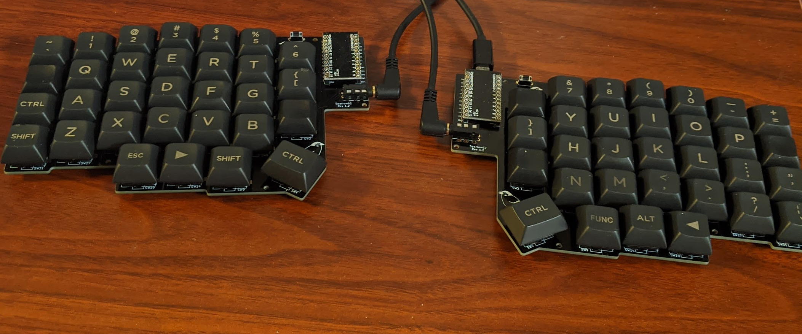
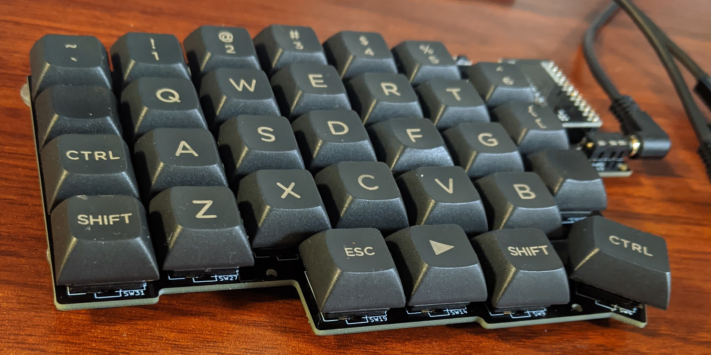

以下のような特徴があります。

- 薄型キースイッチ Kailh Choc V1/V2 が使えること。
- Cherry MX 互換キースイッチが使えること。
- 縦に揃ったキー配置(カラムスタッガード)であること。
- 十分キーの数が多いこと。
- Pro Micro をキーの横に配置してキーボード自体を薄くすること。
- キースイッチ交換可能なようにソケットを使うこと。
- ボトムプレート、トッププレートをキットに含まないが、必要であれば別途発注可能であること。

一方、この特徴をシンプルに実現するために、妥協している点は以下のとおりです。

- LED に対応しないこと。
- OLED ディスプレイ に対応しないこと。
- 形が角ばっており、 Lily58 に比べて外見にこだわりがないこと
- 薄さを優先し、ボトムプレートをキットに含まないこと

より作りやすい、完成度の高いキーボードとして、ゆーちさんの頒布されている Lily58 があります。
ぜひ Lily58 の購入も検討ください。

**Kailh Choc V1 キースイッチの場合**
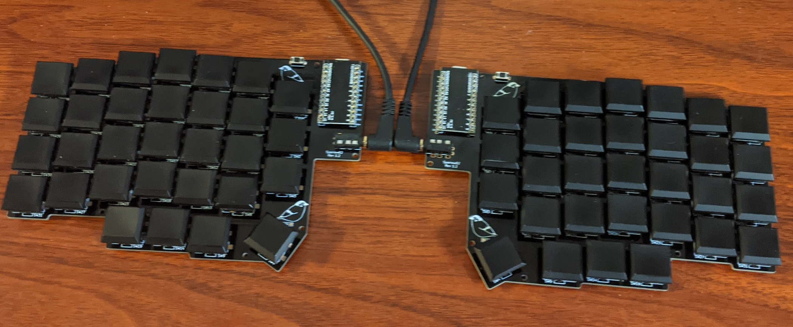

**Cherry MX 互換スイッチを使用し、トッププレートを加えた場合（キーキャップ: DSA）**
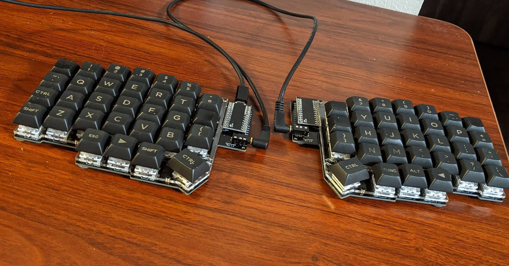

### 対応キースイッチ

Sparrow62 Keyboard では、以下のキースイッチに対応しています。

- MX 互換キースイッチ
- Kailh Low Profile Choc v1 ([遊舎工房](https://yushakobo.jp/shop/pg1350/)): 非常に薄いメカニカルキースイッチです。ただし、専用のキーキャップが必要です。
- Kailh Low Profile Choc v2 ([遊舎工房](https://yushakobo.jp/shop/kailh-choc-v2/)): 非常に薄いメカニカルキースイッチです。MX 軸の一般的なキーキャップが使用可能です。

製作者のおすすめは、Kailh Low Profile Choc v2 です。

## キット以外に必要なもの

以下のものが必要です。

- 電子工作用はんだ及び、はんだ付け工具
- 対応キースイッチ x62
- キースイッチ対応キーキャップ x62
- スイッチ用 PCB ソケット x62 （以下のいづれか）
  - MX 互換スイッチ用 ([遊舎工房](https://yushakobo.jp/shop/a01ps/)、[TALP KEYBOARD](https://talpkeyboard.stores.jp/items/5e02c5405b120c792616bcf9))
  - Kailh Low Profile Choc V1/V2 用 ([遊舎工房](https://yushakobo.jp/shop/a01ps/))
- Micro USB ケーブル x1: Pro Micro と PC の接続用
- TRRS ケーブル、もしくは 3.5mm ステレオミニプラグオーディオケーブル x1 ([遊舎工房](https://yushakobo.jp/shop/trrs_cable/)、[Amazon](https://www.amazon.co.jp/dp/B00NO73IN2))
- Pro Micro x2 ([遊舎工房](https://yushakobo.jp/shop/promicro-spring-pinheader/)、[TALP KEYBOARD](https://talpkeyboard.stores.jp/items/5b24504ba6e6ee7ec60063e3))
- Pro Micro 用コンスルー x2 (遊舎工房 Pro Micro に付属、[TALP KEYBOARD](https://talpkeyboard.stores.jp/items/5e056626d790db16e2889233))

### おすすめのもの

- Kailh Low Profile Choc v2 タクタイル（茶）([遊舎工房](https://yushakobo.jp/shop/kailh-choc-v2/)): 非常に薄いタクタイルスイッチです。MX 軸の一般的なキーキャップが使用可能で、薄さをキープしたまま良い打ち心地を得ることができます。
- Kailh Speed Switch Copper（茶）([遊舎工房](https://yushakobo.jp/shop/kailh-speed/): 押下点（押されたと判定される深さ）が 1.1mm と非常に小さいタクタイルスイッチです。そこまで押すことなく入力が軽快にでき、指が痛くなりません。
- DSA キーキャップ （[遊舎工房](https://yushakobo.jp/product-category/keycaps/dsa/)、[TALP KEYBOARD](https://talpkeyboard.stores.jp/?category_id=59be1864b1b6195942000732)）: 非常に薄い、かつ全て同型のキーキャップです
- 見つけてよかったキーキャップ https://www.amazon.co.jp/gp/product/B0852YVT71/

## キット同梱物

キットには以下のものを含んでいます。

- PCB x2 （左右の手の PCB は同じものです）
- ダイオード 1N4148W x62
- TRRS ジャック x2
- タクトスイッチ x2
- ゴム足 x20

トッププレート付属の場合には、以下のものを含んでいます。

- トッププレート x2
- スペーサー M2 3mm x20
- M2 ネジ x40

トッププレートは Cherry MX 互換キースイッチ専用とお考えください。 Kailh Choc V1/V2 の場合キーキャップと干渉したり、高さが高すぎたりします。

## キット同梱物が追加で必要な場合

キットに付属している以上の材料が必要になった場合、PCB 以外は秋月電子通商、または遊舎工房で購入することが可能です。

- TRRS ジャック: [秋月電子通商](https://akizukidenshi.com/catalog/g/gC-06070/)、[遊舎工房](https://yushakobo.jp/shop/a0800tr-01-1/)
- ダイオード: [秋月電子通商](https://akizukidenshi.com/catalog/g/gI-07084/)、[遊舎工房](https://yushakobo.jp/shop/a0800di-02-100/
- タクトスイッチ: [秋月電子通商](https://akizukidenshi.com/catalog/g/gP-08073/)、[遊舎工房](https://yushakobo.jp/shop/a0800ts-01-1/)、[モノタロウ](https://www.monotaro.com/p/0148/6257/)
- ゴム足: [モノタロウ](https://www.monotaro.com/p/4891/2387/)

## 追加であると良いもの

- はんだこて台 [Amazon](https://www.amazon.co.jp/dp/B0016V7JOC/): やすいものでもあると、机の上が煩雑になりません。
- ハンダ吸い取り線 [Amazon](https://www.amazon.co.jp/dp/B002TKEGRM/): はんだ付け失敗時に取り外しできます。あったほうが心強いです。
- フラックス: はんだ付け失敗時に再びはんだ付けをしやすくするのに塗ります。なくても良いです。
- 逆作用ピンセット [Amazon](https://www.amazon.co.jp/dp/B0036RQR4W/): 手が震えずに効率的にはんだ付けできます。ダイオードは非常に小さい部品なのでこの機会に買いましょう。
- マスキングテープ: ダイオード、ソケットなどの仮どめに使用できます。
- デジタルテスター [Amazon](https://www.amazon.co.jp/dp/B003272E48/): 通電不良時の調査用に使えます。
- ルーペ: ダイオードの方向確認に使えます。スマホのカメラの拡大機能でも代用できます。
- エポキシ系接着剤 [Amazon](https://www.amazon.co.jp/dp/B003SL8CBC/): Pro Micro の MicroUSB 端子のもげ防止に使えます。
- ニッパー [Amazon](https://www.amazon.co.jp/dp/B000ICAOE2/): タクトスイッチの足を切ります。
- ラジオペンチ [Amazon](https://www.amazon.co.jp/dp/B00FB92PJY/): ソケットにスイッチを差し込んだ際、スイッチの端子が曲がることがあります。それを伸ばすのに使います。

## 高さ調整に必要なもの

[詳しくはこちらの高さ調整ガイドを確認ください。](./hight_guide/README.md)

## 手順

### Kailh Choc V2 の場合、足を 1 本切断する

Kailh Choc V2 では銅線の足が 3 つ出ていますが、このうち写真赤丸の 1 本をニッパで切断します。
切断した際に発生する小さな破片にご注意ください。
写真青丸の銅線は切断しないように気をつけてください。

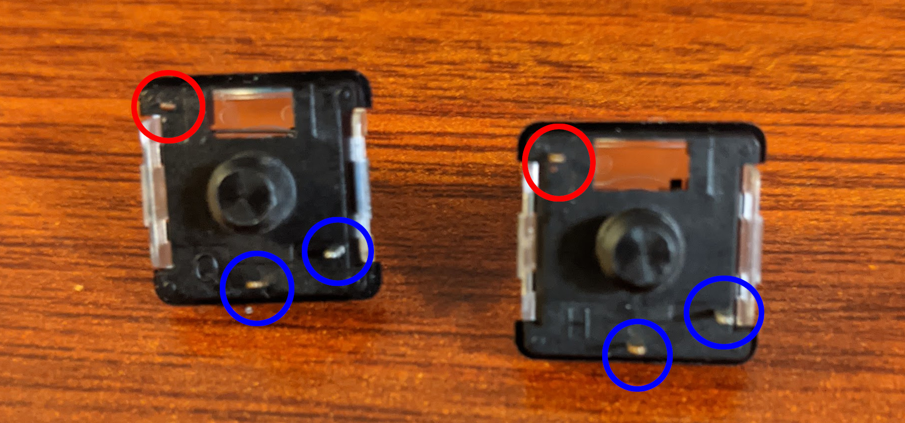

切断後に、少し残ってしまった場合には、折り曲げておきます。

### Pro Micro にもげ防止加工を実施（お好みで）

Pro Micro の Micro USB 端子は非常にもげやすいものになっています。
これを防止するため、端子に エボキシ系接着剤を塗布します。
誤って端子の中に接着剤が入り込まないように気をつけてください。

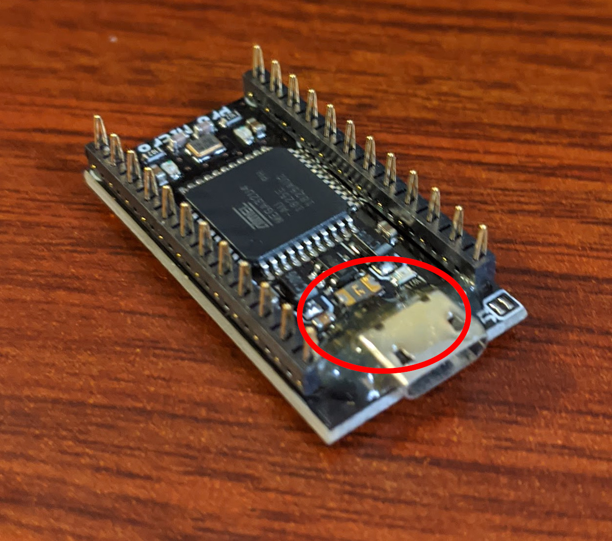

### Pro Micro とピンヘッダをはんだ付けする

ピンヘッダには向きがあります。詳しくは、遊舎工房の解説を確認ださい。

https://yushakobo.zendesk.com/hc/ja/articles/360044233974-%E3%82%B3%E3%83%B3%E3%82%B9%E3%83%AB%E3%83%BC-%E3%82%B9%E3%83%97%E3%83%AA%E3%83%B3%E3%82%B0%E3%83%94%E3%83%B3%E3%83%98%E3%83%83%E3%83%80-%E3%81%AE%E5%8F%96%E3%82%8A%E4%BB%98%E3%81%91%E6%96%B9%E3%82%92%E6%95%99%E3%81%88%E3%81%A6%E4%B8%8B%E3%81%95%E3%81%84

Sparrow62 キーボードは Pro Micro を写真の向きで使います。

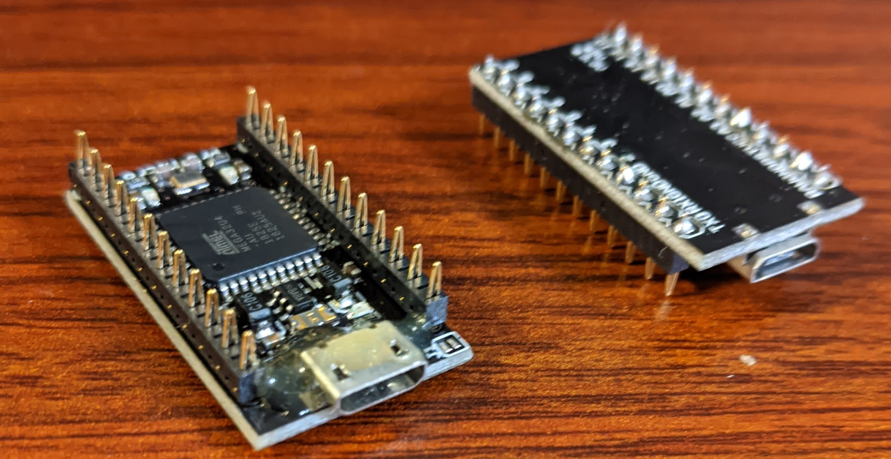

先に、Pro Micro とピンヘッダを PCB に差し込みます。
その上から、 Pro Micro とピンヘッダのみをはんだづけします。
ピンヘッダと PCB ははんだ付けしないようにします。

Pro Micro は脆弱な部品ため、破損した場合交換が可能となります。

### PCB を左右どちらに使うかを決める

部品によって、実装面が異なります。

- 表面に実装: タクトスイッチ、TRRS ジャック
- 裏面に実装: ダイオード、スイッチソケット

誤って反対面に実装しないように、実装する側に印をつけておくとよいでしょう。

### ダイオードを実装する

ダイオードを向きを気をつけて、はんだ付けします。

実装手順については、サリチル酸さんのツイートの動画が非常に良くできているため、こちらを確認いただくと良いと思います。

https://twitter.com/Salicylic_acid3/status/1296494976319315970
https://twitter.com/Salicylic_acid3/status/1108798243142434816

1. 先に PCB の片側にはんだをつける。
2. つけたハンダを溶かして、ダイオードの片側を付ける
3. ダイオードの向きが間違っていないか、虫眼鏡、もしくはスマホカメラの拡大機能で確認する
4. 反対側の足をはんだ付けする

片面のダイオードが全て同じ向きを向くように設計されています。
ダイオードの片側をはんだ付けした時点で、向きの確認を行い、その後反対側の足のはんだ付けをすると良いです。

**1.先に PCB の片側にはんだをつける**

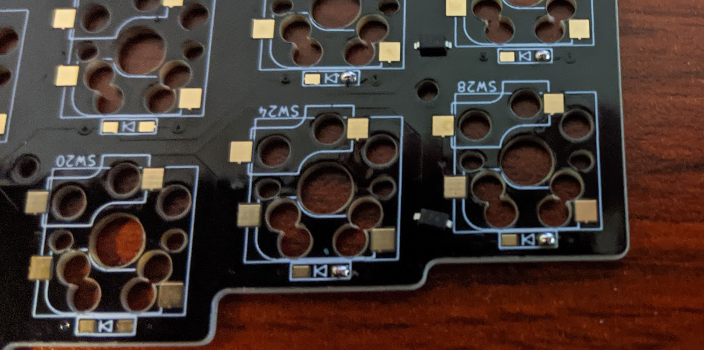

**2.つけたハンダを溶かして、ダイオードを片側をはんだ付けする**

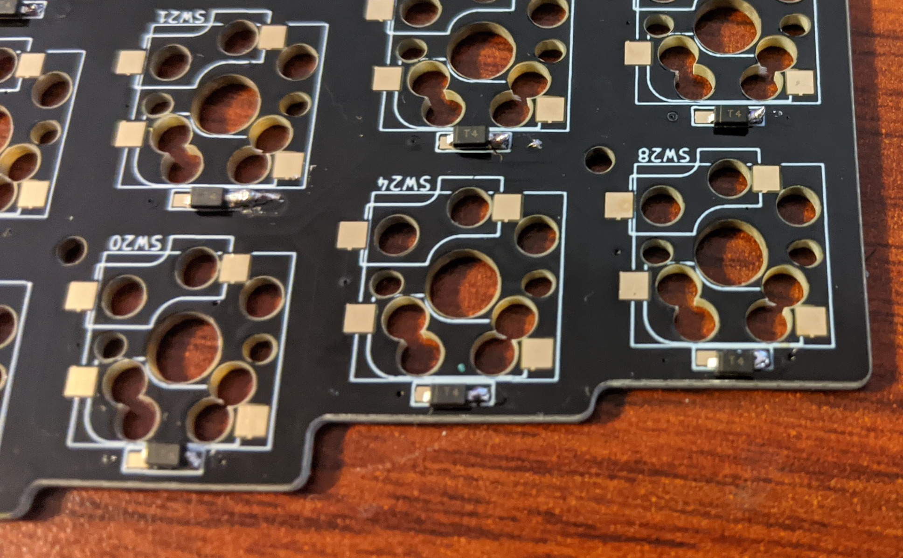

**3.ダイオードの向きを確認する**

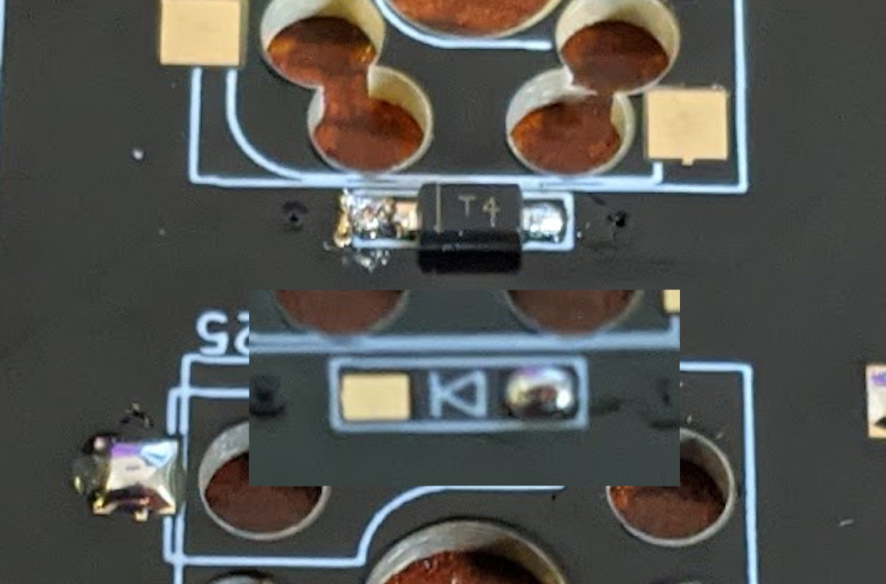

**4.反対側の足をはんだ付けする**


### スイッチソケットを実装する

スイッチソケットを、ダイオードと同じ面に、ハンダ付けします。

実装手順について、こちらもサリチル酸さんのツイートの動画がよくできているため、こちらを確認いただくのが良いと思います。

https://twitter.com/Salicylic_acid3/status/1310253635255717889

私の場合は以下のようにしています。

1. 先に PCB の両側の端子にハンダをつける
2. ソケットを置き、片側を端子の上からハンダごてを当てて、先につけたハンダを溶かして、ソケットの端子と PCB を接着させる。この時、ソケットを上から押してある程度密着させる。
3. 反対側の端子の上からはんだごてを押さえつけるようにあてて、ソケットの端子と基盤を密着させる。このときもソケットを押す。
4. 再度反対側の端子にはんだごてを当てつつ、ソケットを押して、端子と基盤を密着させる。

**1.先に PCB の両側の端子にハンダをつける**


**2.ソケットを置き、ハンダを溶かしながら押す**

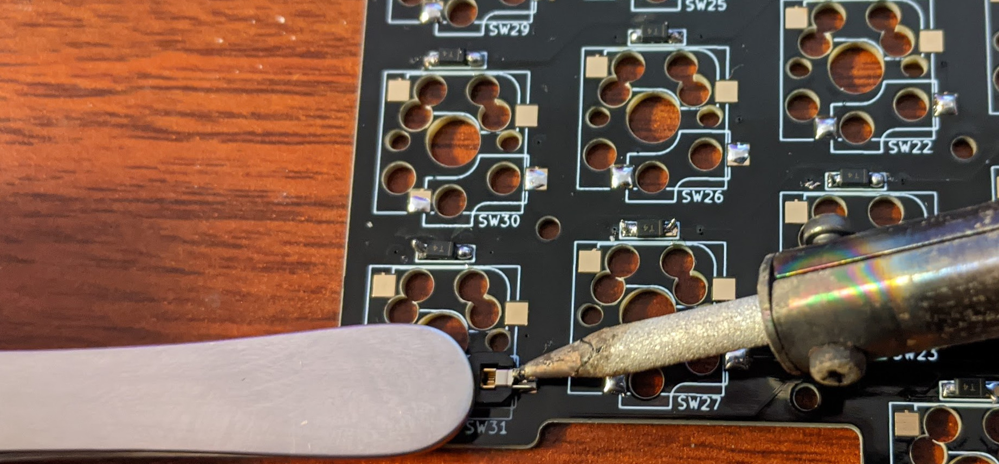

**3.反対側も同様にする**

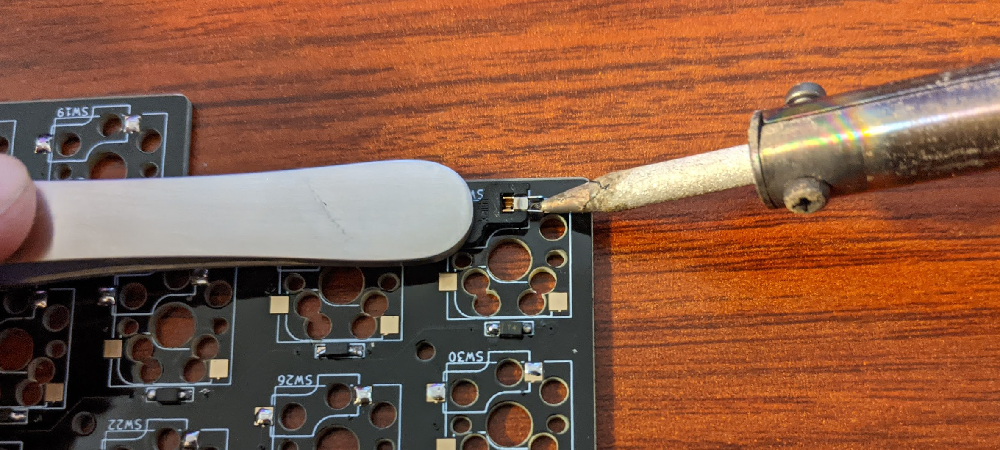

**4.密着するまでくりかえす**

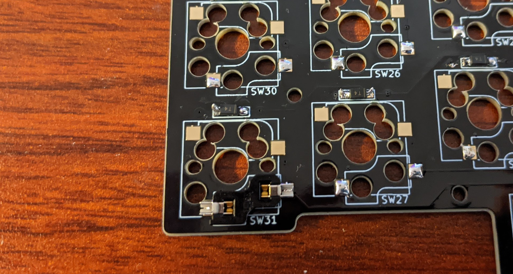

### タクトスイッチを実装する

タクトスイッチは、**ダイオードとは異なる面に** 実装します。

足が裏面に出るため、はんだ付けを行う面は **ダイオードと同じ面** です。

1. 先にタクトスイッチを差し込み、マスキングテープで固定します。
2. 裏返して、足をはんだ付けします。
3. 余分な足をニッパで切ります

**タクトスイッチ**

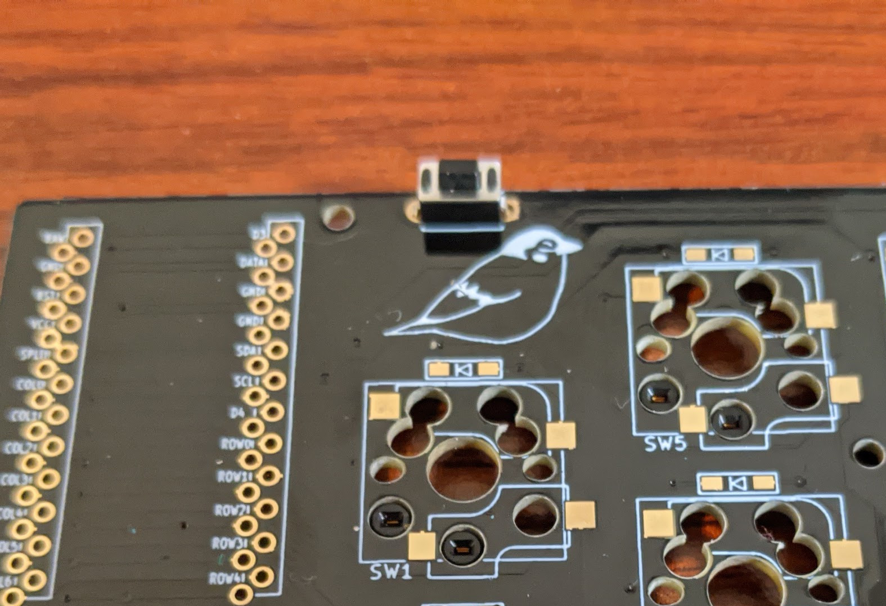

### TRRS ジャックを実装する

TRRS ジャックは、**ダイオードとは異なる面に** 実装します。

足が裏面に出るため、はんだ付けを行う面は **ダイオードと同じ面** です。

1. 先に TRRS ジャックを差し込み、マスキングテープで固定します。
2. 裏返して、足をはんだ付けします。
3. 余分な足をニッパで切ります

**TRRS コネクタ**

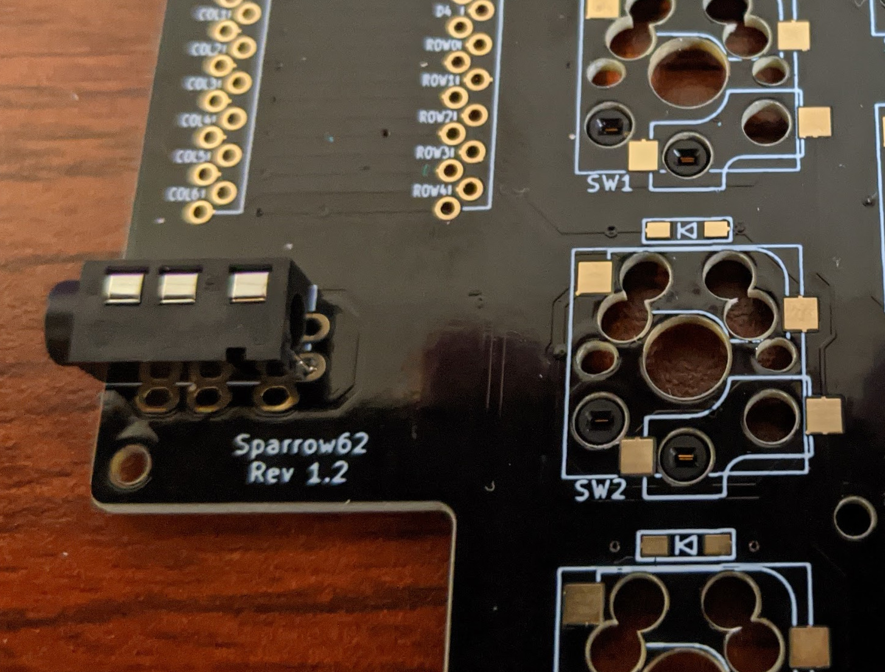

### キースイッチを差し込む

キースイッチをソケットに差し込みます。キーキャップはまだしません。

### Pro Micro にファイームウェアを書き込む

ファームウェアには、[QMK Firmware](https://docs.qmk.fm/) を使います。

QMK Firmware のセットアップ手順（[公式英語](https://docs.qmk.fm/#/newbs_getting_started)、[有志日本語](https://github.com/shelaf/qmk_firmware/blob/master/docs/ja/newbs_getting_started.md)）に従い、インストールします。

Ubuntu を使用している場合には、ModemManager が邪魔をすることがあるので、`sudo systemctl stop ModemManager.service`を実行いておくと有効です。

現在、QMK Firmware には Sparrow62 キーボードのファイルがマージされていません。
qmk firmware のディレクトリに、sparrow62 のリポジトリをチェックアウトしてください。

```
cd ~/qmk_firmware
git remote add 74th https:/github.com/74th/qmk-firmaware.git
git checkout 74th/sparrow62
```

デフォルトのキーマップをインストールするには、PC と Pro Micro を USB ケーブルで接続し、以下を実行します。

```
qmk flash -kb sparrow62 -km default
```

`Detecting USB port, reset your controller now...`と表示されたところで、キーボードのタクトスイッチ（リセット）を押します。
この Firmware の書き込みを、左右 2 つの Pro Micro で両方とも行います。

この default のキーマップは以下のようになっています。 `MO(_FN)`のキーを押すと、キーレイヤが下の`[_FN]`のものに変わり、F1-12 キーや、矢印キーとして動作させることができます。

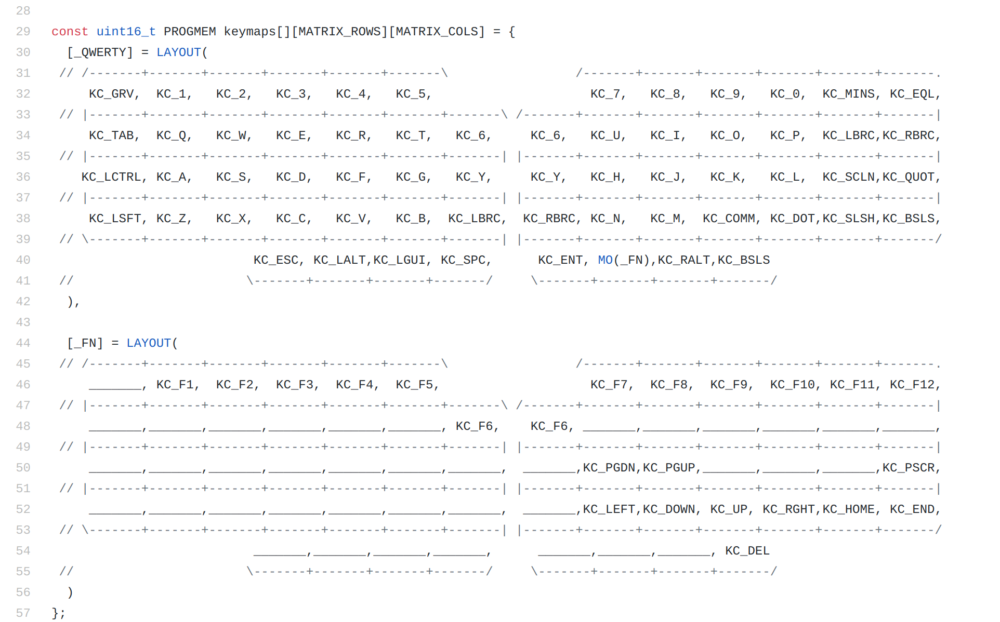

新しいキーマップを作成する場合には、以下のように実行します（nnyn が新しいキーマップ名）

```
qmk new-keymap -kb sparrow62 -km nnyn
```

キーマップの設定する C のソースが `~/qmk_firmware/keyboards/sparrow62/keymaps/nnyn2/keymap.c` にできます。
こちらを変更して、以下のコマンドで Firmware を書き込みます。

```
qmk flash -kb sparrow62 -km nnyn
```

詳しいファームウェアの実装方法は、公式のドキュメントや Qiita の記事を参照ください。

- [Keymap Overview](https://docs.qmk.fm/#/keymap)
- [はじめての QMK キーマップ編集](https://qiita.com/marksard/items/9317949ce1da327f7436)

QMK Firmware を自前でビルドする以外にも、QMK Configurator、QMK Toolbox を使った方法があります。
サリチル酸さんのブログが非常に参考になるため、こちらをご確認ください。

- [（初心者編）QMK Configurator を使ってキーマップを書き換えよう - 自作キーボード温泉街の歩き方](https://salicylic-acid3.hatenablog.com/entry/qmk-configurator)
- [（初心者編）自作キーボードにファームウェアを書き込む - 自作キーボード温泉街の歩き方](https://salicylic-acid3.hatenablog.com/entry/qmk-toolbox)

<!--
また、GUI でキーレイアウトが変更可能な、VIA があります。
こちらもサリチル酸さんのブログが非常に参考になるため、ご確認ください。

- [（初心者編）VIA を使ってキーマップを書き換えよう - 自作キーボード温泉街の歩き方](https://salicylic-acid3.hatenablog.com/entry/via-manual)
-->

### キースイッチのテストをする

QMK Continuator のキーテストを開きます。

https://config.qmk.fm/#/test

キースイッチを押し、キーレイアウトの通りに動作するかを確認します。

### 動作しないキーがある場合

#### 1 キーのみ動作しない場合

まず、キースイッチの足が曲がっていないか確認してください。

左手用のキーの場合、以下の同じ色の部分がつながっています。それぞれテスターなどで疎通しているか確認ください。

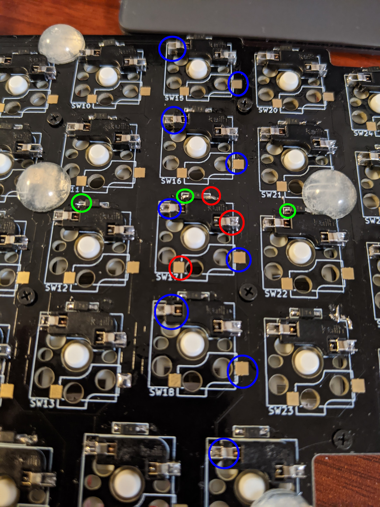

右手用のキーの場合、以下の同じ色の部分がつながっています。それぞれテスターなどで疎通しているか確認ください。


#### 縦一列、横一列が動作しない場合

青丸が COL のラインとなっており、そのまま Pro Micro の COL0-6 につながっています。緑丸が ROW のラインとなっており、そのまま Pro Micro の ROW0-4 につながっています。
Pro Micro の接続を確認ください。

## 不明点がある場合

不明点がある場合、作成にあたり相談したいことがある場合には、私のところまでお気軽に問い合わせください。

- Twitter: @74th
- Mail: site@74th.tech
