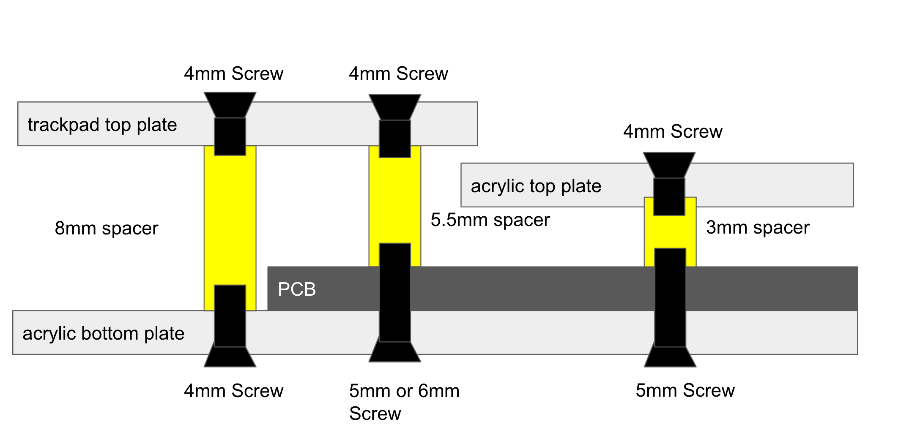

# Sparrow62 (+1) v2 Keyboard Building Guide

- If you build Sparrow 62 v2, please see [v1 Buildguide](./v1.md).

## What's Sparrow 62 Keyboard

Sparrow 62 は 74th が頒布する自作キーボードキットです。
最初は Lily58 からインスピレーションを得て、数々の改良を加えました。

**using Kailh Choc V2 switches（keycap: DSA）**


これは購入者がご自身で組み立てが必要なキットです。
完成を保証するものではありません。

名称は Sparrow62 ですが、Sparrow v2 では **63 キー** で構成されます。

### 特徴 / features

- 縦に揃ったキー配置（カラムスタッガード）であり、指の曲げ伸ばしで多くのキーに届く様になっていること。
- 左右分離しており、肩を開いてタイピングができること。
- CherryMX 互換キースイッチが使えること。
- 薄型キースイッチ Kailh Choc v1/v2 が使えること。
- キースイッチが交換可能なようにスイッチソケットを使えること。
- 数字キーを網羅できるほどキーの数が多いこと（60%キーボード）。
- (new v2) 標準的なキーキャップセットを使用して、組み立てることができること。
- (new v2) 右手のキーボードの右側にマウスなどを配置できるように、右手の右側のキーの数を抑え、左側が膨らむデザインであること。
- (v1.3)オプションで、トラックパッドを右手左側に置くことができること。
- (v1.3)ゴム足の代わりに、ゴムシートを使うことで十分薄くすることができること。
- (new v2) 厚さの異なるプレート、PCB を用いて可能な限り薄くしていること。
- (new v2) PCB とゴムシートの間にプレートをはさみ、全体の剛性と、打鍵感を高めてあること。
- (new v2) 半導体不足でも入手の容易で、高性能な Raspberry Pi PICO を用いること。
- (new v2) マイコン 1 つで左右のキーボードを制御すること。
- (new v2) USB Type-C で接続できること。

### v1 と v2 の違い

- v1 は ProMicro と、QMK Firmware を用いて、キー入力を調整することができました。v2 は ProMicro と QMK Firmware に対応していません。
- チップ抵抗や、マイコン裏のスルーホールとランドの接続など、実装難度は高くなっています。

## 準備が必要なもの

### 部品

キットの他に追加で以下のものが必要です。

- スイッチ用ソケット x63
  - 「Cherry MX 互換用」と「Kailh Choc V1/V2 用」があります
  - MX 互換スイッチ用 ([遊舎工房](https://yushakobo.jp/shop/a01ps/)、[TALP KEYBOARD](https://talpkeyboard.stores.jp/items/5e02c5405b120c792616bcf9))
  - Kailh Low Profile Choc V1/V2 用 ([遊舎工房](https://yushakobo.jp/shop/a01ps/))、TALP KEYBOARD
- 自作キーボードスイッチ x63
  - Cherry MX 互換スイッチ と Kailh Choc v1/v2 スイッチを使うことができます
- TRRS ケーブル （4 極オーディオミニプラグのケーブル）x1
  - 3 極ステレオケーブルは不可
  - TRRS ケーブル x1 ([遊舎工房](https://yushakobo.jp/shop/trrs_cable/)、[Amazon](https://www.amazon.co.jp/dp/B018FPYC78))
  - 50 cm より長いケーブルで接続可能かどうかは確認していません。
- Raspberry PI Pico x1
- USB 2.0 Type-C Cable x1
- (CherryMX 互換スイッチを使用する場合）PCB マウントスタビライザー x3

### 組み立てに必要な機材

- はんだごて、はんだこて台、スポンジ
  - BC 型 と ペン型 の 2 つのこて先があると便利ですが、どちらかでも大丈夫です。
- はんだ
- ピンセット（表面実装部品を抑えるのに利用します）
- ニッパ（連結ピンヘッダの切断や、長いピンの切断に使います）
- 両面テープ（ゴムシートとボトムプレートを接着します）
- はさみ（ゴムシートを切断するのに使います）

### あるとよいもの

- フラックス
  - はんだにはフラックスが含まれていて、端子に広がるようにできていますが、熱を加えすぎるとすべてのフラックスが蒸発します。その場合、追加のフラックスを入れて使います
- フラックス洗浄液
- ルーペ（スマートフォンカメラでも代用できます）
- ラジオペンチ（スイッチの足が曲がってしまった場合に、つまんで伸ばします）

## キットに同梱されているもの

- 左手トッププレート x1
- 左手 PCB x1
- 左手ボトムプレート x1
- 右手トッププレート x1
- 右手 PCB x1
- 右手ボトムプレート x1
- 左手 IC カバー（黒アクリルプレート、穴 3 つ） x1
- 右手 IC カバー（黒アクリルプレート、穴 2 つ） x1
- ゴムシート x2
- 2012 SMD 抵抗 1kΩ(102) x3
- 2012 SMD 抵抗 5.1kΩ(512) x2
- 2012 SMD 抵抗 10kΩ(103) x3
- ダイオード
- USB Type-C ソケット基盤 x1
- LED SK6812MINI-E x1
- TRRS ソケット x2
- IO エキスパンダー IC MCP23017 x1
- ピンヘッダー 1 列 12 ピン x1
- 3.5mm スペーサー x24
- 5.0mm スペーサー x5
- 4.0mm ネジ（黒） x29
- 5.0mm ネジ（銀） x29

## 作成方法 / how to build

### Kailh Choc v2 を使う場合

Kailh Choc v2 を使うの場合、足を 1 本切断する

Kailh Choc V2 has three copper wireand one of the red circles in the photo is cut with nippers.

Kailh Choc V2 では銅線の足が 3 つ出ていますが、このうち写真赤丸の 1 本をニッパで切断します。
切断した際に発生する小さな破片にご注意ください。
写真青丸の銅線は切断しないように気をつけてください。


ここできれいに切断すると、安定性が増します。

### チップ抵抗のはんだ付け

チップ抵抗は左手と右手にそれぞれ 5 個ずつあります。

1k(102)、5.1k(512)、10kΩ(103)の 3 種類の抵抗を使い分けます。
キットに付属のチップ抵抗

### Solder Diodes

Solder the diode, paying attention to the orientation of the diode.
ダイオードを向きを気をつけて、はんだ付けします。

The video by @Salicylic_acid3 is very good, so I think you can check here.
実装手順については、サリチル酸さんのツイートの動画が非常に良くできているため、こちらを確認いただくと良いと思います。

https://twitter.com/Salicylic_acid3/status/1296494976319315970
https://twitter.com/Salicylic_acid3/status/1108798243142434816

**1. Solder one side of the PCB first (先に PCB の片側にはんだをつける)**


**2. Melt the attached solder and solder the diode on one side (つけたハンダを溶かして、ダイオードを片側をはんだ付けする)**


**3. Check the orientation of the diode (ダイオードの向きを確認する)**


**4. Solder the other side (反対側の足をはんだ付けする)**


### Solder switch socket (スイッチソケットを実装する)

The video by @Salicylic_acid3 is very good, so I think you can check here.
実装手順について、こちらもサリチル酸さんのツイートの動画がよくできているため、こちらを確認いただくのが良いと思います。

https://twitter.com/Salicylic_acid3/status/1310253635255717889

**1. Solder the pads on both sides of the PCB(先に PCB の両側の端子にハンダをつける)**


**2. Place the socket and push while melting the solder(ソケットを置き、ハンダを溶かしながら押す)**


**3. Do the same on the other side(反対側も同様にする)**


**4. Repeat until they are in close contact (密着するまでくりかえす)**


### Implement tact switch

タクトスイッチを実装する

The tactile switches are **implement on a different surface than the diode**.
タクトスイッチは、**ダイオードとは異なる面に** 実装します。

The surface to be soldered is **the same surface as the diode**.
足が裏面に出るため、はんだ付けを行う面は **ダイオードと同じ面** です。

**tactile switch(タクトスイッチ)**


### Implement TRRS socket

TRRS ジャックを実装する

The TRRS sockets are **implement on a different surface than the diode**.
TRRS ジャックは、**ダイオードとは異なる面に** 実装します。

The surface to be soldered is **the same surface as the diode**.
足が裏面に出るため、はんだ付けを行う面は **ダイオードと同じ面** です。

**TRRS Socket(TRRS ジャック)**


### Assemble the top and bottom plate

トッププレートとボトムプレートを組み立てる。

#### For Kailh Choc Switches

Attach the bottom plate to the PCB with double-sided tape.
両面テープで PCB とボトムプレートを貼り付けてください。 貼り付けなくても、うまくはまれば固定されます。

#### For Cherry MX Compatible Switches


#### For Cherry MX Cpmpatible Switches with Trackpad




### Cut and attach rubber sheets with double-sided tape

両面テープでボトムプレートとゴムシートを接着します。

For trackpad, use a long rubber sheet.
トラックパッドがある場合、より長いシートをトラックパッド用に使ってください。


### Insert switches and Pro Micro

キースイッチと Pro Micro をソケットに差し込みます。

### flash QMK Firmware

#### using QMK Toolbox and REMAP

[Download sparrow62_via.hex](https://github.com/74th/sparrow62-buildguide/raw/master/sparrow62_via.hex)

Download and install QMK Toolbox.

https://github.com/qmk/qmk_toolbox/releases

Flash via firmware.

- Local File: sparrow62_via.hex
- MCU : atmega32u4

You can use REMAP for configuring your keymap.

https://remap-keys.app/

#### using QMK Firmware

```
qmk flash -kb sparrow62 -km default
```

## hints for Japanese

VIA を使う場合、QMK Toolbox でファームウェアを書き込めば完了です。

キーマップのカスタマイズには、VIA を使うと GUI で変更できます。
更に高度なカスタ合図を行う場合、QMK Firmware のビルド環境を整える必要があります。

#### QMK Toolbox を使ってデフォルトのファームウェアを書き込む

以下のキーマップを、default のファームウェアとして提供しています。

- [Download sparrow62_default.hex](https://github.com/74th/sparrow62-buildguide/raw/master/sparrow62_default.hex)

レイヤ 1


レイヤ 2（レイヤ 1 の`MO(1)`のキーと同時に押すと、動作する）


こちらを [QMK Toolbox](https://github.com/qmk/qmk_toolbox/releases) を使って書き込むことができます。

QMK Toolbox の使い方は[サリチル酸さんの記事](https://salicylic-acid3.hatenablog.com/entry/qmk-toolbox)が詳しいため、こちらを確認ください。

左右のキーボードの両方に書き込む必要があります。

#### VIA を使ってキーマップを変更する

GUI でキーマップを変更できる [VIA](https://caniusevia.com/) というツールがあります。

VIA を使うには、VIA のファームウェアを書き込む必要があります。以下からダウンロードし、[QMK Toolbox](https://github.com/qmk/qmk_toolbox/releases)などを使って書き込んでください。

- [Download sparrow62_via.hex](https://github.com/74th/sparrow62-buildguide/raw/master/sparrow62_via.hex)

VIA のファームウェアは Remap を使うと、ブラウザの UI でキーマップの変更ができます。

#### 更にカスタマイズするため、QMK Firmware のビルド環境を整える

QMK Firmware のセットアップ手順（[公式英語](https://docs.qmk.fm/#/newbs_getting_started)、[有志日本語](https://github.com/shelaf/qmk_firmware/blob/master/docs/ja/newbs_getting_started.md)）に従い、インストールします。

Ubuntu を使用している場合には、ModemManager が邪魔をすることがあるので、`sudo systemctl stop ModemManager.service`を実行いておくと有効です。

デフォルトのキーマップをインストールするには、PC と Pro Micro を USB ケーブルで接続し、以下を実行します。

```
qmk flash -kb sparrow62 -km default
```

`Detecting USB port, reset your controller now...`と表示されたところで、キーボードのタクトスイッチ（リセット）を押します。
この Firmware の書き込みを、左右 2 つの Pro Micro で両方とも行います。

この default のキーマップは以下のようになっています。 `MO(_FN)`のキーを押すと、キーレイヤが下の`[_FN]`のものに変わり、F1-12 キーや、矢印キーとして動作させることができます。


新しいキーマップを作成する場合には、以下のように実行します（nnyn が新しいキーマップ名）

```
qmk new-keymap -kb sparrow62 -km nnyn
```

キーマップの設定する C のソースが `~/qmk_firmware/keyboards/sparrow62/keymaps/nnyn/keymap.c` にできます。
こちらを変更して、以下のコマンドで Firmware を書き込みます。

```
qmk flash -kb sparrow62 -km nnyn
```

詳しいファームウェアの実装方法は、公式のドキュメントや Qiita の記事を参照ください。

- [Keymap Overview](https://docs.qmk.fm/#/keymap)
- [はじめての QMK キーマップ編集](https://qiita.com/marksard/items/9317949ce1da327f7436)

### キースイッチのテストをする

QMK Continuator のキーテストを開きます。

https://config.qmk.fm/#/test

キースイッチを押し、キーレイアウトの通りに動作するかを確認します。

### 動作しないキーがある場合

#### 1 キーのみ動作しない場合

まず、キースイッチの足が曲がっていないか確認してください。

左手用のキーの場合、以下の同じ色の部分がつながっています。それぞれテスターなどで疎通しているか確認ください。


右手用のキーの場合、以下の同じ色の部分がつながっています。それぞれテスターなどで疎通しているか確認ください。


#### 縦一列、横一列が動作しない場合

青丸が COL のラインとなっており、そのまま Pro Micro の COL0-6 につながっています。緑丸が ROW のラインとなっており、そのまま Pro Micro の ROW0-4 につながっています。
Pro Micro の接続を確認ください。

## Contact me

- Twitter: @74th
- Mail: site@74th.tech
