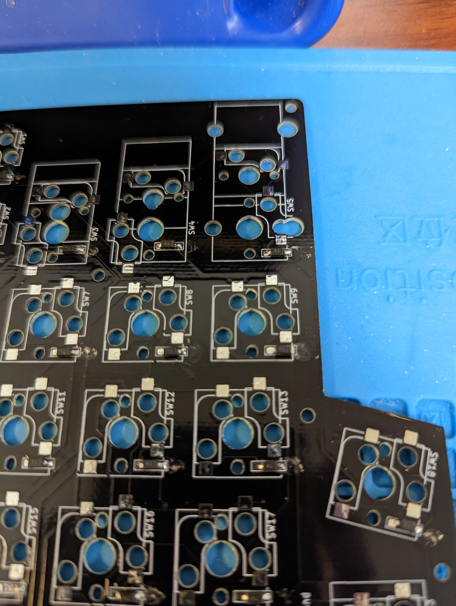
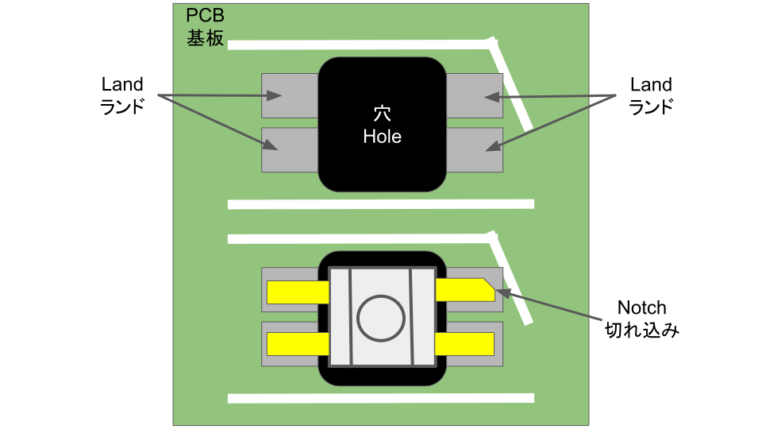
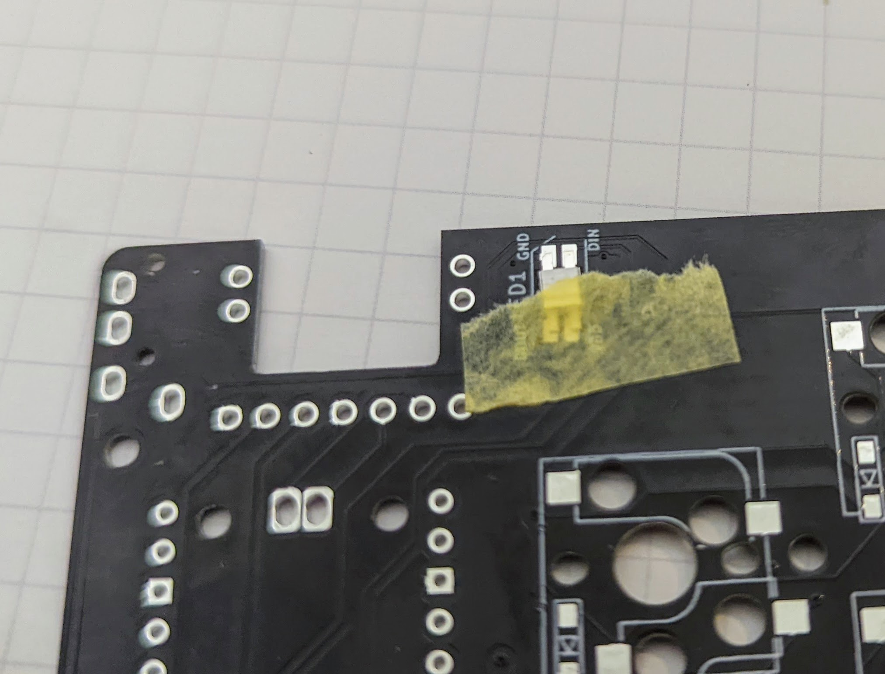

# Sparrow60C Keyboard Kit Build Guide

このビルドガイドには他のキーボードの写真が含まれていますのでご注意ください。

また、作成中に疑問点等質問がありましたら、74th （twitter: [@74th](https://twitter.com/74th) 、email: site@74th.tech 、 本リポジトリの issue）まで問い合わせください。

## 販売先

- booth(準備中)

## Sparrow60C の注意点

- マイコン RP2040 が直接 PCB に実装されています。
- GH60 互換キーボードケース対応の PCB ですが、必ずしもすべてのケースに対応するわけではありません。
- キットの PCB には RP2040 を動作させるためのマイコン及び受動部品が実装されています。

## キットの内容

- Sparrow60C PCB x1
- Sparrow60C Top Plate (FR4 PCB) x1
- ジョイスティックモジュール StickPointV x1
- HY2.0 ケーブル x1
- ダイオード 1N4148W x60
- RGBLED SK6812-MINI-E x1
- M2 4mm スペーサー x4 : StickPointV、PCB間
- M2 8mm 黒 平ネジ x7 : ケースとPCBの間のネジ止め
- M2 4mm 黒 平ネジ x8 : StickPointVとPCBのスペーサーとのネジ止め

### PCB に実装済みの部品

- マイコン RP2040 x1
- マイコンプログラム用フラッシュ W25Q32JVS x1
- RP2040 の動作に必要な受動部品（コンデンサ、抵抗、水晶発振器）
- 電源保護用理想ダイオード CH213K x1
- USB Type-C コネクタ x1

## キットの組み立てに必要なもの

### キットの他に必要なもの

- GH60 互換キーボードケース x1
- MX 互換スイッチソケット x60
- MX 互換スイッチ x60
- MX 互換スイッチ用キーキャップ一式 x1
- PC 接続用 USB Type-C ケーブル x1

### 組み立てに必要な機材

- はんだごて、はんだこて台、スポンジ
- はんだ
- ピンセット（表面実装部品を抑えるのに利用します）
- 両面テープ（ゴムシートとボトムプレートを接着します）
- PC（Windows、Linux、MacOS の動作するもの。ファームウェアの作成に必要。）

### あるとよいもの

- フラックス
  - はんだにはフラックスが含まれていて、端子に広がるようにできていますが、熱を加えすぎるとすべてのフラックスが蒸発します。その場合、追加のフラックスを入れて使います
- フラックス洗浄液
- ルーペ（スマートフォンカメラでも代用できます）
- ラジオペンチ（ネジ止めの他、スイッチの足が曲がってしまった場合に、つまんで伸ばします）

## how to build / 作成方法

### Solder Diodes / ダイオードのはんだ付け

Solder the diode, paying attention to the orientation of the diode.
🇯🇵 ダイオードを向きを気をつけて、はんだ付けします。


The video by @Salicylic_acid3 is very good, so I think you can check here.
🇯🇵 実装手順については、サリチル酸さんのツイートの動画が非常に良くできているため、こちらを確認いただくと良いと思います。

https://twitter.com/Salicylic_acid3/status/1296494976319315970
https://twitter.com/Salicylic_acid3/status/1108798243142434816

Solder one side of the PCB first.
🇯🇵 先に PCB の片側にはんだをつけます。


Melt the solder you have applied and solder one side of the diode.
🇯🇵 つけたハンダを溶かして、ダイオードを片側をはんだ付けします。



First, solder all the diodes **only one side**.
Once one side is soldered, check that all diodes are facing the same way.
🇯🇵 まず、すべてのダイオードを**片側だけ**はんだ付けをしましょう。
片側のはんだ付けが済んだところで、一度すべてのダイオードが同じ向きを向いているか確認します。


Once you have checked and it is ok, solder the other leg as well.
🇯🇵 確認が済んで大丈夫であれば、反対側の足もはんだ付けします。


### Soldering the switch socket / スイッチソケットを実装する

We recommend soldering the socket as shown in the video.
🇯🇵 ソケットのはんだ付けは動画のようにすることをおすすめしています。

[Movie（Google Drive）](https://drive.google.com/file/d/1VQYtKHCZkTQwoi6JiOMwTrHwYhy1caux/view?usp=sharing)

[Movie（Twitter）](https://twitter.com/74th/status/1514942328900775938)

[Movie file switch_socket.mp4](./img/v2/switch_socket.mp4)

1. Set the socket in the correct orientation.
2. Apply heat with a soldering iron from the inside of the socket's terminals.
3. From the outside of the socket, apply solder with the soldering iron and pour the solder into the socket.
4. Remove the solder and hold the socket with tweezers.
5. remove the soldering iron

🇯🇵

1. ソケットを正しい方向にセットします。
2. ソケットの端子の内側から、はんだごてで熱を加えます
3. ソケットの外側から、はんだごてを当ててはんだを流し込みます
4. はんだを外してから、ピンセットなどでソケットを抑えます
5. はんだごてを抜きます

### RGBLED を実装する

RGBLED SK6812MINI-E の方向を注意してください。

RGBLED の実装は、PCB 裏面に裏向きにセットして実装します。
PCB 表向きから見ると、発光面が見える形になります。

また、RGBLED の 4 本の足の 1 つ GND には切れ込みが入っています。切れ込みとシルクの斜め線を合わせるようにしてください。



向きを確認できたら、一方の足をマスキングテープで留めます。



すべての足を実装します。


### Soldering Grove(HY2.0) sockets / Grove(HY2.0) ソケットの実装

Grove(HY2.0)ソケットを実装します。

まず、1本のピンのみを実装し、はんだごてを更にあてながらPCBのシルクの位置になるように調整します。その後、残りのピンも実装します。ケーブルを差し込む面にも下部に固定用の金属部分があるため、こちらも忘れずに実装します。

TODO: 写真

### ケースへの組み込み前の実装確認

ケースへの組み込むと、はんだ実装に不具合があっても、キーキャップ、スイッチ、ネジなどのすべてを外さないとPCBの実装面にはアクセスできません。なるべく、ケースに組み込む前に、一度はんだ実装不良がないか確認すると良いでしょう。

HY2.0(Grove)ケーブルで、PCBとStickPointVを接続してください。

USBをPCに接続します。出荷時点でキーボードとして動作するファームウェアが書き込まれています。

StickPointVを操作し、マウスカーソルが動作することを確認してください。

QMK Configuratorのテスト画面を呼び出します。この画面では、キー入力に対して、どのキーが押されたのかを表示します。

> QMK Configurator
>
> https://config.qmk.fm/#/test

スイッチソケットの2箇所の金属部をジャンパ線や、ピンセットなどをあてたり、実際にスイッチを差し込んで押し込み、通電させます。すると、キースイッチが動作していれば、キー入力として反応します。キー入力として認識されない場合には、そのキーのダイオード、スイッチソケットの実装をやり直します。

SparrowDialの初期キーマップは以下のようになっています。


- MouseBtn1は左クリックです。QMK Configuratorでは反応しませんので、マウスカーソルをクリック可能なところに移動させて確認してください。
- MouseBtn2は右クリックです。
- User 0はスクロールボタンです。User 0を押しながら、StickPointVを上下に入力するとスクロールとして動作します。マウスカーソルをスクロール可能な状態にしてから確認してください。
- MO(1) はレイヤー変更キーです。RGBLEDの色が変われば正常です。

縦一列や、横一列反応しない場合には、RP2040のピンの実装が外れてしまった可能性があります。フラックスを塗った上で、RP2040の対応するピンにはんだごてを当てて、再実装します。どのキーがどのピンに対応しているかは、回路図を参照ください。

また、このキーボードはレイアウト変更時に、LEDの色が変わるようになっています。初期状態でLEDが点灯することを確認してください。

### ケースへの組み込み

ケースへの組み込みは以下の手順で行います。

1. Sparrow60C PCBへHY2.0(Grove)ケーブルの接続
2. Sparrow60C PCBをケースに配置する
3. Sparrow60C PCBとケースのネジ止め
4. Sparrow60C Top PlateへのStickPointVの組み込み
5. Sparrow60C Top Plateを重ねる
6. スイッチの差し込み
7. キーの動作テスト
8. キーキャップの差し込み

#### 1. Sparrow60C PCBへHY2.0(Grove)ケーブルの接続

先にPCBにHY2.0(Grove)ケーブルを差し込み、中央のホールから抜き出します。

TODO: 写真

#### 2. Sparrow60C PCBをケースに配置する

ケースにPCBに重ねます。

TODO: 写真

#### 3. Sparrow60C PCBとケースのネジ止め

M2 8mm ネジで固定します。

TODO: 写真

#### 4. Sparrow60C Top PlateへのStickPointVの組み込み

Sparrow60C Top Plateに、StickPointVを中央の穴に、図のようにスペーサーとネジを使ってマウントします。


写真のようにしてください。

TODO: 写真

StickPointVモジュールとHY2.0(Grove)ケーブルを接続します。

TODO: 写真

#### 5. Sparrow60C Top Plateをケースに設置する

Sparrow60C Top Plateを、ケースに重ねます。Sparrow60Cは、PCBとTop Plate間の固定は、スイッチのみで行います。

TODO: 写真

#### 6. スイッチの差し込み

Sparrow60C Top Plateの穴から、Sparrow60C PCBに向かってスイッチを差し込みます。MX互換スイッチには、Top Plateを挟み込む溝が付いています。この溝にTop Plateが挟まれるようにTop Plateを持ち上げてください。

この時、ケースの外側のスイッチから順に接続していくと、高さをキープしやすくなります。

TODO: 写真

#### 7. キーの動作テスト

USBをPCに接続し、QMK Configuratorを開き、キーをタイプしてすべてのキーが動作するかを確認します。詳細は前述の「ケースへの組み込み前の実装確認」を確認ください。

動作しないキーがある場合、一度すべてをケースから取り外し、該当キーのダイオードとスイッチソケットの実装をやり直します。

#### 8. キーキャップの差し込み

すべてのキーが動作することを確認できたならば、キーキャップを付けて完成です！

## ジョイスティックの操作のチューニング

StickPointVのチューニングについては、StickPointVのファームウェアのリポジトリを確認ください。

https://github.com/74th/stickpoint-firmware

## キーマップの変更、RP2040ファームウェアの更新

キーマップの変更には、2種類の方法があります。

- VIA、Remapを用いる
- QMK Firmwareでファームウェアをビルドする
- RP2040に対応したファームウェアを作成する

始めからVIA、Remap用のファームウェアが書き込まれた状態になっています。Remapを用いる場合には特にこの工程をする必要はありません。

VIA、Remapを利用しない利用しない場合は、別途ファームウェアを用意してください。RP2040はBOOTSELボタンを押しながらRESETを行うと、USBマスストレージデバイスがPCに認識され、その中にuf2ファイルをドラッグドロップすることで、ファームウェアを書き込むことができます。

#### VIA、Remapを利用する場合

VIA、RemapはWebサイトや、ツール上からキーマップの書き換えができるサイトです。VIA対応のファームウェアをRP2040にアップロードすると、利用できるようになります。最初からRemap用のファームウェアが書き込まれた状態で出荷しています。

- Remap https://remap-keys.app/
- VIA https://caniusevia.com/

別のファームウェアを入れた場合に、再度VIA、Remapに戻す場合には、VIA、Remap用のファームウェアは以下からダウンロードできます。

- VIA、Remap 用ファームウェア [firmware/sparrow60c_via.uf2](https://github.com/74th/sparrow62-buildguide/raw/master/firmware/sparrow60c_via.uf2)

#### QMK Firmwareでファームウェアをビルドする場合

現在、Sparrow60CキーボードはQMK Firmwareの本体には取り込まれていません。下記リポジトリに作成したファームウェアのコードがあります。

https://github.com/74th/qmk_firmware_sparrow_keyboard

QMK Firmwareの環境のセットアップについては[公式のドキュメント https://docs.qmk.fm/#/newbs_getting_started](https://docs.qmk.fm/#/newbs_getting_started)を確認ください。[日本語のドキュメント https://docs.qmk.fm/#/ja/newbs_getting_started](https://docs.qmk.fm/#/ja/newbs_getting_started)もあります

まず、リポジトリをチェックアウトしてください。QMK Firmwareのフォークとなっているため、QMK Firmwareのセットアップでチェックアウトされたgitリポジトリのremoteとして登録できます。

```sh
cd ~/qmk_firmware
git remote add sparrow https://github.com/74th/qmk_firmware_sparrow_keyboard.git
git fetch sparrow
git checkout sparrow
```

このリポジトリ上では、キーボード名`sparrow60c`として登録されています。新しいキーマップを作成するには以下を実行します。

```
qmk new-keymap -kb sparrow60c -km <keymap_name>
```

`~/qmk_firmware/keyboards/sparrow60c/keymaps/<keymap_name>`というフォルダに作成されるため、キーマップを作成します。

キーマップ作成後は、以下のコマンドでコンパイルします。

```
qmk compile -kb sparrow60c -km <keymap_name>
```

すると、`~/qmk_firmware/.build/sparrowdial_<keymap_name>.uf2`にビルドされるため、これをRP2040に書き込みます。
