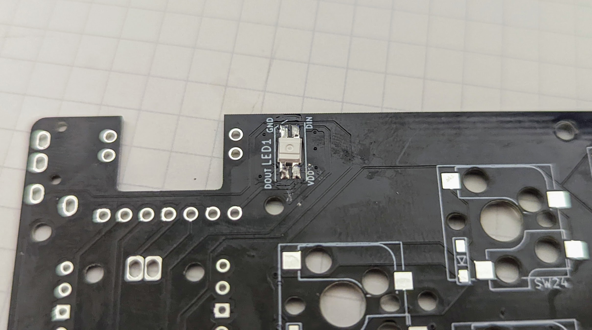
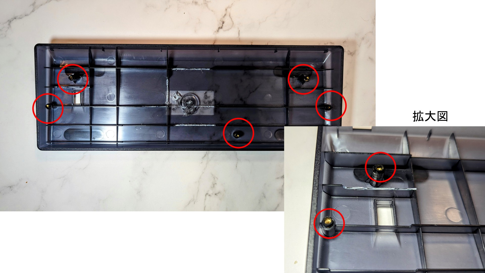

# SparrowDial Keyboard Kit Build Guide

このビルドガイドには他のキーボードの写真が含まれていますのでご注意ください。

また、作成中に疑問点等質問がありましたら、74th（Twitter(X): [@74th](https://twitter.com/74th)、email:`site@74th.tech`、本リポジトリのissue）まで問い合わせください。

## 販売先

- booth(準備中)

## SparrowDial の注意点

- マイコンRP2040が直接PCBに実装されています。
- GH60互換キーボードケース対応のPCBですが、必ずしもすべてのケースに対応するわけではありません。
- キットのPCBにはRP2040を動作させるためのマイコン及び受動部品が実装されています。

## キットの内容

### キーボード PCB

- SparrowDial PCB x1
- ダイオード 1N4148W x56
- RGBLED SK6812-MINI-E x1
- 表面実装 Grove(HY2.0) コネクタ（アイボリー色） x2

### M5Stack Core2 PortA 底面引き出しモジュール

- M5Stack Core2 ProtA 底面引き出し PCB x1
- スルーホール Grove(HY2.0) コネクタ（白色） x1
- 表面実装 2x15P ピンヘッダ x1

### ケーブル

- Grove(HY2.0) 互換 ケーブル 10cm x1
- Grove(HY2.0) - USB-C Daughter ケーブル 10cm x1

### ケース組み込み部品

- SparrowDial Top Plate (FR4 PCB) x1
- M2 2mm スペーサー x6 : ケースとPCBの間のスペーサー
- M2 6mm 黒 平ネジ x5 : ケースとPCBの間のネジ止め（M5Dialを使う場合）
- M2 4mm 黒 平ネジ x5 : ケースとPCBの間のネジ止め（M5Stack Core2を使う場合）
- M3 10mm 鍋ネジ x2 : M5StackCore2とトッププレートのネジ止め
- M3 15mm 鍋ネジ x2 : M5StackCore2とトッププレートのネジ止め

## PCB に実装済みの部品

- マイコン RP2040 x1
- マイコンプログラム用フラッシュ W25Q32JVS x1
- RP2040 の動作に必要な受動部品（コンデンサ、抵抗、水晶発振器）
- 6x6mm SMD タクタイルスイッチ（RP2040 RESET、BOOTSEL用） x2
- 電源保護用理想ダイオード CH213K x1
- USB Type-C コネクタ x1

## キットの組み立てに必要なもの

### キットの他に必要なもの

- GH60互換キーボードケース x1
- MX互換スイッチソケット x56
- MX互換スイッチ x56
- MX互換スイッチ用キーキャップ一式 x1
- PC接続用USBType-Cケーブル x1
- Trackpad用M5Stackどちらか
  - M5Stack Core2 x1
  - M5Stack Dial x1

### 組み立てに必要な機材

- はんだごて、はんだ
- ニッパ（キーボードケースの加工用）
- ピンセット（表面実装部品を抑えるのに利用します）
- PC（Windows、Linux、MacOS の動作するもの。ファームウェアの作成に必要）

### あるとよいもの

- フラックス
  - はんだにはフラックスが含まれていて、端子に広がるようにできていますが、熱を加えすぎるとすべてのフラックスが蒸発します。その場合、追加のフラックスを入れて使います
- フラックス洗浄液（はんだや、フラックスが無洗浄タイプでない場合）
- ルーペ（スマートフォンカメラでも代用できます）
- ラジオペンチ（ネジ止めの他、スイッチの足が曲がってしまった場合に、つまんで伸ばします）

## how to build / 作成方法

このキーボードには、RP2040の動作に必要な部品は既に実装されています。

### M5StackCore2 PortA 底面引き出しモジュールの組み立て

M5StackCore2を利用する場合、モジュールを組み立てます。

JP1ジャンパがありますが、ここは真ん中とBATをショートさせます。


次に表面実装2x15Pピンヘッドを実装します。スルーホールと異なり、はんだがピンヘッダにのみに回り、PCBのランドに届いていないことがあります。ランドまで加熱するようにしてください。ピンヘッダはずれやすいため、対角端の1ピンずつを先に実装して位置合わせの上、残りを実装すると良いでしょう。

Grove(HY2.0)コネクタを実装します。このコネクタは、PortAの記述がある面に実装します。


### ケースの加工

遊舎工房や、TalpKeyboard で販売されているプラスチック GH60互換ケースでは、干渉が発生するためケースの加工が必要です。

#### M5StackCore2 を使う場合

写真の印の部分の仕切りをニッパで切り取ります。記しのネジ穴の支えのプラスチックがわずかに干渉するため、右側のみを2mmほど削ります。


#### M5Dial を使う場合


まず、写真のネジ止め部分を、ニッパで切り取ります。


次に、写真の印の部分の仕切りをニッパで切り取ります。

#### M5Dial がどうしても収まらないとき

コードの整理などでぎりぎり収まりますが、収まらないときは、はんだごてで、写真の箇所のプラスチックを溶かし、空間を広げます。


主に障害になるのは、M5Dial の底部の下の方です。

### Solder Diodes / ダイオードのはんだ付け

Solder the diode, paying attention to the orientation of the diode.
🇯🇵 ダイオードを向きを気をつけて、はんだ付けします。


The video by @Salicylic_acid3 is very good, so I think you can check here.
🇯🇵 実装手順については、サリチル酸さんのツイートの動画が非常に良くできているため、こちらを確認いただくと良いと思います。

https://twitter.com/Salicylic_acid3/status/1296494976319315970
https://twitter.com/Salicylic_acid3/status/1108798243142434816

Solder one side of the PCB first.
🇯🇵 先に PCB の片側にはんだをつけます。


Melt the solder you have applied and solder one side of the diode.
🇯🇵 つけたハンダを溶かして、ダイオードを片側をはんだ付けします。


First, solder all the diodes **only one side**.
Once one side is soldered, check that all diodes are facing the same way.
🇯🇵 まず、すべてのダイオードを**片側だけ**はんだ付けをしましょう。
片側のはんだ付けが済んだところで、一度すべてのダイオードが同じ向きを向いているか確認します。


Once you have checked and it is ok, solder the other leg as well.
🇯🇵 確認が済んで大丈夫であれば、反対側の足もはんだ付けします。


### Soldering switch sockets / スイッチソケットを実装する

We recommend soldering the socket as shown in the video. With the latest Kailh switch sockets, it is no longer possible to insert the soldering iron from the top, but you should still insert it from the open side.
🇯🇵 ソケットのはんだ付けは動画のようにすることをおすすめしています。最新のKailh社製スイッチソケットでは、上面からはんだごてを差し込むことはできなくなりましたが、それでも横の空いている面からはんだごてを差し込む様にします。

[Movie（Google Drive）](https://drive.google.com/file/d/1VQYtKHCZkTQwoi6JiOMwTrHwYhy1caux/view?usp=sharing)

[Movie（Twitter）](https://twitter.com/74th/status/1514942328900775938)

[Movie file switch_socket.mp4](./img/v2/switch_socket.mp4)

1. Set the socket in the correct orientation.
2. Apply heat with a soldering iron from the inside of the socket's terminals.
3. From the outside of the socket, apply solder with the soldering iron and pour the solder into the socket.
4. Remove the solder and hold the socket with tweezers.
5. remove the soldering iron

🇯🇵

1. ソケットを正しい方向にセットします。
2. ソケットの端子の内側から、はんだごてで熱を加えます
3. ソケットの外側から、はんだごてを当ててはんだを流し込みます
4. はんだを外してから、ピンセットなどでソケットを抑えます
5. はんだごてを抜きます

### RGBLED ライトを実装する

RGBLED SK6812MINI-E の方向を注意してください。

RGBLED の実装は、PCB 裏面に裏向きにセットして実装します。
PCB 表向きから見ると、発光面が見える形になります。

また、LED の 4 本の足の 1 つ GND には切れ込みが入っています。切れ込みとシルクの斜め線を合わせるようにしてください。


向きを確認できたら、一方の足をマスキングテープで留めます。


すべての足を実装します。



### Soldering Grove(HY2.0) sockets / Grove(HY2.0) ソケットの実装

2箇所あるGrove(HY2.0)ソケットを実装します。

まず、1本のピンのみを実装し、はんだごてを更にあてながらPCBのシルクの位置になるように調整します。その後、残りのピンも実装します。ケーブルを差し込む面にも下部に固定用の金属部分があるため、こちらも忘れずに実装します。


### M5StackCore2、M5Dialへのファームウェアの書き込み

ファームウェアは以下の方法でマイコンにアップロードできます。

- 1. WebHIDを用いる [Sparrow Series Keyboards ESP32 Upload tool https://74th.github.io/sparrow62-buildguide/](https://74th.github.io/sparrow62-buildguide/) にて、ファームウェアをアップロードする
- 2. [esptool](https://github.com/espressif/esptool/)、[espflash](https://github.com/esp-rs/espflash)等ファームウェアアップロードツールを用いる
- 3. PlatformIOを用いて自前でビルドして書き込む

[Sparrow Series Keyboards ESP32 Upload tool](https://74th.github.io/sparrow62-buildguide/)を用いる場合、特にツールのインストールがなく手軽に行うことができます。
既に[esptool](https://github.com/espressif/esptool/)、[espflash](https://github.com/esp-rs/espflash)を導入しているのであれば、そのツール経由の方が煩雑ではないかもしれません。
このファームウェアはPlatformIO（VS Codeを用いた汎用ファームウェア開発環境）を用いて、Arduinoフレームワークで開発するようになっております。M5Dial Simple Pointer FirmwareにはWiFi経由でアップロードする方法もあり、それを利用する場合にはWiFiのSSIDとパスワードを追加する必要があるため、自前でのビルドが必要になります。

M5StackCore2、M5DialはUSBで接続します。M5Dialについてはケースに組み込む前にファームウェアをアップロードする必要があります。

#### Sparrow Series Keyboards ESP32 Upload tool

Chromeブラウザを用いて、以下のサイトを開いてください。

https://74th.github.io/sparrow62-buildguide/

M5StackCore2を用いる場合「M5StackCore2 Simple Pointer」の下の「CONNECT」ボタンを、M5Dialを用いる場合「M5Dial Simple Pointer」の下の「CONNECT」ボタンを押してください。

すると、接続するUSBを選択するポップアップが表示されます。ここで、「USB JTAG/serial debug unit」など、デバイスのUSBを選択し「CONNECT」ボタンを押してください。どれがデバイスのUSBかわからない場合、このポップアップの表示中にUSBを抜き差しすると、登場するUSBデバイスがそれであるとわかります。

選択した後に「Device Dashboard」というウィンドウが表示されるため、「INSTALL <ファームウェア名>」のボタン（文字）を押します。「Confirm Installation」というウィンドウが続けて表示されるため「INSTALL」ボタンを押します。すると、ファームウェアがインストールされます。完了すると「Installation complete!」の表示になります。

インストール後にデバイスは自動で再起動し、画面上に「no I2C Connection」と表示されていれば正常です。

#### esptool、espflashを用いる場合

esptool、espflashを用いる場合、ファームウェアを以下のGitHubリポジトリのReleaseから、最新の m5stackcore2-simple-pointer.bin、m5dial-simple-pointer.bin ダウンロードして利用ください。

https://github.com/74th/m5-trackpad-module/releases

コマンドが二つかかれていますが、両方行う必要はありません。どちらかのツールを利用ください。実行ファイル一つの[espflash](https://github.com/esp-rs/espflash)の方が手軽に思われます。

```
# M5StackCore2
esptool.py --chip esp32 write_flash -z 0 m5stackcore2-simple-pointer.bin
espflash write-bin 0 m5stackcore2-simple-pointer.bin

# M5Dial
esptool.py --chip esp32s3 write_flash -z 0 m5dial-simple-pointer.bin
espflash write-bin 0 m5dial-simple-pointer.bin
```

#### 自前でビルドして書き込む

PlatformIO等の使い方についてはご自身で調査の上利用ください。

まず、以下のリポジトリをチェックアウトします。

https://github.com/74th/m5-trackpad-module

それぞれのディレクトリをワークスペースフォルダーにするようにVS Codeを起動します。

- M5StackCore2: m5stackcore2-simple-pointer ディレクトリ
- M5Dial: m5dial-simple-pointer ディレクトリ

VS Codeに拡張機能[PlatformIO IDE](https://marketplace.visualstudio.com/items?itemName=platformio.platformio-ide)をインストールします。

M5Dialの場合には、src/ssid.h.templateをsrc/ssid.hとして複製し、コード内のSSIDとパスワードを更新します。

VS Code上でコマンド「PlatformIO: Upload」を実行すると、USB経由でアップロードすることができます。

M5Dial Simple Pointer Firmwareについては、WiFi経由でファームウェアをアップロードする機能があります。これは、ボタン（上面のオレンジ色のリングのM5と書かれた部分）を押しながら電源入れることで、WiFiへ接続し、ファームウェアのアップロードを受け付けるモードになります。WiFiへの接続に成功すると、画面上にIPアドレスが書き込まれます。この状態で、PlatformIOの設定ファイル`platfomio.ini`の最下部に以下の記述を追加すると、コマンド「PlatformIO: Upload」を行うと、書き込めるようになります。なお、`image=@`のパスの記述はMacOS、Linuxの場合の記述例になります。Windowsでは適宜変更を行ってください。

```ini
# platformio.ini

upload_protocol = custom
upload_command = curl -F "image=@.pio/build/m5dial/firmware.bin" 192.168.1.100/update
```

### ケースへの組み込みの前の実装確認

ケースへの組み込むと、はんだ実装に不具合があっても、キーキャップ、スイッチ、ネジなどのすべてを外さないとPCBの実装面にはアクセスできません。なるべく、ケースに組み込む前に、一度はんだ実装不良がないか確認すると良いでしょう。

#### M5StackCore2を使う場合

M5StackCore2のM-Bus PCB（底面のCore2と書かれた白いPCB）を外します。このPCBには、ピンヘッダとピンソケットで本体PCBに接続されており、垂直に抜く必要があります。


M5StackCore2の底面の4つのネジを外し、ボトムケースを取り外します。ボトムケース部分には、バッテリーが搭載されており、本体PCBとソケットとケーブルで接続されています。このソケットを外して下さい。


M-BusにM5StackCore2 PortA 底面引き出しモジュールを写真の向きで接続します。


なお、必ずバッテリーを外した状態で行ってください。

M5StackCore2 PortA底面引き出しモジュールのGroveソケットと、SparrowDial PCBのI2C Groveと書かれたGroveソケットを、HY2.0(Grove)ケーブルで接続してください。

#### M5Dialを使う場合

M5Dialの裏面のPortAのGroveソケット（赤色）と、SparrowDial PCBのI2C Groveと書かれたGroveソケットを、HY2.0(Grove)ケーブルで接続してください。

M5DialのUSBと、SparrowDial PCBのPower Groveと書かれたGroveソケットを、Grove USBドーターケーブルで接続してください。

#### 動作の確認

PCBをUSBに接続します。出荷時点でキーボードとして動作するファームウェアが書き込まれています。

M5StackCore2、M5Dialにno I2C Connectionと書かれている場合、I2C通信に失敗していることがあります。ソケットの実装を見直してください。また、ファームウェア書き込み後にもこの表示が消えない場合には、一度USBを抜き差しして電源を入れ直してみてください（USBの抜き差しで、RP2040とM5StackCore2/M5Dialの両方の再起動を同じタイミングで行えます）。

M5StackCore2/M5Dialを操作し、マウスカーソルが動作することを確認してください。

各キーが動作することをRemapのTest Matrix modeを使って確認して下さい。

> RemapのTest Matrix modeを使ったキーマトリックスのテスト方法
>
> [./remap_test_matrix_mode.md](./remap_test_matrix_mode.md)

### ケースへの組み込み

ケースへの組み込みは以下の手順で行います。

1. ケース底面の加工（まだの場合）
2. SparrowDial PCBへHY2.0(Grove)ケーブルを接続
3. （M5Dialを用いる場合のみ）ケース底面のネジ穴に対して、2mm中空スペーサーを置く
4. SparrowDial PCBをケースに配置する
5. SparrowDial PCBとケースのネジ止め
6. SparrowDial Top PlateへのM5StackCore2、M5Dialの組み込み
7. SparrowDial Top Plateを重ねる
8. スイッチの差し込み
9. キーの動作テスト
10. キーキャップの差し込み

#### 1. ケース底面の加工（まだの場合）

前述のケース底面の加工を行ってください。

#### 2. SparrowDial PCBへGroveケーブルを接続

HY2.0(Grove)ケーブルをSparrowDial PCBのI2C Groveポートに接続してください。

M5Dialを用いる場合、追加でGrove USBドーターケーブルをSparrowDial PCBのPower Groveポートに接続してください。

コードの先端を、SparrowDial PCBの中央の円形ホールを通すようにしてください。


#### 3. （M5Dialを用いる場合のみ）ケース底面のネジ穴に対して、2mm中空スペーサーを置く

ケース底面の、各ネジ穴のところに、M2 2mm中空スペーサーを置きます。



#### 4. SparrowDial PCBをケースに配置する

SparrowDial PCBを載せます。

M5Dialを用いる場合、ケースの上の中空スペーサーを落とさないように気をつけてください。

M5StackCore2を用いる場合、若干ダイオードがケースに干渉しますが、少しPCBをずらすと干渉を避けて、ケースのネジ穴に密着させることができます。


#### 5. SparrowDial PCBとケースのネジ止め

利用するモジュールによって使用するネジが異なります。

- M5StackCore2を使う場合: M2 4mmネジ
- M5Dialを使う場合: M2 6mmネジ

付属のネジを用いて、5箇所を留めます。M5Dialを用いる場合、中空スペーサーを落とさない様にしてください。


#### 6. SparrowDial Top PlateへのM5StackCore2、M5Dialの組み込み

SparrowDial Top Plateは、SparrowDialの名前が入っている方が、上面になります。上面がタッチパネルになるように取り付けます。

##### 6.1. M5StackCore2を用いる場合

M5StackCore2のタッチボタンが左側になるように、Top Plateの裏面からM3ネジで留めます。


なお、必ずバッテリーを外した状態で行ってください。

M5StackCore2 PortA底面引き出しモジュールのGroveソケットと、SparrowDial PCBのI2C Groveと書かれたGroveソケットを、HY2.0(Grove)ケーブルで接続してください。

##### 6.2. M5Dialを用いる場合

M5Dialの、オレンジ色の大きなナット部品を使って、Top Plateを挟み込むように固定します。この時、上面のM5の文字が下になるようにしてください。


M5DialのPortA Groveソケット（赤茶色）に、SparrowDial PCBのI2C Groveと接続されたHY2.0ケーブルを接続します。


M5DialのUSBソケットに、SparrowDial PCBのPower Groveと接続されたGrove USBドーターケーブルを接続します。USB-Cドーターケーブルは壊れやすいため、気をつけてください。もし、USB-CドーターケーブルのUSB-Cコネクタからケーブルが外れてしまった場合には、ケーブルの皮むきを行い、以下のVCCとGNDのみ接続してください。


M5Dialは垂直には、USBの部分が邪魔して入りません。USBドーターケーブルのUSBコネクタがPCBの下に入るようにななめに差し込んでください。M5Dialはかなりギリギリの所で格納されます。ケーブルをM5Dialのケースの接触部分に当たらないようにしてください。わりと、スイッチをはめていく段階で収まったりします。

どうしてもM5Dialが収まらない場合、はんだごてを用いてケースの接触部分のプラスチックを溶かすなどして、空間を作って見てください。

#### 7. SparrowDial Top Plateを重ねる

SparrowDial Top Plateを、ケースに重ねます。SparrowDialは、PCBとTop Plate間の固定はスイッチのみで行うため、この時点では固定されません。


#### 8. スイッチの差し込み

SparrowDial Top Plateの穴から、SparrowDial PCBに向かってスイッチを差し込みます。MX互換スイッチには、Top Plateを挟み込む溝が付いています。この溝にTop Plateが挟まれるようにTop Plateを持ち上げてください。

SparrowDialのキーはGH60互換ケースを使う都合、以下のキーが異なる向きを向いています。差し込むときに気をつけてください。


この時、M5Dial、M5StackCore2のまわりのスイッチと、左右外側のスイッチから、順に固定していくと、高さをキープしやすくなります。


M5Dialは結構干渉し、十分に刺さらない場合があります。その場合、M5Dialのケーブルが干渉していないか確認して、ケーブルをずらしたり、前述の「M5Dial がどうしても収まらないとき」の対策を行ってみてください。

#### 9. キーの動作テスト

USBをPCに接続し、すべてのキーが動作するかを確認します。詳細は前述の「ケースへの組み込み前の実装確認」を確認ください。

動作しないキーがある場合、一度すべてをケースから取り外し、該当キーのダイオードとスイッチソケットの実装をやり直します。

#### 10. キーキャップの差し込み

すべてのキーが動作することを確認できたならば、キーキャップを付けて完成です！

## トラックパッドモジュールの操作方法

### M5StackCore2の場合

以下の操作となっております。

- スライド：ポインタ移動
- タップ：左クリック
- 2本指タップ：右クリック
- 2本指垂直スライド：ホイール
- 左下のエリアのタップ：左クリック

詳しくは、以下の動画を確認ください。

https://www.youtube.com/watch?v=8jPP54jqswg

なかなか2本指タップの反応が難しいです。指を離したり、垂直方向ではなく水平方向に指が並ぶようにしたりすると反応します。

その場合には、キーに左クリック、右クリックを設定してみてください。また、ユーザキー0`SCROLL`（REMAP上の`USER 0`）には押下中のスライドでスクロールする機能が含まれています。初期ファームウェアでは有効になっていませんが、試してみてください。

### M5Dialの場合

以下の操作となっております。

- スライド：ポインタ移動
- タップ：左クリック
- ボタン：右クリック
- 指がタッチパネルに接触中にボタン（M5と書かれた部分）：左クリック
- ロータリーエンコーダ：ホイール

指がタッチパネルに接触中にボタンを押してその状態でスライドすることで、ドラッグを実現するように設計しています。しかし、操作が若干難しいです。

その場合には、ーに左クリックを設定してみてください。

## キーマップの変更、RP2040ファームウェアの更新

キーマップの変更には、2種類の方法があります。

- VIA、Remapを用いる
- QMK Firmwareでファームウェアをビルドする
- RP2040に対応したファームウェアを作成する

始めからVIA、Remap用のファームウェアが書き込まれた状態になっています。Remapを用いる場合には特にこの工程をする必要はありません。

VIA、Remapを利用しない利用しない場合は、別途ファームウェアを用意してください。RP2040はBOOTSELボタンを押しながらRESETを行うと、USBマスストレージデバイスがPCに認識され、その中にuf2ファイルをドラッグドロップすることで、ファームウェアを書き込むことができます。

### VIA、Remapを利用する場合

VIA、RemapはWebサイトや、ツール上からキーマップの書き換えができるサイトです。VIA対応のファームウェアをRP2040にアップロードすると、利用できるようになります。最初からRemap用のファームウェアが書き込まれた状態で出荷しています。

- Remap https://remap-keys.app/
- VIA https://caniusevia.com/

ファームウェアは以下からダウンロードできます。

- VIA、Remap 用ファームウェア [firmware/sparrowdial_via.uf2](https://github.com/74th/sparrow62-buildguide/raw/master/firmware/sparrowdial_via.uf2)

書き込みを行う領域の都合上、新たにVIA、REMAPのファームウェアをインストールしても、以前変更したキーマップの変更が残っている場合があります。その時には、[公式サイトのResetting Flash memory](https://www.raspberrypi.com/documentation/microcontrollers/raspberry-pi-pico.html#resetting-flash-memory)にあるUF2ファイル(flash_nuke.uf2)を一度インストールして、FLASHの全消去を行ってください。

### QMK Firmwareでファームウェアをビルドする場合

現在、SparrowDialキーボードはQMK Firmwareの本体には取り込まれていません。下記リポジトリに作成したファームウェアのコードがあります。

https://github.com/74th/qmk_firmware_sparrow_keyboard

QMK Firmwareの環境のセットアップについては[公式のドキュメント https://docs.qmk.fm/#/newbs_getting_started](https://docs.qmk.fm/#/newbs_getting_started)を確認ください。[日本語のドキュメント https://docs.qmk.fm/#/ja/newbs_getting_started](https://docs.qmk.fm/#/ja/newbs_getting_started)もあります

まず、リポジトリをチェックアウトしてください。QMK Firmwareのフォークとなっているため、QMK Firmwareのセットアップでチェックアウトされたgitリポジトリのremoteとして登録できます。

```sh
cd ~/qmk_firmware
git remote add sparrow https://github.com/74th/qmk_firmware_sparrow_keyboard.git
git fetch sparrow
git checkout sparrow
```

このリポジトリ上では、キーボード名`sparrowdial`として登録されています。新しいキーマップを作成するには以下を実行します。

```
qmk new-keymap -kb sparrowdial -km <keymap_name>
```

`~/qmk_firmware/keyboards/sparrowdial/keymaps/<keymap_name>`というフォルダに作成されるため、キーマップを作成します。

キーマップ作成後は、以下のコマンドでコンパイルします。

```
qmk compile -kb sparrowdial -km <keymap_name>
```

すると、`~/qmk_firmware/.build/sparrowdial_<keymap_name>.uf2`にビルドされるため、これをRP2040に書き込みます。

## トラブルシューティング

こちらのページを確認ください。

> Trouble Shooting Guide
>
> [./trouble_shooting_guide.md](./trouble_shooting_guide.md)

## Data Sheet

- [SparrowDial v1.1.0 Semantics](datasheets/SparrowDial-v1.1.0-semantics.pdf)
- [SparrowDial v1.1.0 PCB](datasheets/SparrowDial-v1.1.0-pcb.pdf)
