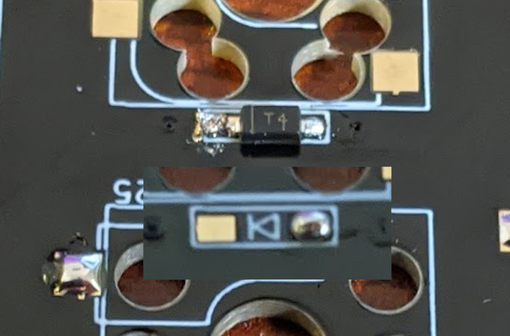

# SparrowDial Keyboard Kit Build Guide

このビルドガイドには他のキーボードの写真が含まれていますのでご注意ください。

また、作成中に疑問点等質問がありましたら、74th （twitter: [@74th](https://twitter.com/74th) 、email: site@74th.tech 、 本リポジトリの issue）まで問い合わせください。

## 販売先

- booth(準備中)

## SparrowDial の注意点

- マイコン RP2040 が直接 PCB に実装されています。
- GH60 互換キーボードケース対応の PCB ですが、必ずしもすべてのケースに対応するわけではありません。
- キットの PCB には RP2040 を動作させるためのマイコン及び受動部品が実装されています。

## キットの内容

### キーボード PCB

- SparrowDial PCB x1
- ダイオード 1N4148W x56
- RGBLED SK6812-MINI-E x1
- 表面実装 Grove(HY2.0) コネクタ（アイボリー色） x2

### M5Stack Core2 PortA 底面引き出しモジュール

- M5Stack Core2 ProtA 底面引き出し PCB x1
- スルーホール Grove(HY2.0) コネクタ（白色） x1
- 表面実装 2x15P ピンヘッダ x1

### ケーブル

- Grove(HY2.0) 互換 ケーブル 10cm x1
- Grove(HY2.0) - USB-C Daughter ケーブル 10cm x1

### ケース組み込み部品

- SparrowDial Top Plate (FR4 PCB) x1
- M2 2mm スペーサー x6 : ケースと PCB の間のスペーサー
- M2 6mm 黒 平ネジ x6 : ケースと PCB の間のネジ止め

## PCB に実装済みの部品

- マイコン RP2040 x1
- マイコンプログラム用フラッシュ W25Q32JVS x1
- RP2040 の動作に必要な受動部品（コンデンサ、抵抗、水晶発振器）
- 電源保護用理想ダイオード CH213K x1
- USB Type-C コネクタ x1

## キットの組み立てに必要なもの

### キットの他に必要なもの

- GH60 互換キーボードケース x1
- MX 互換スイッチソケット x56
- MX 互換スイッチ x56
- MX 互換スイッチ用キーキャップ一式 x1
- PC 接続用 USB Type-C ケーブル x1
- Trackpad 用 M5Stack どちらか
  - M5Stack Core2 x1
  - M5Stack Dial x1

### 組み立てに必要な機材

- はんだごて、はんだ
- ニッパ（キーボードケースの加工用）
- ピンセット（表面実装部品を抑えるのに利用します）
- PC（Windows、Linux、MacOS の動作するもの。ファームウェアの作成に必要）

### あるとよいもの

- フラックス
  - はんだにはフラックスが含まれていて、端子に広がるようにできていますが、熱を加えすぎるとすべてのフラックスが蒸発します。その場合、追加のフラックスを入れて使います
- フラックス洗浄液
- ルーペ（スマートフォンカメラでも代用できます）
- ラジオペンチ（ネジ止めの他、スイッチの足が曲がってしまった場合に、つまんで伸ばします）

## how to build / 作成方法

このキーボードには、RP2040 の動作に必要な部品は既に実装されています。

### M5Stack Core2 PortA 底面引き出しモジュール の組み立て

M5StackCore2 を利用する場合、モジュールを組み立てます。

JP1 ジャンパがありますが、ここは真ん中と BAT をショートさせます。

次に表面実装 2x15P ピンヘッドを実装します。スルーホールと異なり、はんだがピンヘッダにのみに回り、PCB のランドに届いていないことがあります。ランドまで加熱するようにしてください。ピンヘッダはずれやすいため、対角端の 1 ピンずつを先に実装して位置合わせの上、残りを実装すると良いでしょう。

Grove(HY2.0)コネクタを実装します。このコネクタは、PortA の記述がある面に実装します。

### ケースの加工

遊舎工房や、TalpKeyboard で販売されているプラスチック GH60 互換ケースでは、干渉が発生するためケースの加工が必要です。

#### 共通

TODO: 写真

写真の印の部分の仕切りをニッパで切り取ります。

#### M5Dial 使用時のみ

TODO: 写真

まず、写真のネジ止め部分を、ニッパで切り取ります。

TODO: 写真

次に、写真の印の部分の仕切りをニッパで切り取ります。

#### M5Dial がどうしても収まらないとき

コードの整理などでぎりぎり収まりますが、収まらないときは、はんだごてで、写真の箇所のプラスチックを溶かし、空間を広げます。

TODO: 写真

主に障害になるのは、M5Dial の底部の下の方です。

### Solder Diodes / ダイオードのはんだ付け

Solder the diode, paying attention to the orientation of the diode.
🇯🇵 ダイオードを向きを気をつけて、はんだ付けします。

The video by @Salicylic_acid3 is very good, so I think you can check here.
🇯🇵 実装手順については、サリチル酸さんのツイートの動画が非常に良くできているため、こちらを確認いただくと良いと思います。

https://twitter.com/Salicylic_acid3/status/1296494976319315970
https://twitter.com/Salicylic_acid3/status/1108798243142434816

Solder one side of the PCB first.
🇯🇵 先に PCB の片側にはんだをつけます。

Melt the solder you have applied and solder one side of the diode.
🇯🇵 つけたハンダを溶かして、ダイオードを片側をはんだ付けします。

First, solder all the diodes **only one side**.
Once one side is soldered, check that all diodes are facing the same way.
🇯🇵 まず、すべてのダイオードを**片側だけ**はんだ付けをしましょう。
片側のはんだ付けが済んだところで、一度すべてのダイオードが同じ向きを向いているか確認します。

Once you have checked and it is ok, solder the other leg as well.
🇯🇵 確認が済んで大丈夫であれば、反対側の足もはんだ付けします。

### Soldering switch sockets / スイッチソケットを実装する

We recommend soldering the socket as shown in the video. With the latest Kailh switch sockets, it is no longer possible to insert the soldering iron from the top, but you should still insert it from the open side.
🇯🇵 ソケットのはんだ付けは動画のようにすることをおすすめしています。最新の Kailh 社製スイッチソケットでは、上面からはんだごてを差し込むことはできなくなりましたが、それでも横の空いている面からはんだごてを差し込む様にします。

[Movie（Google Drive）](https://drive.google.com/file/d/1VQYtKHCZkTQwoi6JiOMwTrHwYhy1caux/view?usp=sharing)

[Movie（Twitter）](https://twitter.com/74th/status/1514942328900775938)

[Movie file switch_socket.mp4](./img/v2/switch_socket.mp4)

1. Set the socket in the correct orientation.
2. Apply heat with a soldering iron from the inside of the socket's terminals.
3. From the outside of the socket, apply solder with the soldering iron and pour the solder into the socket.
4. Remove the solder and hold the socket with tweezers.
5. remove the soldering iron

🇯🇵

1. ソケットを正しい方向にセットします。
2. ソケットの端子の内側から、はんだごてで熱を加えます
3. ソケットの外側から、はんだごてを当ててはんだを流し込みます
4. はんだを外してから、ピンセットなどでソケットを抑えます
5. はんだごてを抜きます

### Soldering Grove(HY2.0) sockets / Grove(HY2.0) ソケットの実装

2 箇所ある Grove(HY2.0) ソケットを実装します。

まず、1 本のピンのみを実装し、はんだごてを更にあてながら PCB のシルクの位置になるように調整します。その後、残りのピンも実装します。ケーブルを差し込む面にも下部に固定用の金属部分があるため、こちらも忘れずに実装します。

TODO:

### M5StackCore2、M5Dial へのファームウェアの書き込み

ファームウェアは以下の方法でマイコンにアップロードできます。

- 1. https://74th.github.com/sparrow62-buildguide/firmware/index.html にて、ファームウェアをアップロードする
- 2.

M5StackCore2、M5Dial は USB で接続します。

TODO:

### SparrowDial PCB 上の RP2040 へのファームウェアの書き込み

始めから VIA、Remap 用のファームウェアが書き込まれた状態になっています。VIA、Remap を利用しない利用しない

#### VIA、Remap を利用する場合

VIA、Remap は Web サイトや、ツール上からキーマップの書き換えができるサイトです。VIA 対応のファームウェアを RP2040 にアップロードすると、利用できるようになります。

- Remap https://remap-keys.app/
- VIA https://caniusevia.com/

ファームウェアは以下からダウンロードできます。

- VIA、Remap 用ファームウェア [firmware/sparrowdial_via.uf2](https://github.com/74th/sparrow62-buildguide/raw/master/firmware/sparrowdial_via.uf2)

左下の BOOTSEL ボタンを押しながら、RESET ボタンを押します。すると PC に USB ドライブが認識します。USB ドライブ上 RP2040 ではこれで USB ドライブ経由でファームウェアをアップロードすることができます。

#### QMK Firmware でファームウェアをビルドする場合

## 追加で加工すると良いこと
