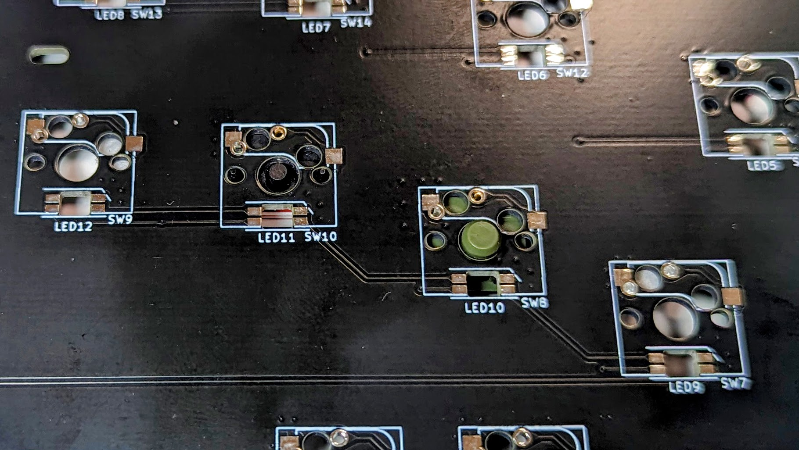
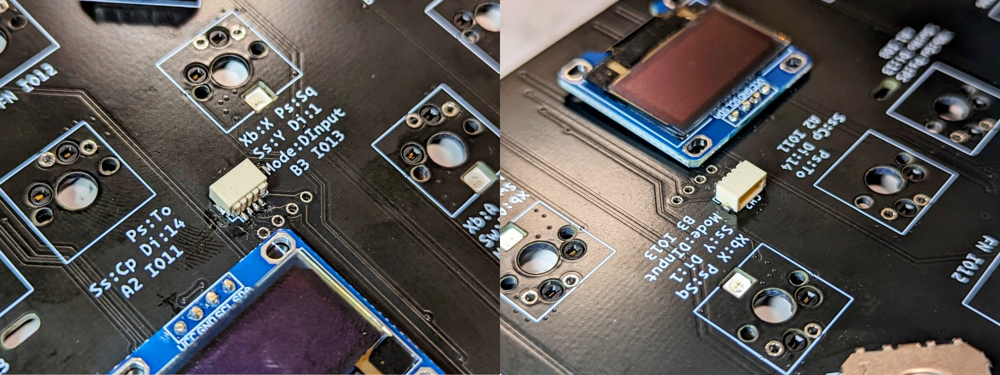
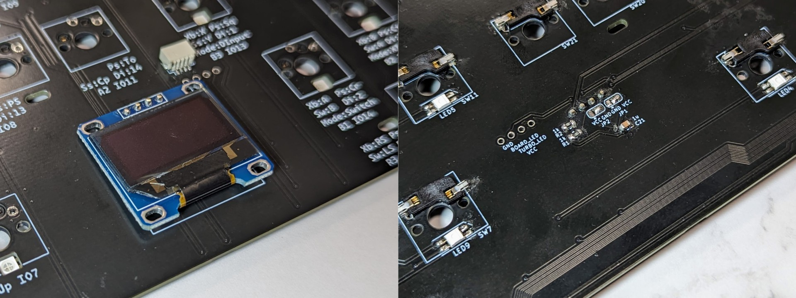
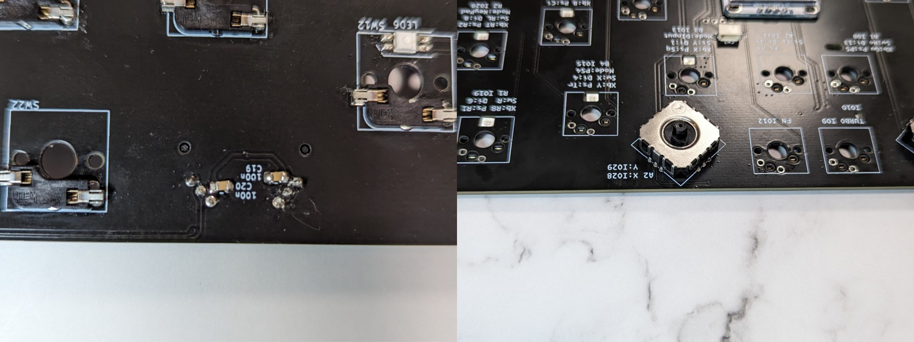
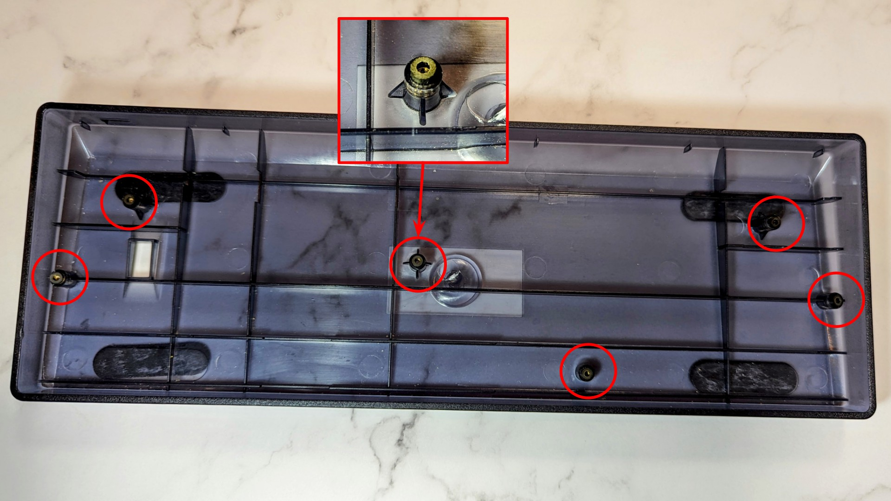
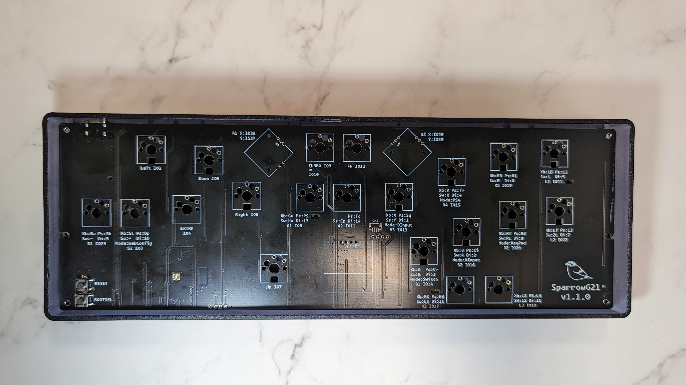
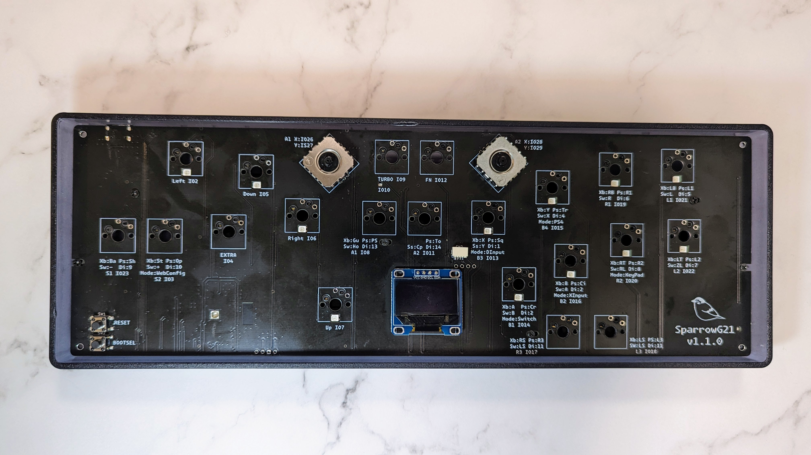
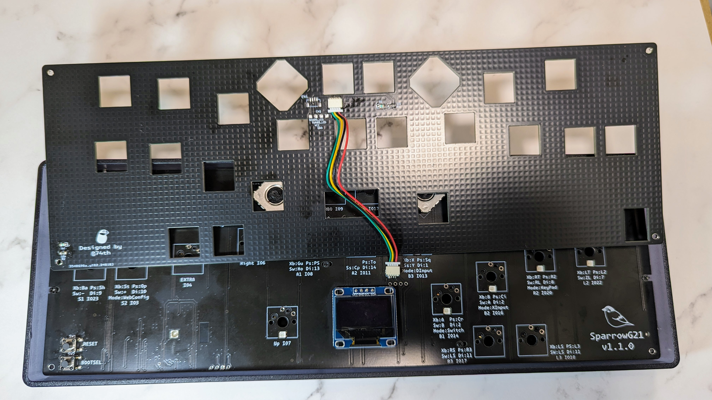
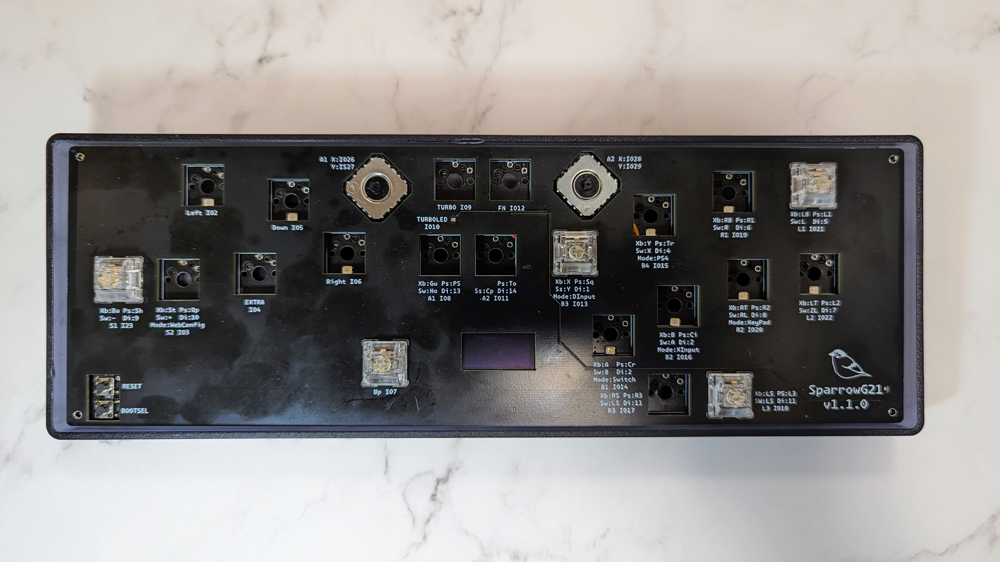

# SparrowG21 Build Guide

このビルドガイドには他のキーボードの写真が含まれていますのでご注意ください。

また、作成中に疑問点等質問がありましたら、74th （twitter: [@74th](https://twitter.com/74th) 、email: site@74th.tech 、 本リポジトリの issue）まで問い合わせください。

## 販売先

- booth(準備中)

## Sparrow60C の注意点

- マイコン RP2040 が直接 PCB に実装されています。
- GH60 互換キーボードケース対応の PCB ですが、必ずしもすべてのケースに対応するわけではありません。
- キットの PCB には RP2040 を動作させるためのマイコン及び受動部品が実装されています。

## キットの内容

- SparrowG21 PCB x1
- SparrowG21 Top Plate (FR4 PCB) x1
- OLED x1
- ジョイスティックモジュール B10K x2
- SH1.0-4P(Qwiic) ケーブル x1
- SH1.0-4P(Qwiic) SMD ソケット x1
- RGBLED SK6812-MINI-E x12
- M2 2mm スペーサー x6 : ケースとPCBの間の距離調整
- M2 6mm 黒 平ネジ x6 : ケースとPCBの間のネジ止め

### PCBに実装済みの部品

- マイコン RP2040 x1
- マイコンプログラム用フラッシュ W25Q32JVS x1
- RP2040 の動作に必要な受動部品（コンデンサ、抵抗、水晶発振器）
- 6x6mm SMD タクタイルスイッチ（RP2040 RESET、BOOTSEL用） x2
- 電源保護用理想ダイオード CH213K x1
- 0805 SMD 青色LED x2
- USB Type-C コネクタ x1

### トッププレートに実装済みの部品

- SH1.0-4P(Qwiic) SMD ソケット x1
- 0805 SMD 抵抗 x2
- 0805 SMD 青色LED x2

## キットの組み立てに必要なもの

### キットの他に必要なもの

本キットは、「MX互換スイッチ」もしくは「Kailh Choc v1 スイッチ/LOFREE x KAILH Full POM Low Profile スイッチ」を排他的に利用します。

#### 共通で必要なもの

- GH60 互換キーボードケース x1
- MX 互換スイッチソケット x21 （MX互換スイッチを用いる場合）
- MX 互換スイッチ x21（MX互換スイッチを用いる場合）
- MX 互換スイッチ用キーキャップ一式 x1（MX互換スイッチを用いる場合）
- PC 接続用 USB Type-C ケーブル x1

### 組み立てに必要な機材

- はんだごて、はんだこて台、スポンジ
- はんだ
- ピンセット（表面実装部品を抑えるのに利用します）
- PC（Windows、Linux、MacOS の動作するもの。ファームウェアの作成に必要。）

### あるとよいもの

- フラックス
  - はんだにはフラックスが含まれていて、端子に広がるようにできていますが、熱を加えすぎるとすべてのフラックスが蒸発します。その場合、追加のフラックスを入れて使います
- フラックス洗浄液
- ルーペ（スマートフォンカメラでも代用できます）
- ラジオペンチ（ネジ止めの他、スイッチの足が曲がってしまった場合に、つまんで伸ばします）

## how to build / 作成方法

### Soldering the switch socket / スイッチソケットを実装する

> [!CAUTION]
> MX互換キー用ソケットを取り付けた場合には、Kailh Chocスイッチを利用することはできません。Kailh Chocスイッチを利用する場合には、ソケットを実装しないでください。

We recommend soldering the socket as shown in the video.
🇯🇵 ソケットのはんだ付けは動画のようにすることをおすすめしています。

[Movie（Google Drive）](https://drive.google.com/file/d/1VQYtKHCZkTQwoi6JiOMwTrHwYhy1caux/view?usp=sharing)

[Movie（Twitter）](https://twitter.com/74th/status/1514942328900775938)

[Movie file switch_socket.mp4](./img/v2/switch_socket.mp4)

1. Set the socket in the correct orientation.
2. Apply heat with a soldering iron from the inside of the socket's terminals.
3. From the outside of the socket, apply solder with the soldering iron and pour the solder into the socket.
4. Remove the solder and hold the socket with tweezers.
5. remove the soldering iron

🇯🇵

1. ソケットを正しい方向にセットします。
2. ソケットの端子の内側から、はんだごてで熱を加えます
3. ソケットの外側から、はんだごてを当ててはんだを流し込みます
4. はんだを外してから、ピンセットなどでソケットを抑えます
5. はんだごてを抜きます

### Kailh Chocスイッチの実装

> [!CAUTION]
> Kailh Chocスイッチを取り付けた場合には、MX互換スイッチを利用することはできません。MX互換スイッチを利用する場合には、Kailh Chocスイッチを実装しないでください。

表面から、Kailh Chocスイッチを差し込み、裏面から実装します。かならず、写真のようにLEDのランドが見えている面ではんだ付けをするようにしてください。

### RGBLED の実装

RGBLED SK6812MINI-E の方向を注意してください。

RGBLED の実装は、PCB 裏面に裏向きにセットして実装します。
PCB 表向きから見ると、発光面が見える形になります。

また、RGBLED の 4 本の足の 1 つ GND には切れ込みが入っています。切れ込みとシルクの斜め線を合わせるようにしてください。

向きを確認できたら、一方の足をマスキングテープで留めます。

すべての足を実装します。

### Soldering SH1.0(Qwiic) sockets / SH1.0(Qwiic) ソケットの実装

SH1.0(Qwiic)ソケットを実装します。

まず、1本のピンのみを実装し、はんだごてを更にあてながらPCBのシルクの位置になるように調整します。その後、残りのピンも実装します。ケーブルを差し込む面にも下部に固定用の金属部分があるため、こちらも忘れずに実装します。

### OLEDの実装

OLEDにはVCCとGNDの位置の違いで、2種類あり、それに応じてジャンパを実装するようになっています。キットでは、同梱したOLEDによって、すでにジャンパがなされています。

以下の手順で実装します。

実装後は以下のようになります。

### ジョイスティックの実装

表面からスルーホールに差し込みます。まず、足を1本だけ実装し、奥まで刺さっていることを確認してから、残りの足を実装してください。足の実装後、余分な足の部分をニッパ出切り取ります。

### ケースへの組み込み

ケースへの組み込みは以下の手順で行います。Kailh Chocスイッチを使う場合、Top Plateは不要です。

1. ケース底面のネジ穴に対して、2mm中空スペーサーを置く
2. SparrowG21 PCBをケースに配置する
3. SparrowG21 PCBとケースのネジ止め
4. （MX互換スイッチを使う場合のみ）SparrowG21 Top PlateとSH1.0(Qwiic)ケーブルを接続し、ケースに配置する
5. （MX互換スイッチを使う場合のみ）スイッチの差し込み
6. キーキャップの差し込み
7. スティックキャップの差し込み

#### 1. ケース底面のネジ穴に対して、2mm中空スペーサーを置く

ケース底面の、各ネジ穴のところに、M2 2mm中空スペーサーを置きます。

#### 2. SparrowG21 PCBをケースに配置する

SparrowG21 PCBを載せます。ケースの上の中空スペーサーを落とさないように気をつけてください。

#### 3. SparrowG21 PCBとケースのネジ止め

付属のネジを用いて、M2 6mmネジで6箇所を留めます。中空スペーサーを落とさない様にしてください。

#### 4. （MX互換スイッチを使う場合のみ）SparrowG21 Top PlateとSH1.0(Qwiic)ケーブルを接続し、ケースに配置する

SparrowG21 PCBとTop PlateのSH1.0(Qwiic)ポートを、SH1.0(Qwiic)ケーブルで接続してください。

#### 5. （MX互換スイッチを使う場合のみ）スイッチの差し込み

Top Plateの穴から、PCBに向かってスイッチを差し込みます。MX互換スイッチには、Top Plateを挟み込む溝が付いています。この溝にTop Plateが挟まれるようにTop Plateを持ち上げてください。

この時、左右外側のスイッチから、順に固定していくと、高さをキープしやすくなります。

#### 6. キーキャップの差し込み

キースイッチへ、キーキャップを付けてください。

#### 7. スティックキャップの差し込み

ジョイスティックへ、キャップを付けてください。これで完成です！

### 実装後の確認

本キットのRP2040にはあらかじめGP2040-CEを書き込んでいます。

実際にキーを押して確認してください。

テスト画面の表示の仕方はWindowsであれば以下のサイトを参照してください。

> ゲームパッドとは？／動作確認方法は？／設定方法は？
>
> https://qa.elecom.co.jp/faq_detail.html?id=5432

GP2040-CEを新たにRP2040に書き込んだ場合には、SparrowG21用のキーアサインをやり直す必要があります。

### GP2040-CEのSparrowG21用の設定

本キットのRP2040にはあらかじめ設定したGP2040-CEを書き込んでいます。以下は、GP2040-CEのファームウェアを更新した場合や、設定を変更したい場合に参照してください。

GP2040にはWeb Configuratorがあります。Web Configuratorを起動するには、以下のように操作します。

- GP2040インストール直後: R3キー（IO17）を押しながらRESETを押す
- SparrowG21用の設定を適用後: S2キーを押しながらRESETを押す

その後、ブラウザにて [http://192.168.7.1](http://192.168.7.1)にアクセスすると開けます。

また、設定をリストアしたファイルは以下にあります。こちらを読み込ませても設定が完了します。

- [GP2040-ce v0.7.5 - SparrowG21 v1.1.0: gp2040ce-v0.7.5_sparrowg21.gp2040](./firmware/gp2040ce-v0.7.5_sparrowg21.gp2040)
- [GP2040-ce v0.7.7 - SparrowG21 v1.1.0: gp2040ce-v0.7.7_sparrowg21.gp2040](./firmware/gp2040ce-v0.7.7_sparrowg21.gp2040)（こちらを適用しても、Peripheral Mappingの設定が適用されないのを確認しています。Peripheral Mappingの設定は手動で行ってください）

#### IO（ピン）ごとの機能リスト

| IO       | Role                    |
| -------- | ----------------------- |
| 0        | OLED I2C0 SDA           |
| 1        | OLED I2C0 SCL           |
| 2        | HAT Left Button         |
| 3        | S2 Button               |
| 4        | Extra (重複割り当て用)  |
| 5        | HAT Down Button         |
| 6        | HAT Right Button        |
| 7        | HAT UP Button           |
| 8        | A1 Button               |
| 9        | Turbo Button            |
| 10       | Turbo LED (Active Low)  |
| 11       | A2 Button               |
| 12       | Function Button         |
| 13       | B3 Button               |
| 14       | B1 Button               |
| 15       | B4 Button               |
| 16       | B2 Button               |
| 17       | R3 Button               |
| 18       | L3 Button               |
| 19       | R1 Button               |
| 20       | R2 Button               |
| 21       | L1 Button               |
| 22       | L2 Button               |
| 23       | S1 Button               |
| 24       | RGB LED Data            |
| 25       | Board LED (Active High) |
| 26(ADC0) | Analog1 X               |
| 27(ADC1) | Analog1 Y               |
| 28(ADC2) | Analog2 X               |
| 29(ADC3) | Analog2 Y               |

#### Pin Mapping

各スイッチと繋がるピンの設定です。

ヘッダーの「Configuration」から「Pin Mapping」を開いてください。

それぞれのピンを以下のように設定してください。v0.7.7では、IOから機能を設定する様に変わりました。

| IO       | Role                                   |
| -------- | -------------------------------------- |
| 0        | None/Assigned to addon (OLED I2C0 SDA) |
| 1        | None/Assigned to addon (OLED I2C0 SCL) |
| 2        | HAT Left Button                        |
| 3        | S2 Button                              |
| 4        | 任意 (重複割り当て用)                  |
| 5        | HAT Down Button                        |
| 6        | HAT Right Button                       |
| 7        | HAT UP Button                          |
| 8        | A1 Button                              |
| 9        | Turbo Button                           |
| 10       | None/Assigned to addon (Turbo LED)     |
| 11       | A2 Button                              |
| 12       | Function Button                        |
| 13       | B3 Button                              |
| 14       | B1 Button                              |
| 15       | B4 Button                              |
| 16       | B2 Button                              |
| 17       | R3 Button                              |
| 18       | L3 Button                              |
| 19       | R1 Button                              |
| 20       | R2 Button                              |
| 21       | L1 Button                              |
| 22       | L2 Button                              |
| 23       | S1 Button                              |
| 24       | None/Assigned to addon (RGB LED)       |
| 25       | None (Board LED)                       |
| 26(ADC0) | None/Assigned to addon (Analog1 X)     |
| 27(ADC1) | None/Assigned to addon (Analog1 Y)     |
| 28(ADC2) | None/Assigned to addon (Analog2 X)     |
| 29(ADC3) | None/Assigned to addon (Analog2 Y)     |

設定後、Saveを押してください。

#### Peripheral Mapping

v0.7.7ではOLEDで使用するI2Cのピンの設定はPeripheral Mappingで行います。以下のように設定してください。

| Setting Name             | Value           |
| ------------------------ | --------------- |
| I2C &gt; I2C0            | ON              |
| I2C &gt; I2C0 &gt; SDA   | 0               |
| I2C &gt; I2C0 &gt; SCL   | 1               |
| I2C &gt; I2C0 &gt; Speed | Normal - 100000 |

#### LED Configuration

各スイッチのLEDの設定です。

ヘッダーの「Configuration」から「LED Configuration」を開いてください。

以下を設定します。設定後、Saveを押してください。

| Setting Group Name    | Setting Name    | Value           |
| --------------------- | --------------- | --------------- |
| RGB LED Configuration | Data Pin        | 24              |
|                       | LED Format      | RGB             |
|                       | LED Layout      | 8-Button Layout |
|                       | LEDs Per Button | 1               |

#### Display Configuration

中央のOLEDの設定です。

ヘッダーの「Configuration」から「Display Configuration」を開いてください。

以下を設定します。設定後、Saveを押してください。

| Setting Name                                    | Value    |
| ----------------------------------------------- | -------- |
| Enabled                                         | Enabled  |
| I2C Block                                       | i2c0     |
| SDA Pin(v0.7.7以降はPeripheral Mappingで設定)   | 0        |
| SCL Pin(v0.7.7以降はPeripheral Mappingで設定)   | 1        |
| I2C Address                                     | 0x3C     |
| I2C Speed(v0.7.7以降はPeripheral Mappingで設定) | 400000   |
| Flip Display                                    | None     |
| Invert Display                                  | Disabled |

#### On-Board LED Configuration

SparrowG21のロゴの右側のLEDの設定です。

ヘッダーの「Configuration」から「Add-Ons Configuration」を開いてください（以降の設定はすべてAdd-Ons Configurationです）。

「On-Board LED COnfiguration」と書かれたパネルの「Enabled」をオンにしてください。LED Modeはお好みのものを設定してください。設定後、最下部のSaveを押してください。

#### Analog

2つのジョイスティックの設定です。

ヘッダーの「Configuration」から「Add-Ons Configuration」を開いてください。

「Analog」と書かれたパネルの「Enabled」をオンにして、設定項目に以下の設定をしてください。設定後、最下部のSaveを押してください。

| Setting Name          | Value        |
| --------------------- | ------------ |
| Analog Stick 1 X Pin  | 26           |
| Analog Stick 1 Y Pin  | 27           |
| Analog Stick 1 Mode   | Left Analog  |
| Analog Stick 1 Invert | None         |
| Analog Stick 2 X Pin  | 28           |
| Analog Stick 2 Y Pin  | 29           |
| Analog Stick 2 Mode   | Right Analog |
| Analog Stick 2 Invert | None         |
| Deadzone Size         | 5            |

#### Turbo

連射機能の設定です。

ヘッダーの「Configuration」から「Add-Ons Configuration」を開いてください。

「Turbo」と書かれたパネルの「Enabled」をオンにして、設定項目に以下の設定をしてください。設定後、最下部のSaveを押してください。

| Setting Name                             | Value    |
| ---------------------------------------- | -------- |
| Turbo Pin(v0.7.7以降はPin Mappingで設定) | 9        |
| Turbo Pin LED                            | 10       |
| Turbo Shot Count（連射速度）             | お好みで |
| Turbo Dial                               | none     |

#### Extra Button Configuration

> ![!NOTE]
> この機能はv0.7.7から削除されました。Pin Mappingで、複数のキーに同一のボタンを割当可能になりました。

追加ボタン（Down、RIGHT、S2ボタンに挟まれたEXTRAボタン）の設定です。任意のボタンを左手にも割り当てることができます。

ジャンプアクションゲームでDownキーを割り当て、従来のDown（IO5）にUp、従来のUp（IO7）にB1を割り当てたりして、左手親指でジャンプする操作を想定しています。

ヘッダーの「Configuration」から「Add-Ons Configuration」を開いてください。

「Extra Button Configuration」と書かれたパネルの「Enabled」をオンにして、設定項目に以下の設定をしてください。設定後、最下部のSaveを押してください。

| Setting Name                   | Value            |
| ------------------------------ | ---------------- |
| Extra Button Pin               | 4                |
| Extra Button（機能させるキー） | Downなどお好みで |

## トラブルシューティング

こちらのページを確認ください。

> Trouble Shooting Guide
>
> [./trouble_shooting_guide.md](./trouble_shooting_guide.md)

## Data Sheet

- [SparrowG21 v1.1.1 Semantics](datasheets/SparrowG21-v1.1.1-semantics.pdf)
- [SparrowG21 v1.1.1 PCB](datasheets/SparrowG21-v1.1.1-pcb.pdf)
