# SparrowS v3 ビルドガイド

## 販売先

- booth （準備中）

## SparrowS v3 の注意点

- 互換スイッチと、Chocスイッチに対応ですが、Chocスイッチを利用する場合、実装しては"いけない"部品があります（後の手順中でも説明します）。MX互換の場合でも、実装しなくても問題ありません。
  - 左手PCB:
    - CH9（上面の、TopPlateLEDと書かれたQwiicソケット）
  - 左手トッププレート:
    - 全て（キャパシタ C1、Qwiicソケット CH1、RGBLED D1）
- Qwiicソケットは実装が難しめの部品になります。実装しなくてもキーボードとして全ての機能を利用できます。実装に必要な機材がなかったり、実装に自信がない場合はひとまず実装せずに進めてください。
  - 左手PCB: CH9、CH10
  - 左手トッププレート: CH1
  - 右手PCB: CH3
  - 右手トッププレート: -
  - 推奨機材: フラックス、ブリッジをチェックするためのテスター
- ケースはMX互換スイッチとChocスイッチの使用時で異なるものを用意しています。対応ケースをご準備ください。MX互換スイッチ用ケースではChocスイッチでも使用可能ですが、高さが適切ではありません。
- 拡張用にI2C Qwiicソケットを搭載しています。しかし、現状販売中のケースは右手のみにしか対応しません。必要に応じて利用してください。

## SparrowS v3キーボードとは

SparrowS v3は@74thが頒布する自作キーボードキットです。

最初は Lily58 からインスピレーションを得て、数々の改良を加えました。

これは購入者がご自身で組み立てが必要なキットです。
完成を保証するものではありません。

本キーボードの前作はSparrow62(+1)v2です。左右分割（スプリット）タイプのキーボードシリーズとして、SparrowSと改名し、SparrowS v3となっています。

## SparrowS v3の特徴

- 左右分割で、方を開いてタイプできる
- 縦に揃ったキー配置（カラムスタッガード）であり、指の曲げ伸ばしで多くのキーに届くようになっている
- 右手のキーボードの右側にマウスなどを配置できるように、右手の右側のキーの数を抑え、左側が膨らむデザインである
- 右手のキーボードの左側にトラックパッドなどを配置できるように、右手の左側が削れている
- ガスケットマウントを採用し、打鍵感を和らげている
- CherryMX互換スイッチと、薄型のKailh Chocスイッチに対応
- スイッチソケットにより、スイッチの交換が可能
- 数字キーを網羅できるほどキーの数が多いこと（60%キーボード）。
- 標準的なキーキャップセットを利用して、組み立てが可能
- ゴム足の代わりに、ゴムシートを使うことで薄くしている

## キット同梱品

- 左手用PCB x1
- 右手用PCB x1
- 左手用トッププレート x1
- 右手用トッププレート x1
- ダイオード 1N4148W x58
- SK6812-MINI-E x1
- TRRSソケット x1
- SH1.0(Qwiic)ソケット x2
- SH1.0(Qwiic)ケーブル x1
- ガスケットマウントクッション x3
- グリップクッション x4片

## 追加で必要なもの

- スイッチソケット（以下のどちらか） x58
  - Cherry MX互換ソケット（Kailh製で確認済み）
    - 遊舎工房: https://shop.yushakobo.jp/products/a01ps
    - TALP KEYBOARD: https://talpkeyboard.net/items/5e02c5405b120c792616bcf9
  - Kailh Chocソケット
    - 遊舎工房: https://shop.yushakobo.jp/products/a01ps
    - TALP KEYBOARD: https://talpkeyboard.net/items/6365b6224ff8c216413a0c92
- TRRSケーブル x1
- USB-Cケーブル x1

## 実装手順

### 1. ダイオードの実装

ダイオードの実装は以下のページをみてください。

[ダイオード1N4148Wの実装方法 ./diode_1n4148w.md](./diode_1n4148w.md)

### 2. スイッチソケットの実装

スイッチソケットの実装は以下のページをみてください。

[スイッチソケットの実装方法 ./switch_soket.md](./switch_soket.md)

### 3. CherryMXソケットのみ、トッププレートLEDの実装

> [!Caution]
> Kailh Chocスイッチを使う場合はトッププレートLEDのための部品は実装してはいけません

CherryMX互換スイッチを使う場合のみ、この実装を行ってください。
Chocスイッチ利用時は、実装してしまうとスイッチが取り付けられなくなります。
トッププレートLEDがなくても、PCB中のLEDが見えるため問題ありません。

トッププレートと、PCBのQwiicソケットを実装します。

QwiicソケットをPCBにマスキングテープで固定します。

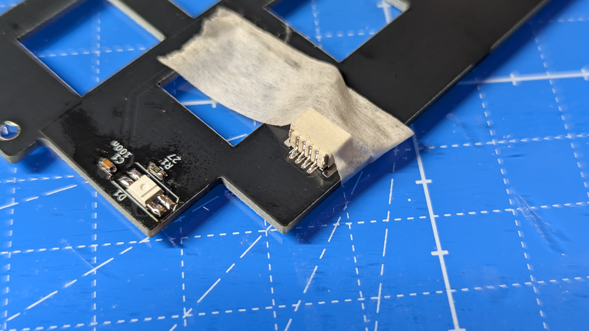

固定した上で、ブリッジするのを気にせずに実装します。

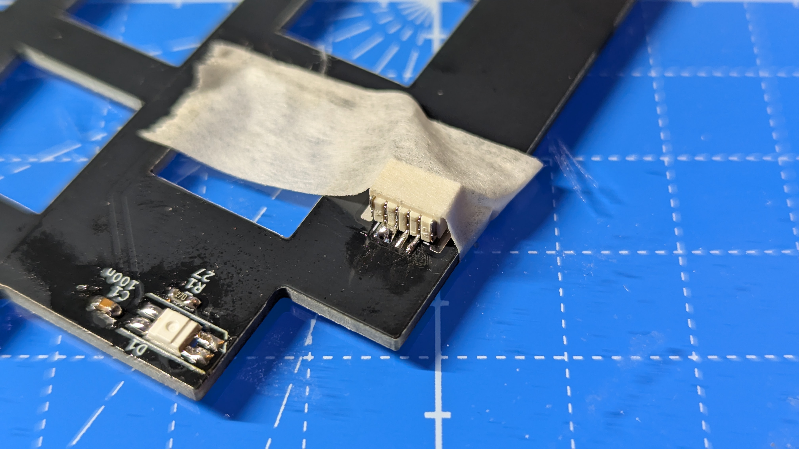

フラックスを塗り、はんだごてを当ててブリッジした余分なはんだをはんだごてに移し、はんだごてを拭います。
これを繰り返し、余分なはんだを取り除きブリッジを除去します。

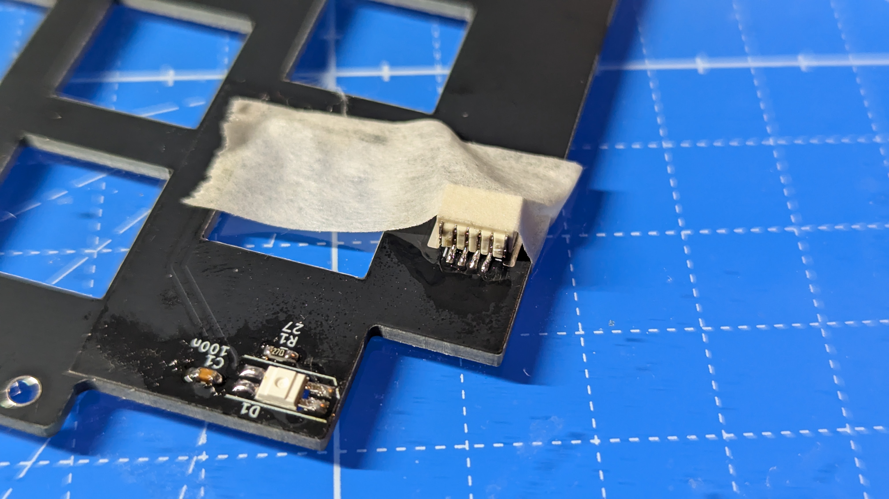

次に本体固定のためのランドを実装します。
まず、PCB上のランドを温めて、はんだを流してください。
この時、無理にソケットの金属部分まで温めようとしなくて大丈夫です。

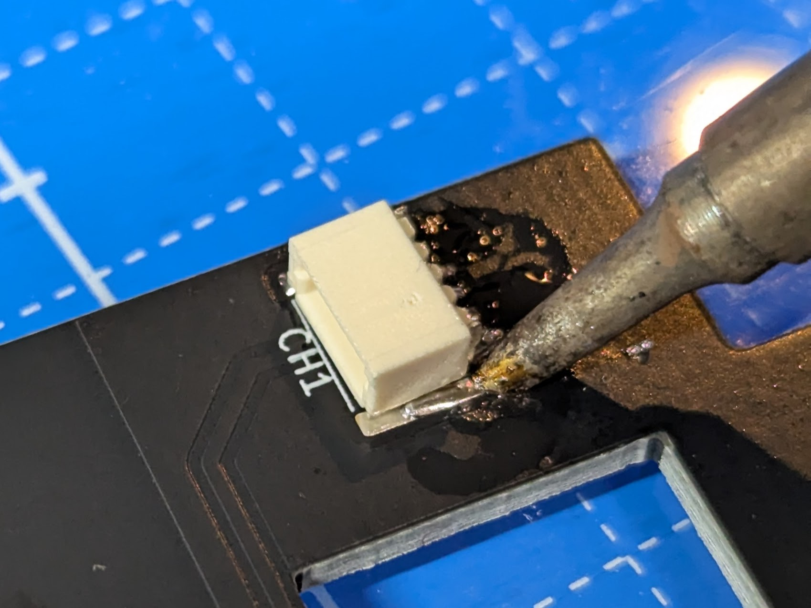

次にソケットの金属部分を温めてください。
すると、次第に隣接しているランドに熱が伝わり、ソケットの金属部分にまではんだが流れ込み、はんだで溶接されます。

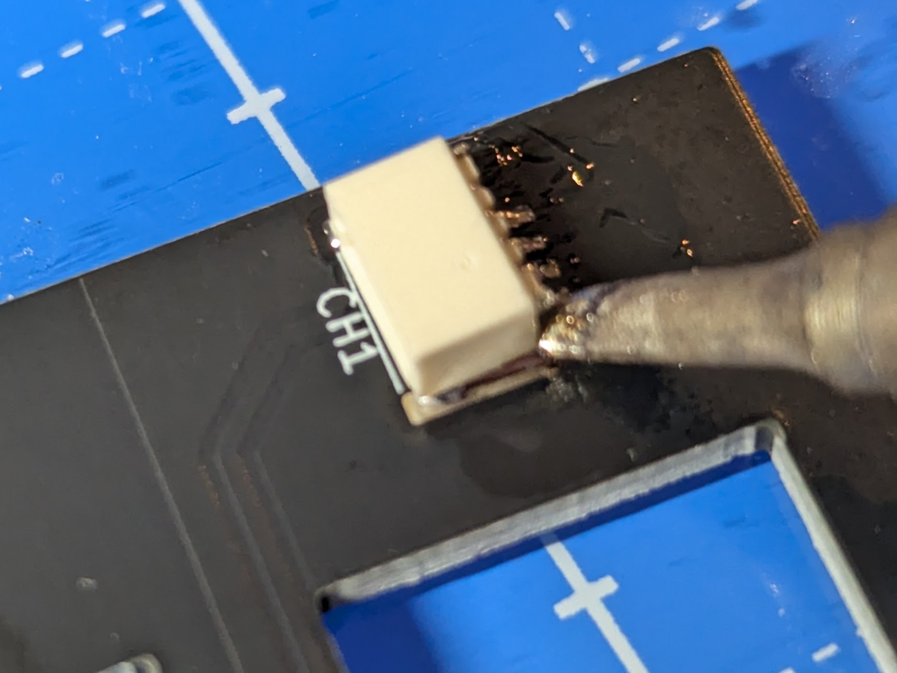

次にSK6812

### 4. TRRSソケットの実装

まず、TRRSソケットをPCB上にセットし、マスキングテープで固定します。

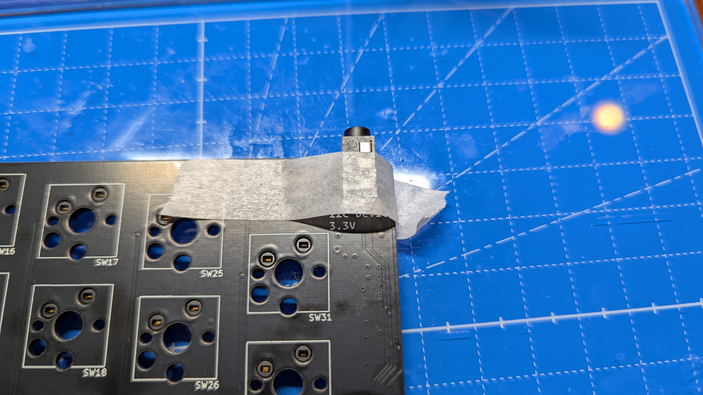

裏返し、TRRSソケットのはみ出ている足をニッパで切ります。
それからはんだ実装してください。

### 5. ここまでの実装確認

ここまでの実装を、確認しましょう。
ケースに入れる前に確認しましょう。

SparrowS v3には、Remapに対応したQMK Firmwareを予め書き込んであります。
PCとUSBで接続するとキーボードとして認識します。

PCBにトッププレートPCBを重ねて、トッププレート越しにスイッチを差し込みます。
トッププレートとPCBはネジ止めしません。

MX互換スイッチには、トッププレートを挟み込む溝が付いています。この溝にトッププレートが挟まれるようにトッププレートを持ち上げてください。

TRRSソケットにケーブルを差し込み、接続します。

USBをPCに接続し、すべてのキーが動作するかを確認します。詳細は前述の「ケースへの組み込み前の実装確認」を確認ください。

各キーが動作することをRemapのTest Matrix modeを使って確認して下さい。

> RemapのTest Matrix modeを使ったキーマトリックスのテスト方法
>
> [./remap_test_matrix_mode.md](./remap_test_matrix_mode.md)

動作しないキーがある場合、一度すべてをケースから取り外し、該当キーのダイオードとスイッチソケットの実装をやり直します。

### 6. ケースのバリ取り

ケースは家庭用3Dプリンタで製造したものをキットに同梱しています。
プリムという印刷を安定化させる部分も含んだ状態で出荷しています。

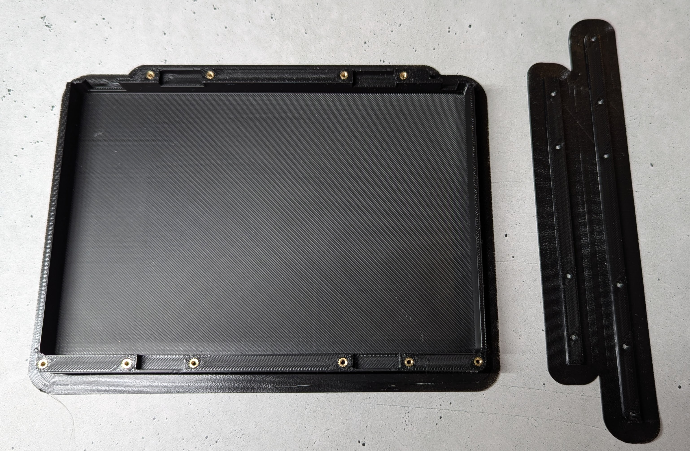

カッターナイフでブリムの部分を切り取ります。
カッターナイフとしては、デザインナイフを使うと、細くて使いやすいです。
怪我しないように気をつけてください。

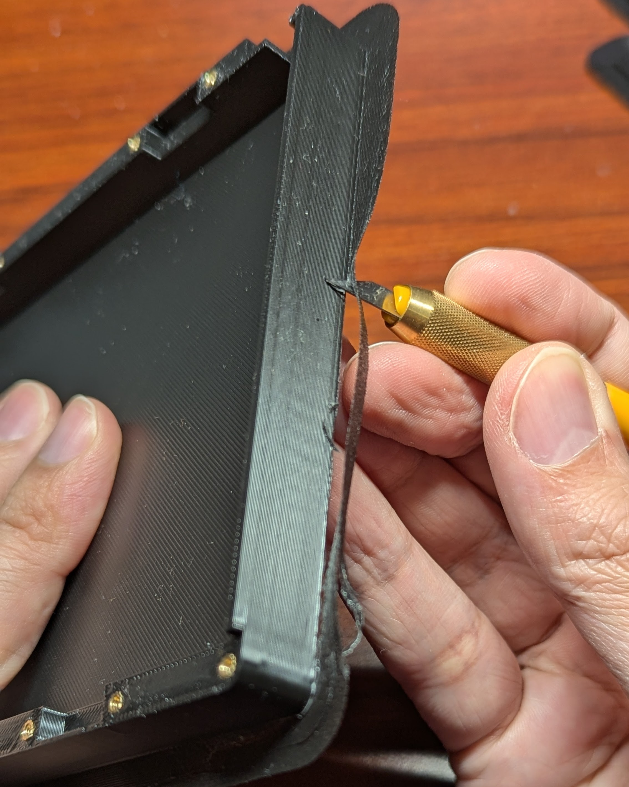

### 7. ガスケットクッションの取り付け

ガスケットマウントのクッションを、はさみで6つに切り分けます。

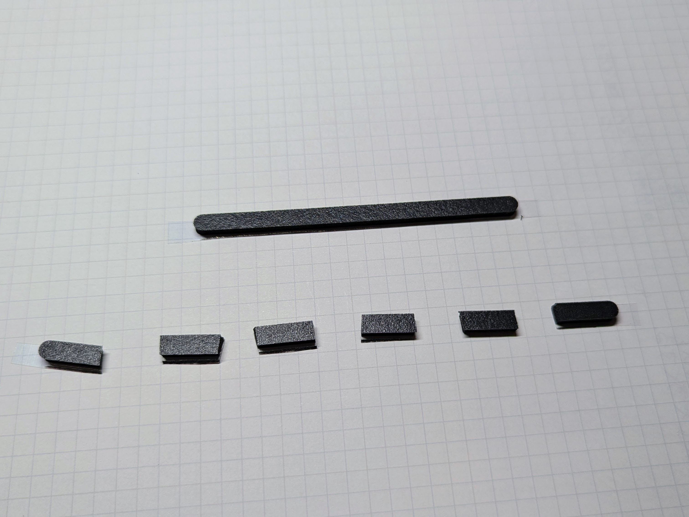

ケースと、ケースのバーに、クッションをそれぞれ取り付けます。

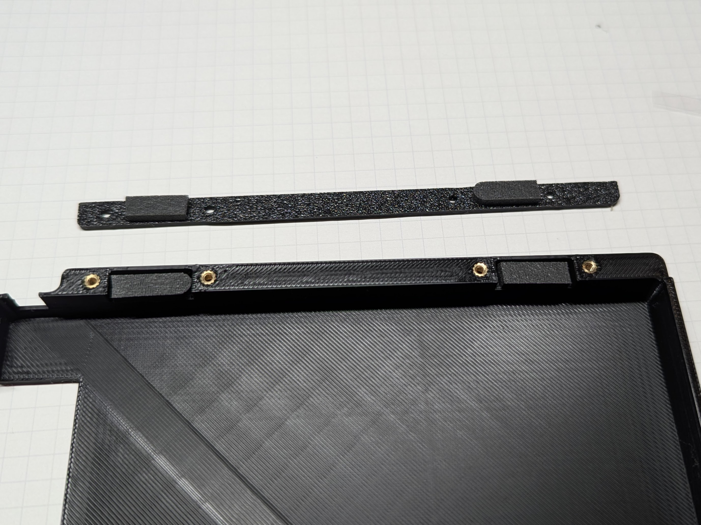

合計16箇所とりつけてください。

### 8. ネジ止め

キーボードPCBを入れて、ネジで留めます。

### 9. 底面のグリップゴムとりつけ

グリップゴムは4片付属しています。まず、こちらをはさみで半分に切ります。

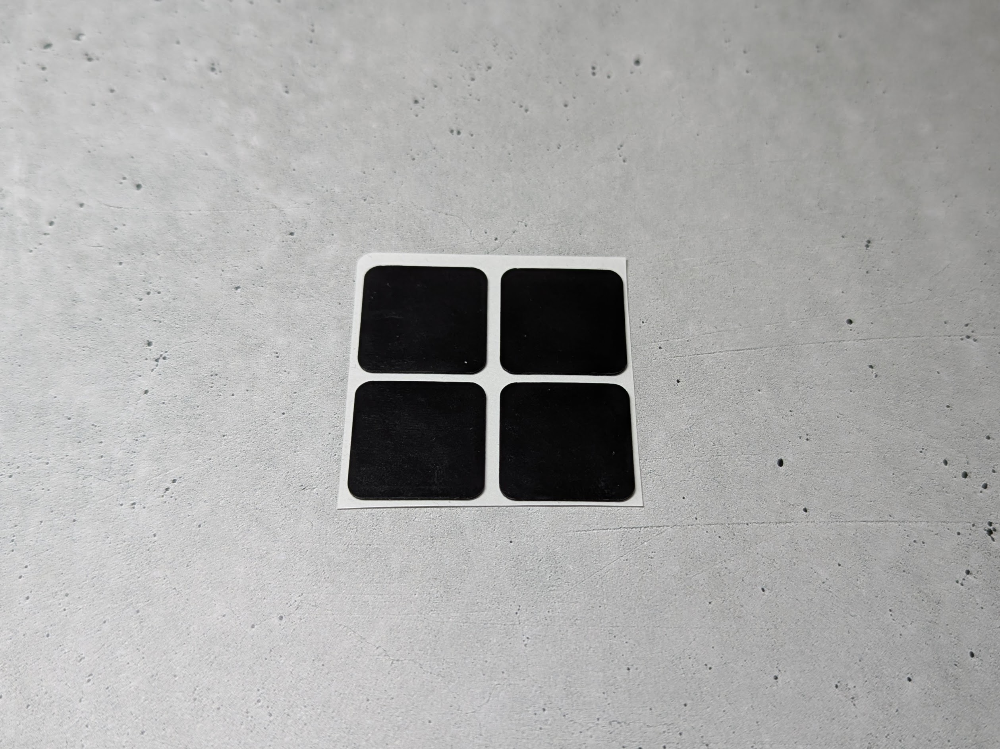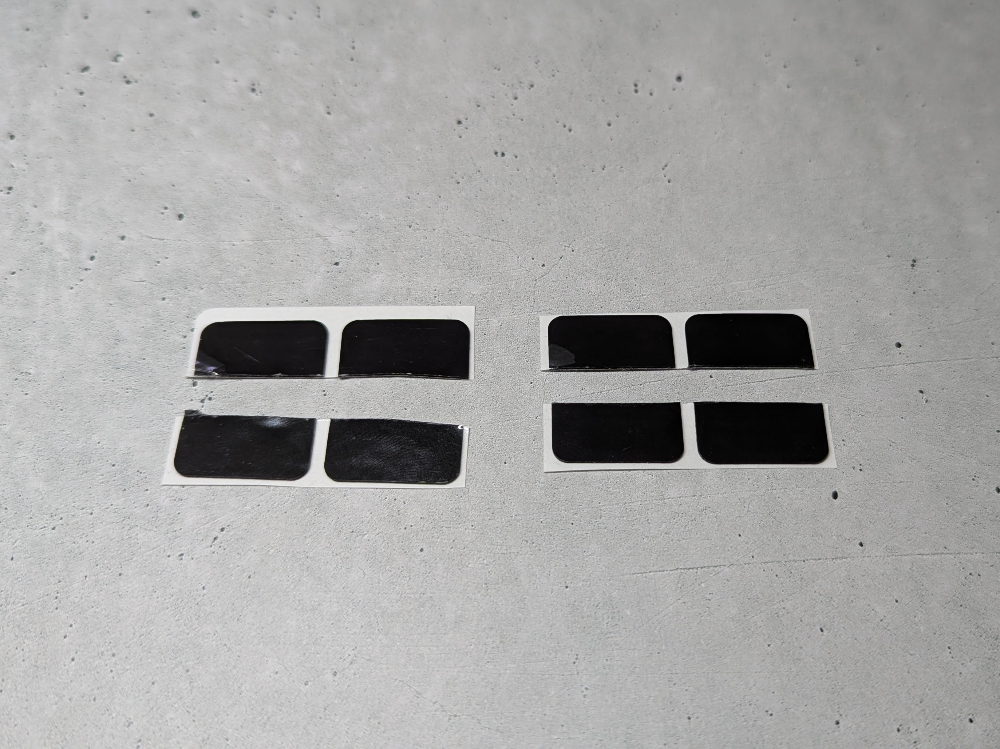

これをケースの底面の四隅に貼り付けます。

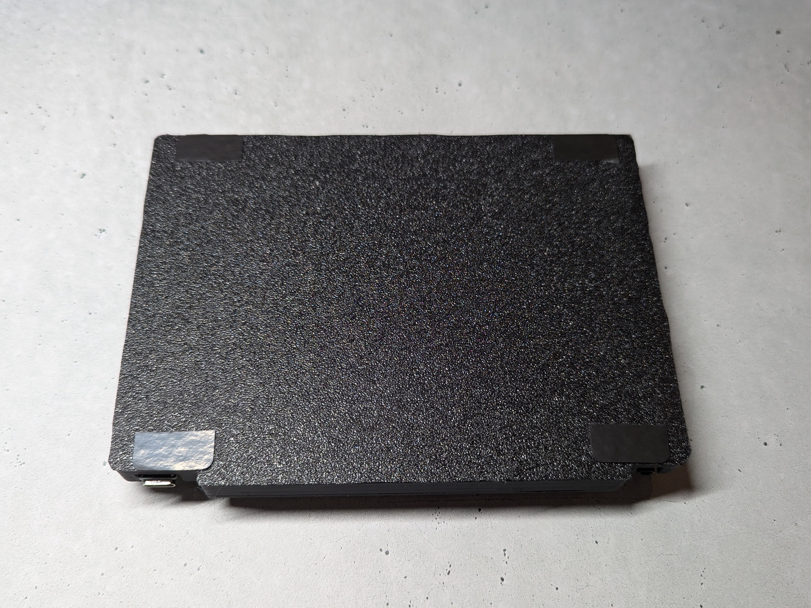

これで完成です！

## キーマップの変更、RP2040ファームウェアの更新

キーマップの変更には、2種類の方法があります。

- VIA、Remapを用いる
- QMK Firmwareでファームウェアをビルドする
- RP2040に対応したファームウェアを作成する

始めからVIA、Remap用のファームウェアが書き込まれた状態になっています。Remapを用いる場合には特にこの工程をする必要はありません。

VIA、Remapを利用しない利用しない場合は、別途ファームウェアを用意してください。RP2040はBOOTSELボタンを押しながらRESETを行うと、USBマスストレージデバイスがPCに認識され、その中にuf2ファイルをドラッグドロップすることで、ファームウェアを書き込むことができます。

### VIA、Remapを利用する場合

VIA、RemapはWebサイトや、ツール上からキーマップの書き換えができるサイトです。VIA対応のファームウェアをRP2040にアップロードすると、利用できるようになります。最初からRemap用のファームウェアが書き込まれた状態で出荷しています。

- Remap https://remap-keys.app/
- VIA https://caniusevia.com/

ファームウェアは以下からダウンロードできます。

- VIA、Remap 用ファームウェア [firmware/sparrowdial_via.uf2](https://github.com/74th/sparrow62-buildguide/raw/master/firmware/sparrowsv3_via.uf2)

書き込みを行う領域の都合上、新たにVIA、REMAPのファームウェアをインストールしても、以前変更したキーマップの変更が残っている場合があります。その時には、[公式サイトのResetting Flash memory](https://www.raspberrypi.com/documentation/microcontrollers/raspberry-pi-pico.html#resetting-flash-memory)にあるUF2ファイル(flash_nuke.uf2)を一度インストールして、FLASHの全消去を行ってください。

### QMK Firmwareでファームウェアをビルドする場合

現在、SparrowDialキーボードはQMK Firmwareの本体には取り込まれていません。下記リポジトリに作成したファームウェアのコードがあります。

https://github.com/74th/qmk_firmware_sparrow_keyboard

QMK Firmwareの環境のセットアップについては[公式のドキュメント https://docs.qmk.fm/#/newbs_getting_started](https://docs.qmk.fm/#/newbs_getting_started)を確認ください。[日本語のドキュメント https://docs.qmk.fm/#/ja/newbs_getting_started](https://docs.qmk.fm/#/ja/newbs_getting_started)もあります

まず、リポジトリをチェックアウトしてください。QMK Firmwareのフォークとなっているため、QMK Firmwareのセットアップでチェックアウトされたgitリポジトリのremoteとして登録できます。

```sh
cd ~/qmk_firmware
git remote add sparrow https://github.com/74th/qmk_firmware_sparrow_keyboard.git
git fetch sparrow
git checkout sparrow
```

このリポジトリ上では、キーボード名`sparrowdial`として登録されています。新しいキーマップを作成するには以下を実行します。

```
qmk new-keymap -kb sparrowdial -km <keymap_name>
```

`~/qmk_firmware/keyboards/sparrowdial/keymaps/<keymap_name>`というフォルダに作成されるため、キーマップを作成します。

キーマップ作成後は、以下のコマンドでコンパイルします。

```
qmk compile -kb sparrowdial -km <keymap_name>
```

すると、`~/qmk_firmware/.build/sparrowdial_<keymap_name>.uf2`にビルドされるため、これをRP2040に書き込みます。

## トラブルシューティング

こちらのページを確認ください。

> Trouble Shooting Guide
>
> [./trouble_shooting_guide.md](./trouble_shooting_guide.md)

## Data Sheet

- [SparrowSV3 Left PCB v3.0.2 Semantics](datasheets/SparrowSV3-left-3.0.2-semantics.pdf)
- [SparrowSV3 Left PCB v3.0.2 PCB](datasheets/SparrowSV3-left-3.0.2-pcb.pdf)
- [SparrowSV3 Right PCB v3.0.2 Semantics](datasheets/SparrowSV3-right-3.0.2-semantics.pdf)
- [SparrowSV3 Right PCB v3.0.2 PCB](datasheets/SparrowSV3-right-3.0.2-pcb.pdf)
- [SparrowSV3 Left Top Plate v3.0.2 Semantics](datasheets/SparrowSV3-left-top-3.0.2-semantics.pdf)
- [SparrowSV3 Left Top Plate v3.0.2 PCB](datasheets/SparrowSV3-left-top-3.0.2-pcb.pdf)
- [SparrowSV3 Right Top Plate v3.0.2 Semantics](datasheets/SparrowSV3-right-top-3.0.2-semantics.pdf)
- [SparrowSV3 Right Top Plate v3.0.2 PCB](datasheets/SparrowSV3-right-top-3.0.2-pcb.pdf)
