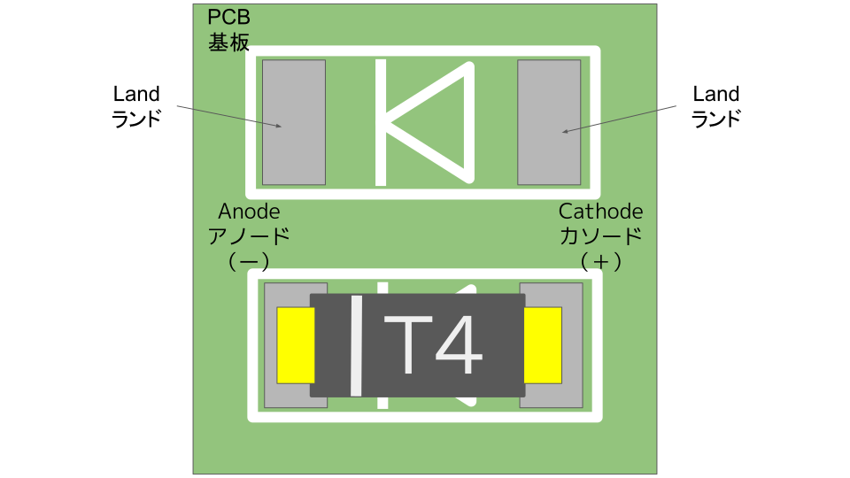

# SparrowTV Build Guide


このビルドガイドには他のキーボードの写真が含まれていますのでご注意ください。

また、作成中に疑問点等質問がありましたら、74th （twitter: [@74th](https://twitter.com/74th) 、email: site@74th.tech 、 本リポジトリの issue）まで問い合わせください。

## 販売先

- booth(準備中)

## SparrowTV の注意点

- iPhone SE2ケース応のPCBですが、必ずしもすべてのケースに対応するわけではありません。
- ファームウェアは、CircuitPythonを用いた独自のファームウェアを利用します。QMK等の既存のファームウェアは利用できません。
- コードの変更なしに機能を変更する機能はありません。ファームウェアのコードの変更が必要です。

## キットの内容

- SparrowTV PCB x1
- 0805 SMD コンデンサ 100nF x8
- 0805 SMD コンデンサ 1uF x3
- 0805 SMD コンデンサ 10uF x2
- 0805 SMD 抵抗 1Ω x1
- 0805 SMD 抵抗 27Ω x1
- 0805 SMD 抵抗 1kΩ x2
- 0805 SMD 抵抗 5.1kΩ x2
- 0805 SMD 抵抗 10kΩ x4
- 0805 SMD 抵抗 42kΩ x1
- HY2.0-4P(Grove) SMD ソケット x1
- RGBLED SK6812-MINI-E x15
- SOD-123 ダイオード 1N4148W x15
- USB-C ミッドマウントソケット x1（実装済みの場合もあり）
- 2x3p ボックスピンヘッダ x1
- ジョイスティック B10K x1
- SOT-223 レギュレータ AMS1117-3.3 x1
- SOT-23-6 USB電源スイッチIC CH217K x1
- WiFiモジュール ESP32-C3-WROOM-02
- SSOP-20 MCU CH32V003F4P6 x1
- SOIC-16 UART-To-USBキーボード変換IC WCH9329
- 熱伝導テープ x1
- ESP32-C3-WROOM-02 技適シール x1

## キットの組み立てに必要なもの

### キットの他に必要な部品

- [Kailh Chocスイッチ x15](./parts.md#kailh-chocスイッチ)
- [Kailh Chocスイッチ用ソケット x15](./parts.md#kailh-chocスイッチソケット)
- [Kailh Chocスイッチ用キーキャップ x15](./parts.md#kailh-choc-v1キーキャップ)
- [M5Stack用赤外線送受信ユニット x1](./parts.md#m5stack用赤外線送受信ユニット)
- Groveケーブル（M5Stack用赤外線送受信ユニットに付属） x1
- iPhone SE 2 or 3ケース x1

### 組み立てに必要な機材

- USBシリアル変換
  - [秋月電子通商で販売されている AE-CH340E-TYPEC](https://akizukidenshi.com/catalog/g/g114745/)
  - 74th の販売する ESP32-Writer
  - Espressif ESP-Prog など
- はんだごて、はんだこて台、スポンジ
- はんだ
- フラックス
  - はんだにはフラックスが含まれていて、端子に広がるようにできていますが、熱を加えすぎるとすべてのフラックスが蒸発します。その場合、追加のフラックスを入れて使います
- テスター
- ピンセット（表面実装部品を抑えるのに利用します）
- PC（Windows、Linux、MacOS の動作するもの。ファームウェアの作成に必要。）

### あるとよいもの

- フラックス洗浄液
- ルーペ（スマートフォンカメラでも代用できます）
- ラジオペンチ（ネジ止めの他、スイッチの足が曲がってしまった場合に、つまんで伸ばします）
- WCH-LinkE（CH32V003F4P6のプログラムが書き換え可能）

## 組み立て方法

以下の順序で組み込みを行います。

1. USB-C ソケット
2. コンデンサ、抵抗、ダイオード等の受動部品
3. RGBLED
4. レギュレータ、CH217K
5. CH32V003、CH9329
6. ESP32-C3-WROOM-02
7. スイッチソケット、HY2.0コネクタ、ボックスピンヘッダ

### 1. USB-C ソケット

最初にUSB-Cコネクタを実装するのは、USB-Cコネクタが最もブリッジしやすいため、実装後に以下のそれぞれのランド間にテスターを当てて抵抗値を計り、ブリッジしていないことを確認してください。

- 5V: U5(CH217K) 6ピンのランド
- GND: U5(CH217K) 2ピンのランド
- D+: U4(CH9329) 12ピンのランド
- D-: U4(CH9329) 13ピンのランド
- CC1: R7(抵抗) USB-Cソケット寄りのランド
- CC2: R6(抵抗) USB-Cソケット寄りのランド

※ 一部のPCBにはあらかじめUSB-Cコネクタが実装済みになっています。

### 2. コンデンサ、抵抗、ダイオード等の受動部品

部品の対応表は、下記リポジトリを確認ください。

> https://github.com/74th/tv-side-keyboard-SparrowTV

ダイオードは向きを間違えないように気をつけてください。



### 3. RGBLED

RGBLED SK6812MINI-E の方向を注意してください。

RGBLED の実装は、PCB 裏面に裏向きにセットして実装します。
PCB 表向きから見ると、発光面が見える形になります。

また、RGBLED の 4 本の足の 1 つ GND には切れ込みが入っています。切れ込みとシルクの斜め線を合わせるようにしてください。


向きを確認できたら、一方の足をマスキングテープで留めます。


すべての足を実装します。


### 4. レギュレータ、CH217K

部品表に従って、実装してください。ブリッジした場合も、フラックスを足して、再度はんだごてを当てて取り除くようにしてください。

### 5. CH32V003、CH9329

IC上のマーキングを確認し、まず対角の2ピンだけを実装して、位置を適切にした上で、残りのピンを実装するようにしてください。

CH32V003は若干熱で壊れやすい様に思うため、熱の当てすぎに気をつけてください。

位置が定まらないときは、細く切ったマスキングテープで固定するのも手です。

### 6. ESP32-C3-WROOM-02

モジュールの裏には放熱用のランドが付いています。この場所に熱伝導テープを貼り、PCBに１２機を付けながら貼り付けてください。

モジュールを上から押さえつけながら、ランドとモジュール間を実装してください。

実装後にモジュールを横から眺めてみて、ランドとモジュールが確かにはんだで溶接されているか確認してください。よくいくつかのピンが浮いていることがあります。

また、ESP32-C3-WROOM-02は、少し熱に弱いように思うため、はんだごての当てすぎに気をつけてください。

上手く位置が固定できない特には、マスキングテープでPCBに固定するのも手です。

### 7. スイッチソケット、HY2.0コネクタ、ボックスピンヘッダ

残りのソケット等を実装してください。

HY2.0コネクタには、ケーブルを差し込む面にも下部に固定用の金属部分があるため、こちらも忘れずに実装してください。

## ファームウェアの書き込みと、動作確認

### USBの接続確認

USBコネクタはESP32-C3-WROOM-02ではなく、CH9329に接続されています。PCと接続すると、USBキーボードとして認識します。USBキーボードとして認識することを確認してください。

### CircuitPythonの確認とファイルのアップロード

販売しているキットには、あらかじめCircuitPythonをESP32-C3に書き込んであります。ESP32C3のCircuitPythonはUARTからアクセスします。

USBⅡ接続して電源を供給した状態であれば、ESP-ProgポートのTXD、RXD、GNDをUSBシリアル変換アダプタと接続します。
WindowsならばTeraTerm、MacOS、Linuxならばminicom等を使うことで、CircuitPythonのコンソールにアクセスできます。

CircuitPythonを再度インストールする必要がある場合には、ESP32の書き込み方法を調べてみてください。EN、IO0を制御することで書き込みを行うことができます。CircuitPythonには複数のESP32-C3対応ボード用のファームウェアが存在していますが、"ESP32-C3-DevKitM-1-N4"のものを利用してください。

CircuitPythonへ編集したファイルを書き込むには、WiFi経由でアップロードすることができます。UARTを繋いだときに、一度Ctrl+C & Enterを押してPythonコンソールに入り、以下のように入力して、settings.toml を作る必要があります

```python
f = open('settings.toml', 'w')
f.write('CIRCUITPY_WIFI_SSID = "ssid-name"\n')
f.write('CIRCUITPY_WIFI_PASSWORD = "wifi-password"\n')
f.write('CIRCUITPY_WEB_API_PASSWORD = "webui-password"\n')
f.close()
import microcontroller; microcontroller.reset()
```

すると、起動時のシーケンスを見ると「NO IP」からIPアドレスの表示に変わります。そのIPアドレスに、一度Ctrl+C & Enterを押してPythonコンソールが表示される状態の時に、IPアドレスにブラウザからアクセスするとファイルブラウザを見ることができます。
そこから更新することができます。

ファームウェアは以下のリポジトリのPythonコードです。

> https://github.com/74th/tv-side-keyboard-SparrowTV/tree/main/firmware-circuitpython

このリポジトリ中では、タスクランナーとしてinvokeを利用しており、invoke.yamlに以下のように書き込むと、invokeからcurlコマンドを呼び出し、アップロードが可能です。なお、Linuxでしか動作を確認しておりませんが、MacOSでも動作すると思われます。Windowsの方はWSLを利用してみてください。

```
# invoke.yaml
circuitpy_hostname: 192.168.1.199
circuitpy_web_api_password: webui-password
```

invokeでのコマンド

```sh
# invoke/__init__.py にコードがある
# ライブラリのアップロード
inv -e upload-libs
# プログラムのアップロード
inv -e upload-codes
# コンフィグのアップロード
inv -e upload-config
```

アップロード後、REPLから再起動を促すには、Ctrl+Dを押してください。

## キーアサインや、IRの命令を変更する

キーアサインなどは config/config.py に実装があります。

### 赤外線パルス config/ir_pulse.py

パルスデータをこのファイルにリストの形で記述します。

リモコンの赤外線を受信して、パルスデータを作るためには、ir.py に test_receive() と言う関数があるので、これをPythonコンソールから実行すると、行うことができます。

コンソールにてCtrl+Cを押して、REPLに戻った上で、以下を実行してみてください。実行して、M5IRモジュールに赤外線リモコンの信号を送ると、リストで表示されます。

```python
import ir
ir.test_receive()
```

また、屋内の環境によっては不要なノイズが混入することがあります。何度か試してみてください。

後ほど、WebServerをCircuitPythonで立ち上げて、curlでコマンドを叩くと、このモードが使えるように改修する予定です。

### キーマップ config/config.py

config/config.py はキーの機能を定義し、キーにアサインします。

現在は以下の命令が使用可能です。命令のリストは、action_codes.py に定義されています。

- `CM_SEND_IR`: 赤外線信号の送信。ペイロードには赤外線パルスを設定。
- `CM_TYPE_KEY`: キーボードのキーのタイプ。ペイロードには、単一のキーコード、もしくはキーコードの配列を設定する。キーコードの配列の場合
- `CM_TYPE_TEXT`: キーボードのキーをテキストで連続入力する。ペイロードにはstrを設定。
- `CM_LED_XY`: 指定箇所のLEDの色を変更する。ペイロードには`(r, g, b)`で0-255の値を設定。
- `CM_MOUSE_LEFT`: マウス左ボタン
- `CM_MOUSE_RIGHT`: マウス右ボタン
- `CM_MOUSE_WHEEL`: マウスホイールボタン

これからキーの機能を定義します。

```python
# 赤外線を送信する
KC_TV_POWER: KeyAssign = (CM_SEND_IR, ir_pulse.TV_POWER)
# キーボードのキーにする
KC_ESC: KeyAssign = [(CM_TYPE_KEY, 243)] # ESC
KC_CTRL_W: KeyAssign = [(CM_TYPE_KEY, [87, 17])] # Ctrl-W
# マウスのボタンにする
KC_MOUSE_L = CM_MOUSE_LEFT
```

これを、3x5の配列にして、`LAYER1`変数に定義します。

```py
LAYER1: Layer = [
    [KC_TV_POWER,        KC_TV_CURSOR_BACK, KC_TV_CURSOR_UP,   KC_TV_CURSOR_OK,    KC_A],
    [KC_TV_CHANGE_INPUT, KC_TV_CURSOR_LEFT, KC_TV_CURSOR_DOWN, KC_TV_CURSOR_RIGHT, KC_A],
    [KC_MOUSE_L,         KC_MOUSE_R,        KC_CTRL_W,         KC_ESC,             KC_A],
]
```

LEDの色を変更するには、LAYER1_LEDⅡ定義します。

```py
LAYER1_LED: LayerLED = [
    [L_RED, L_YELLOW, L_WHITE, L_PURPLE, L_PURPLE],
    [L_GREEN, L_WHITE, L_WHITE, L_WHITE, L_PURPLE],
    [L_CYAN, L_CYAN, L_GREEN, L_GREEN, L_PURPLE],
]
```

※ 現在レイヤー機能は実装されていません

## Appendix

### CH32V003のI2Cのプロトコル

詳しくは、firware-circuitpython/ui.py に処理するコードがあるので見てみてください。

> https://github.com/74th/tv-side-keyboard-SparrowTV/blob/main/firmware-circuitpython/ui.py

常に9バイト受信します。各バイト配下の通りです。

- 0: マウスのxの負の移動量
- 1: マウスのxの正の移動量
- 2: マウスのyの正の移動量
- 3: マウスのyの負の移動量
- 4: 常に0
- 5: 1列目の、各列番号のbitが、押されていると1、押されていないと0になる
- 6: 2列目の、各列番号のbitが、押されていると1、押されていないと0になる
- 7: 3列目の、各列番号のbitが、押されていると1、押されていないと0になる

### CH9329のプロトコル

ESP32-C3とCH9329はUARTで通信して、USBキーボード、マウスを実現しています。

CH9329については、拙著『WCHのICを活用する電子工作の本』でも紹介しています。

また、みんなのラボさんの同人誌『キーボード／マウス　エミュレータ解説書』に詳しく解説があります。この機会にぜひ利用してみてください。

## Data Sheet

- [SparrowTV v1.2.0 Semantics](datasheets/SparrowTV-v1.2.0-semantics.pdf)
- [SparrowTV v1.2.0 PCB](datasheets/SparrowTV-v1.2.0-pcb.pdf)
