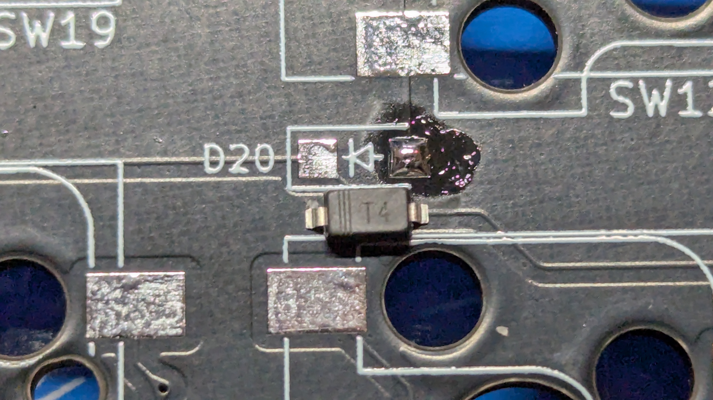
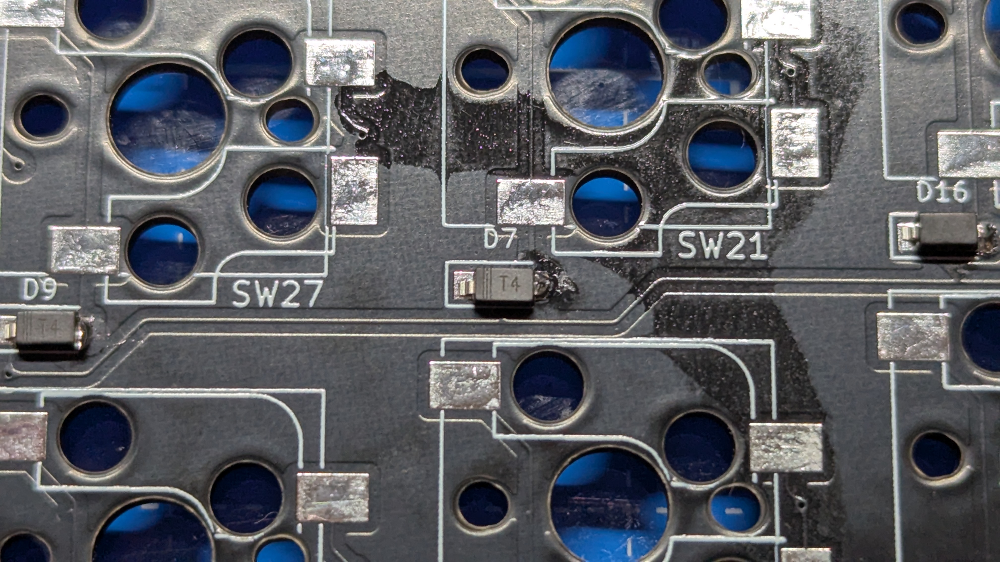

# ダイオード1N4148Wの実装方法

1N4148Wの実装手順を説明します。

まず、方向に注意してください。
IC中のマーキングは見にくい場合があります。
ライトを当てたり、スマホのカメラ機能を使って拡大してみてみてください。
手元を明るくして作業すると良いでしょう。

片方のランドに、よびはんだとして、はんだを溶かして載せます。

片手でピンセットで部品を抓み、はんだごてではんだを溶かし、部品をスライドする様にして実装します。

全ての部品を一度片方の足のみ実装しましょう。
実装後に、全てのダイオードの向きを確認してください。
