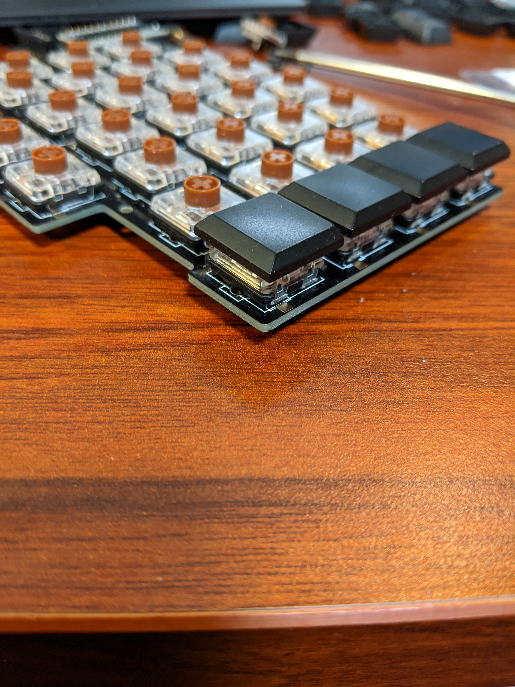
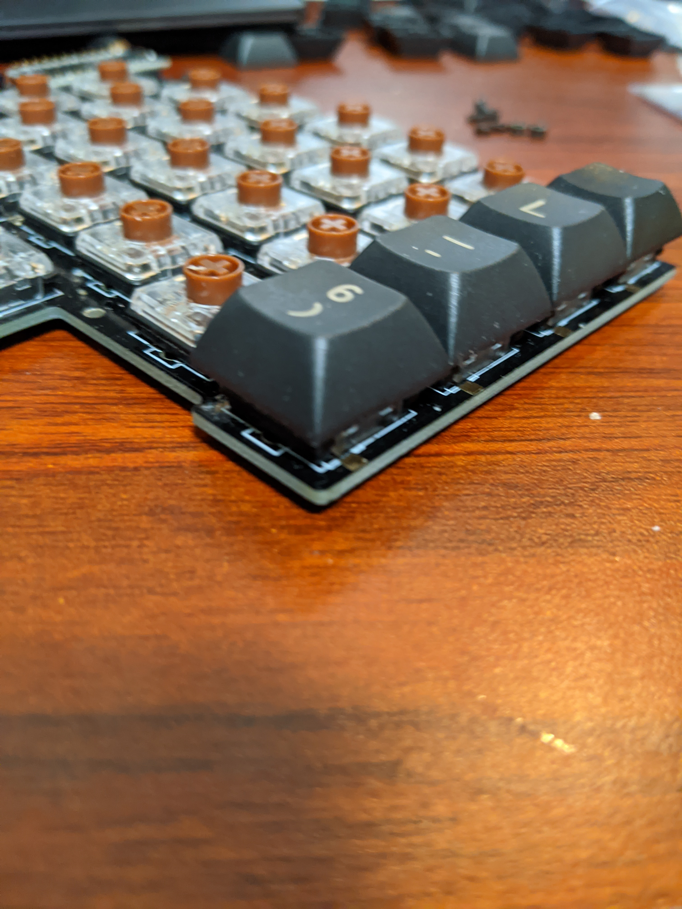
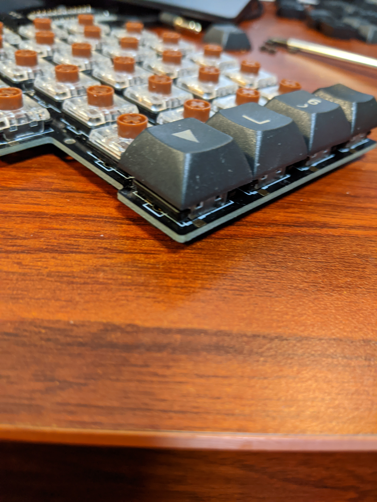
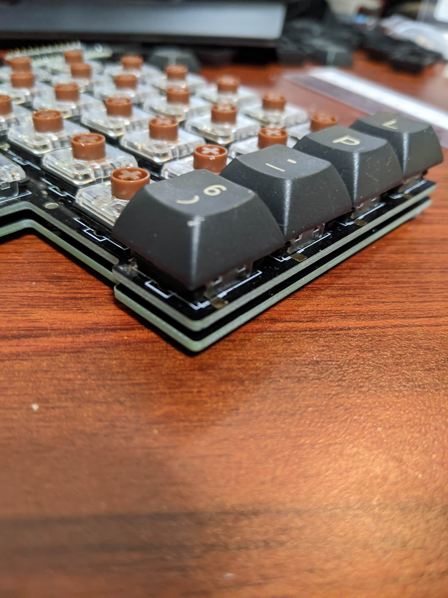
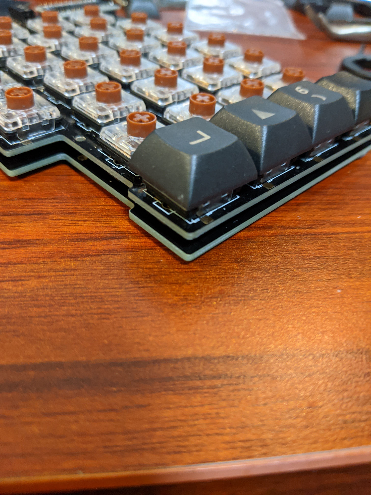
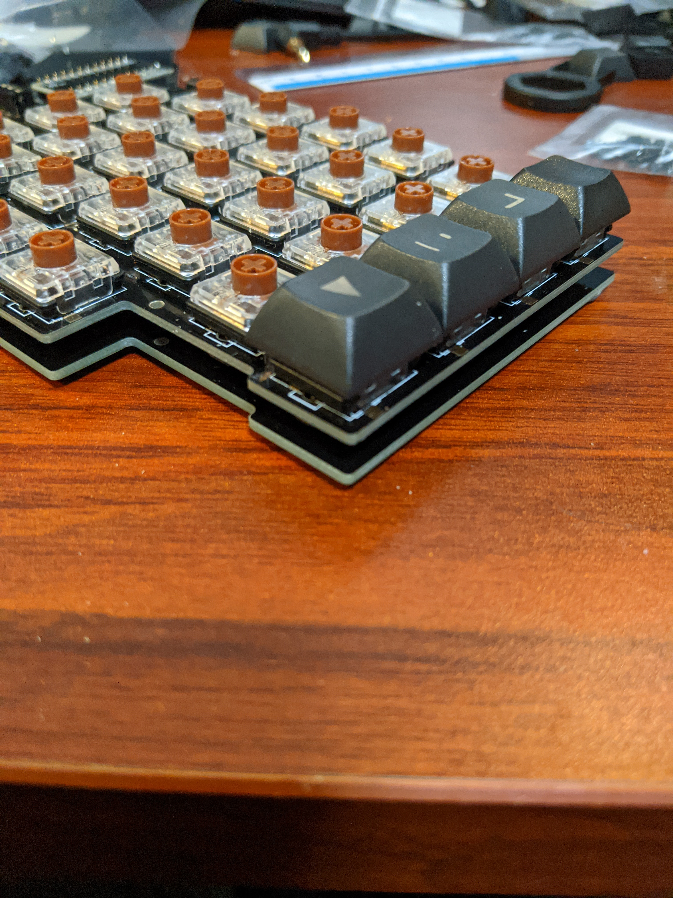

# 高さ調整ガイド

## 使う部品

PCB 背面のソケットは 1.6mm であるため、2mm のゴム足でも支えることができます。
最低限の高さ +2mm までの調整にはゴム足を使い分けることができます。
こちらは両方の部品をキットに付属しています。

- [モノタロウ ソフトクッション 8x2.0](https://www.monotaro.com/p/4891/2353/) ￥ 699 / 100 個
- [モノタロウ ソフトクッション 10x4.0](https://www.monotaro.com/p/4891/2387/) ￥ 899 / 100 個

これ以上の調整が必要な場合には、ボトムプレートが必要となります。
ボトムプレートはアクリルで作成する場合、遊舎工房に発注することが可能です。
A4 サイズで左右分を作ることができます。
アクリルの厚さは、2mm、もしくは 3mm になり、1mm 調整可能です。
Elecrow にて、 PCB として作ることもできます。

- [遊舎工房 レーザーカットサービス アクリル押出 A4 2mm](https://yushakobo.jp/lasercut/) ￥ 3,780 / 2 枚
- [遊舎工房 レーザーカットサービス アクリル押出 A4 3mm](https://yushakobo.jp/lasercut/) ￥ 3,920 / 2 枚
- [Elecrow PCB 105mm x 159mm 厚さ 1.6mm](https://www.elecrow.com/pcb-manufacturing.html) \$ 38.83 / 5 枚

発注に必要なデータと発注方法のページは準備中です。

ボトムプレートと PCB プレートの間にはスペーサーを挟みます。
スペーサーのサイズにより、高さ調整が可能です。

最低限の 2mm のスペーサーを使用する場合、両雌ねじのスペーサーを使用できないため、中空スペーサーを使います。
ナットも高さが 1.6mm のものがあるため、2mm のゴム足で支えることができます。

- [モノタロウ スペーサー（中空）M2 2mm](https://www.monotaro.com/p/1126/1364/) ￥ 799 / 50 個
- [皿子ネジ M2 8mm](https://www.monotaro.com/p/4926/2771/) ￥ 449 / 50 個
- [六角ナット M2](https://www.monotaro.com/p/4221/6097/) ￥ 399 / 12 個

3mm 以上のスペーサーを使用する場合、両雌ねじのスペーサーを使うことができます。
このスペーサーにより 0.5 mm 単位の調整が可能です。
両雌ねじのスペーサーを使う場合、ネジには 4mm のものを使います。

- [皿小ねじ M2 4mm](https://www.monotaro.com/p/4926/2744/) ￥ 449 / 50 個
- [モノタロウ 黄銅スペーサー M2 3~10mm/0.5mm](https://www.monotaro.com/g/00428593/) ￥ 1,490 / 50 個
- [モノタロウ ジュラコンスペーサー M2 3~10mm/0.5mm](https://www.monotaro.com/g/01213180/) ￥ 1,290 / 50 個

スペーサーはいろいろ試すには、若干高価です。
中国産であれば安価に入手することができます。
ネジはネジ穴が潰れると辛いため日本製のものを使いますが、スペーサーであれば中国産で妥協の範囲かと思います。

- [Aliexpress brass spacer m2 3~10mm/1mm](https://www.aliexpress.com/item/32904784115.html) US\$ 1.04 ~ 2.20 / 50 個
- [Aliexpress nylon spacer m2 5,6,8,10mm](https://www.aliexpress.com/item/32996308968.html) US\$ 0.49 ~ 1.37 / 50 個

## Choc v1 で 約 15mm

- Kailh Choc v1 スイッチ
- PCB 1.6mm
- ゴム足 2mm

## Choc v2 で 約 16mm

- DSA キーキャップ
- Kailh Choc v2 スイッチ
- PCB 1.6mm
- ゴム足 2mm

## Choc v2 で 約 18mm

- DSA キーキャップ
- Kailh Choc v2 スイッチ
- PCB 1.6mm
- ゴム足 4mm

## Choc v2 で 約 20mm

- DSA キーキャップ
- Kailh Choc v2 スイッチ
- PCB 1.6mm
- 中空スペーサー 2mm
- ボトムプレート 1.6mm
- ゴム足 2mm
- （8mm 小ねじ、六角ナットを使用）

## Choc v2 で 約 21mm

- DSA キーキャップ
- Kailh Choc v2 スイッチ
- PCB 1.6mm
- 両雌ねじスペーサー 3mm
- ボトムプレート 1.6mm
- ゴム足 2mm

## Choc v2 で 約 23mm

- DSA キーキャップ
- Kailh Choc v2 スイッチ
- PCB プレート 1.6mm
- 両雌ねじスペーサー 5mm
- ボトムプレート 1.6mm
- ゴム足 2mm

