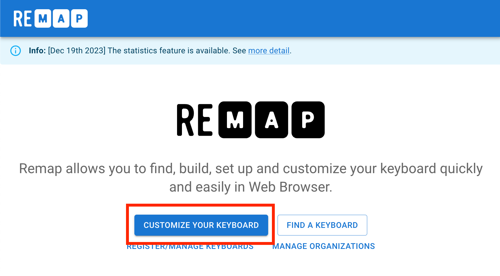
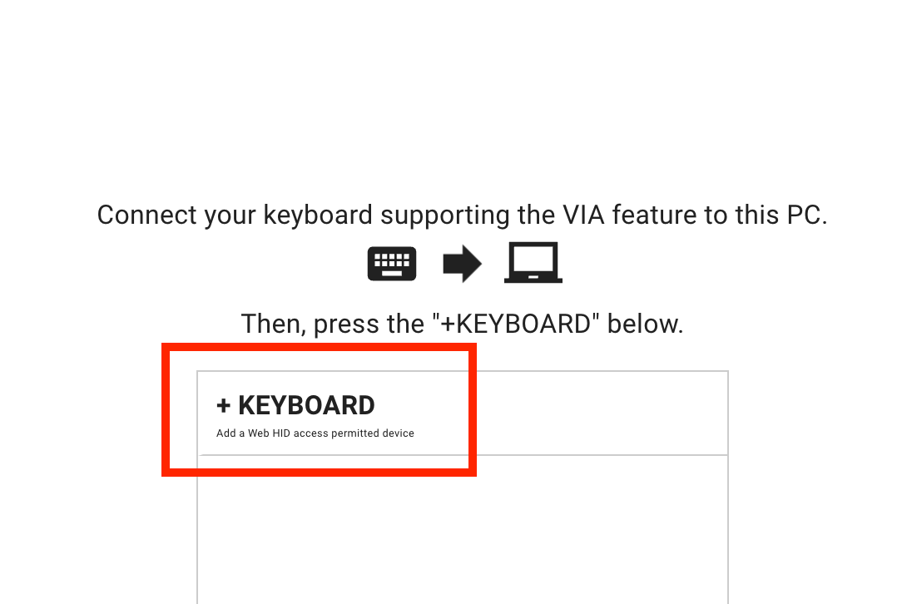
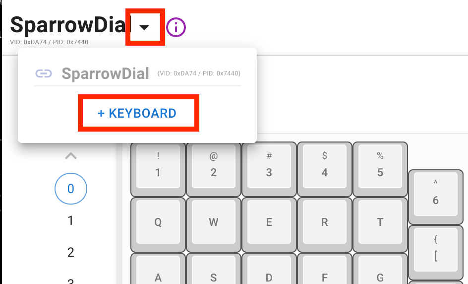
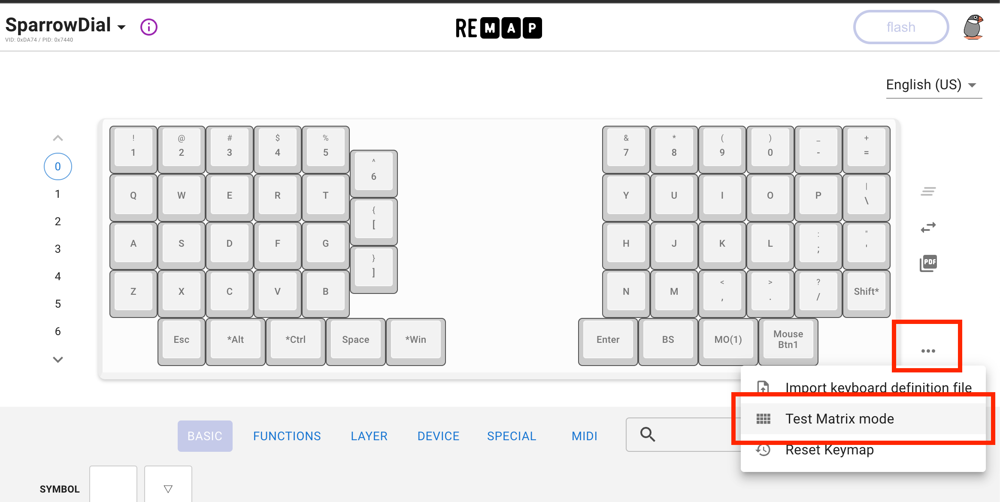
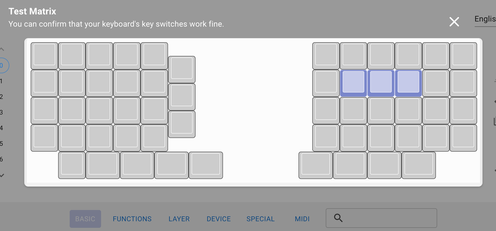

# RemapのTest Matrix modeを使ったキーマトリックスのテスト方法

Remap には、キーマトリックスをテストする機能があります。
こちらを使うことで、各キーのダイオードやソケットの実装が正常かどうか確認することができます。

それにはまず、VIA、Remap対応のファームウェアをキーボードに書き込みます。Sparrow60C、SparrowDialにおいてはあらかじめ対応ファームウェアが書き込まれています。

まず、RemapのWebサイトを開き、「CUSTOMIZE YOUR KEYBOARD」を押します。

https://remap-keys.app/

キーボードの接続が表示されるため、「+ KEYBOARD」を押します。

既にUSB接続している場合には、左上のメニューから追加を行ってください。

キーマップの設定画面になりましたら、図のメニューから「Test Matrix mode」を選んでください。

この画面では、キーを押すとこのように色が変わって表示されます。この状態ですべてのキーが動作することを確認してください。

キーが押されるとスイッチの2つのピンが通電した状態になります。スイッチを実際に刺さなくても、「金属ピンセットでソケットの2つの金属部分に触れる」ことや「ジャンパワイヤーでソケットの2つうの金属部分に触れること」で通電させることもできます。
