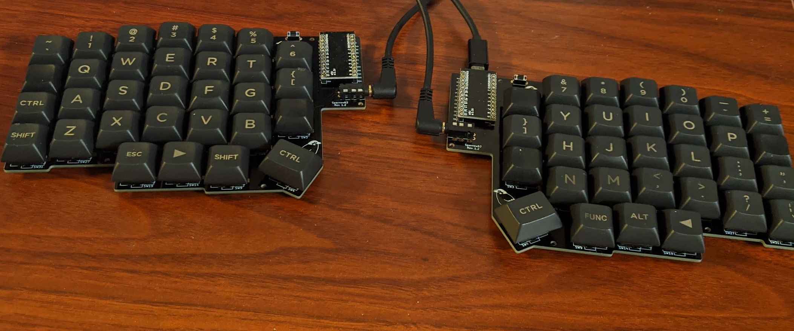
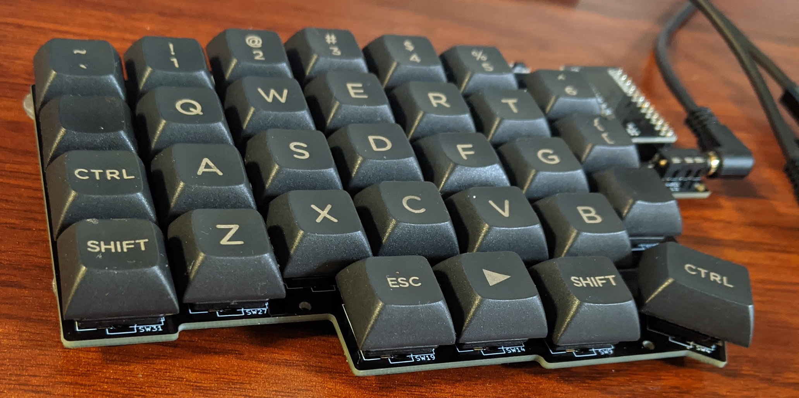
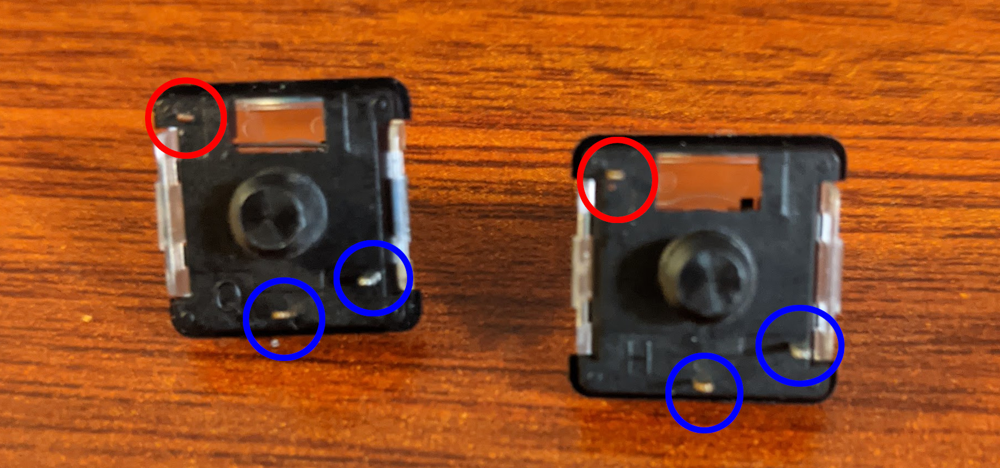
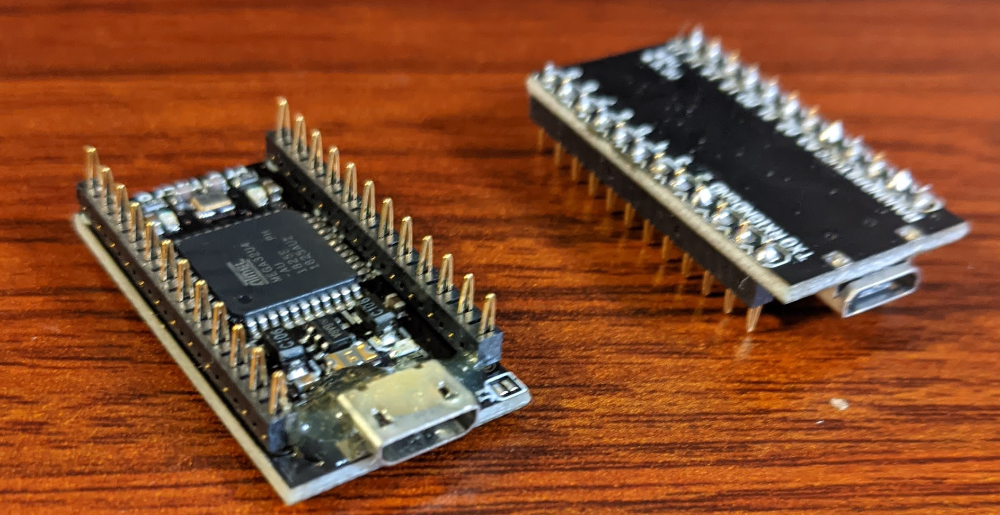
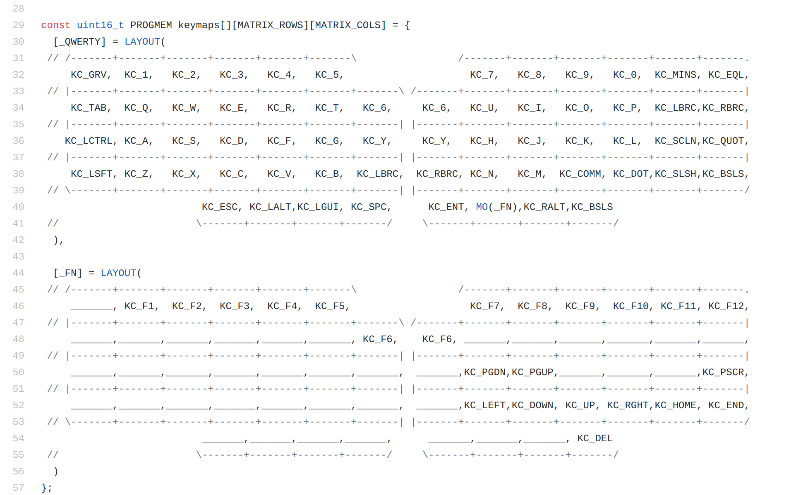
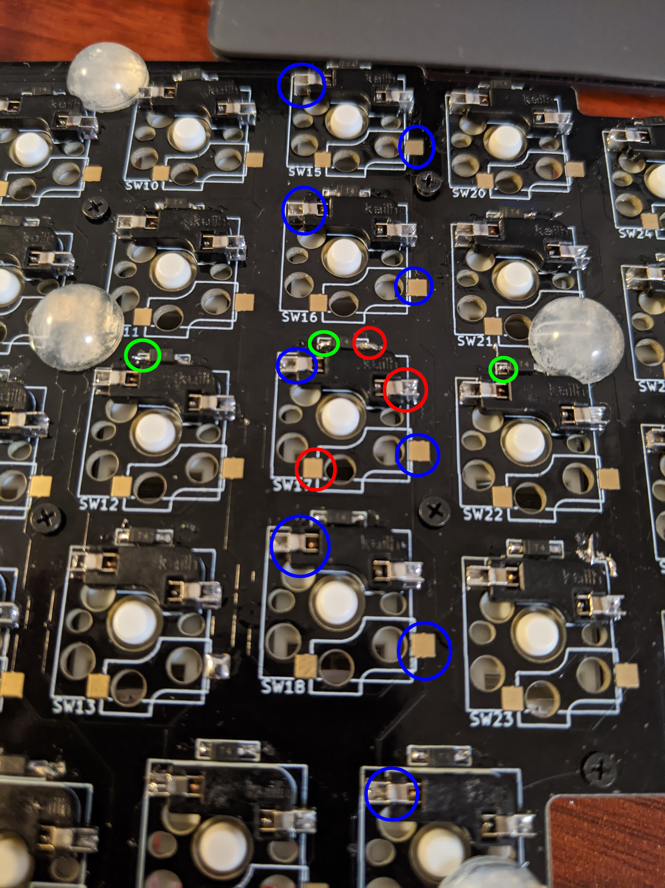

# Sparrow 62 Keyboard Building Guide

## What's Sparrow 62 Keyboard

Sparrow62 is the DIY Keyboard kit inspired by Lily58.

Lily58 に触発された @74th が販売する、自作キーボードキットです。

**using Kailh Choc V2 switches（keycap: DSA）**



### features

- able to use thin switches, Kailh Choc v1/v2 （薄型キースイッチ Kailh Choc V1/V2 が使えること）
- able to use Cherry MX compatible switches （CherryMX 互換キースイッチが使えること）
- aligned vertically (縦に揃ったキー配置(カラムスタッガード)であること）
- enough number of keys（十分キーの数が多いこと）
- placing the Pro Micro next to the keys to make the keyboard itself thinner （Pro Micro をキーの横に配置してキーボード自体を薄くすること)
- using a socket to be able to replace switches (キースイッチ交換可能なようにソケットを使うこと)

As a more complete keyboard that is easier to make, there is Lily58 distributed by @F_YUUCHI. Please consider purchasing Lily58.
（より作りやすい、完成度の高いキーボードとして、ゆーちさんの頒布されている Lily58 があります。 ぜひ Lily58 の購入も検討ください。）

**Kailh Choc V1 キースイッチの場合**


**Cherry MX 互換スイッチを使用し、トッププレートを加えた場合（キーキャップ: DSA）**


## additional items

The additional items required are as follows.
（追加で以下のものが必要です。）

### For Kailh Choc v1/2 switches set（薄型キースイッチ Kailh Choc v1/2 セットの場合）

- Kailh switch socket for Kailh Choc switches（Choc スイッチ用ソケット） x62
- Kailh Choc switch v1/v2 x62
- TRRS Cable x1
- Pro Micro (ATMega 32U4) x2
- USB Cable for Pro Micro x2

### For CherryMX Compatible switches set（CherryMX 互換スイッチの場合）

- Kailh switch socket for Cherry MX Compatible switches（CherryMX 互換スイッチ用ソケット） x62
- Cherry MX Compatible switches x62
- TRRS Cable x1
- Pro Micro (ATMega 32U4) x2
- USB Cable for Pro Micro x2

### For CherryMX Compatible switches with Trackpad set（CherryMX 互換スイッチトラックパッド対応用の場合）

- Kailh switch socket for Cherry MX Compatible switches（CherryMX 互換スイッチ用ソケット） x58
- Cherry MX Compatible switches x58
- TRRS Cable x1
- Pro Micro (ATMega 32U4) x2

### 購入できるストア

- スイッチ用 PCB ソケット x62 （以下のいづれか）
  - MX 互換スイッチ用 ([遊舎工房](https://yushakobo.jp/shop/a01ps/)、[TALP KEYBOARD](https://talpkeyboard.stores.jp/items/5e02c5405b120c792616bcf9))
  - Kailh Low Profile Choc V1/V2 用 ([遊舎工房](https://yushakobo.jp/shop/a01ps/))
- TRRS ケーブル、もしくは 3.5mm ステレオミニプラグオーディオケーブル x1 ([遊舎工房](https://yushakobo.jp/shop/trrs_cable/)、[Amazon](https://www.amazon.co.jp/dp/B018FPYC78))
- Pro Micro x2 ([遊舎工房](https://yushakobo.jp/shop/promicro-spring-pinheader/)、[TALP KEYBOARD](https://talpkeyboard.stores.jp/items/5b24504ba6e6ee7ec60063e3))
- Pro Micro 用コンスルー x2 (遊舎工房 Pro Micro に付属、[TALP KEYBOARD](https://talpkeyboard.stores.jp/items/5e056626d790db16e2889233))

## how to build

### if using Kailh Choc V2, remove 1 foot

Kailh Choc v2 を使うの場合、足を 1 本切断する

Kailh Choc V2 has three copper wireand one of the red circles in the photo is cut with nippers.

Kailh Choc V2 では銅線の足が 3 つ出ていますが、このうち写真赤丸の 1 本をニッパで切断します。
切断した際に発生する小さな破片にご注意ください。
写真青丸の銅線は切断しないように気をつけてください。



ここできれいに切断すると、安定性が増します。
もし少し残ってぐらついてしまう場合、補助的にトッププレートを使うことで安定させることもできます（ただし、Choc スイッチの下の爪と上の爪までの幅が 1.65mm であるため、完全にははまりません）。
[後からトッププレートが必要となった場合、遊舎工房さんで発注することができます。こちらを確認ください。](https://github.com/74th/sparrow62-buildguide#%E8%BF%BD%E5%8A%A0%E3%81%A7%E3%83%88%E3%83%83%E3%83%97%E3%83%97%E3%83%AC%E3%83%BC%E3%83%88%E3%83%9C%E3%83%88%E3%83%A0%E3%83%97%E3%83%AC%E3%83%BC%E3%83%88%E3%81%8C%E6%AC%B2%E3%81%97%E3%81%84%E5%A0%B4%E5%90%88)

### Pro Micro anti-scratch processing

Pro Micro にもげ防止加工を実施（お好みで）

The Pro Micro's Micro USB port is extremely fragile.
To prevent this, apply an evoxy adhesive to the terminals.
Be careful not to accidentally get the adhesive inside the terminals.

Pro Micro の Micro USB 端子は非常にもげやすいものになっています。
これを防止するため、端子に エボキシ系接着剤を塗布します。
誤って端子の中に接着剤が入り込まないように気をつけてください。


### Solder Pro Micro and pin header (if you using mac8 pin header)



#### コンスルーピンヘッダを使用する場合

Pro Micro とピンヘッダをはんだ付けする

ピンヘッダには向きがあります。詳しくは、遊舎工房の解説を確認ださい。

https://yushakobo.zendesk.com/hc/ja/articles/360044233974-%E3%82%B3%E3%83%B3%E3%82%B9%E3%83%AB%E3%83%BC-%E3%82%B9%E3%83%97%E3%83%AA%E3%83%B3%E3%82%B0%E3%83%94%E3%83%B3%E3%83%98%E3%83%83%E3%83%80-%E3%81%AE%E5%8F%96%E3%82%8A%E4%BB%98%E3%81%91%E6%96%B9%E3%82%92%E6%95%99%E3%81%88%E3%81%A6%E4%B8%8B%E3%81%95%E3%81%84

Sparrow62 キーボードは Pro Micro を写真の向きで使います。

先に、Pro Micro とピンヘッダを PCB に差し込みます。
その上から、 Pro Micro とピンヘッダのみをはんだづけします。
ピンヘッダと PCB ははんだ付けしないようにします。

Pro Micro は脆弱な部品ため、破損した場合交換が可能となります。

### Solder Diodes

Solder the diode, paying attention to the orientation of the diode.
ダイオードを向きを気をつけて、はんだ付けします。

The video by @Salicylic_acid3 is very good, so I think you can check here.
実装手順については、サリチル酸さんのツイートの動画が非常に良くできているため、こちらを確認いただくと良いと思います。

https://twitter.com/Salicylic_acid3/status/1296494976319315970
https://twitter.com/Salicylic_acid3/status/1108798243142434816

**1. Solder one side of the PCB first (先に PCB の片側にはんだをつける)**


**2. Melt the attached solder and solder the diode on one side (つけたハンダを溶かして、ダイオードを片側をはんだ付けする)**


**3. Check the orientation of the diode (ダイオードの向きを確認する)**


**4. Solder the other side (反対側の足をはんだ付けする)**


### Solder switch socket (スイッチソケットを実装する)

The video by @Salicylic_acid3 is very good, so I think you can check here.
実装手順について、こちらもサリチル酸さんのツイートの動画がよくできているため、こちらを確認いただくのが良いと思います。

https://twitter.com/Salicylic_acid3/status/1310253635255717889

**1. Solder the pads on both sides of the PCB(先に PCB の両側の端子にハンダをつける)**


**2. Place the socket and push while melting the solder(ソケットを置き、ハンダを溶かしながら押す)**


**3. Do the same on the other side(反対側も同様にする)**


**4. Repeat until they are in close contact (密着するまでくりかえす)**


### Implement tact switch

タクトスイッチを実装する

The tactile switches are **implement on a different surface than the diode**.
タクトスイッチは、**ダイオードとは異なる面に** 実装します。

The surface to be soldered is **the same surface as the diode**.
足が裏面に出るため、はんだ付けを行う面は **ダイオードと同じ面** です。

**tactile switch(タクトスイッチ)**


### Implement TRRS socket

TRRS ジャックを実装する

The TRRS sockets are **implement on a different surface than the diode**.
TRRS ジャックは、**ダイオードとは異なる面に** 実装します。

The surface to be soldered is **the same surface as the diode**.
足が裏面に出るため、はんだ付けを行う面は **ダイオードと同じ面** です。

**TRRS Socket(TRRS ジャック)**


### Assemble the top and bottom plate

トッププレートとボトムプレートを組み立てる。

#### For Kailh Choc Switches

Attach the bottom plate to the PCB with double-sided tape.
両面テープで PCB とボトムプレートを貼り付けてください。 貼り付けなくても、うまくはまれば固定されます。

#### For Cherry MX Compatible Switches


#### For Cherry MX Cpmpatible Switches with Trackpad


### Cut and attach rubber sheets with double-sided tape

両面テープでボトムプレートとゴムシートを接着します。

For trackpad, use a long rubber sheet.
トラックパッドがある場合、より長いシートをトラックパッド用に使ってください。


### Insert switches and Pro Micro

キースイッチと Pro Micro をソケットに差し込みます。

### flash QMK Firmware

#### using QMK Toolbox and REMAP

[Download firmware/ssparrow62_v1_via.hex](https://github.com/74th/sparrow62-buildguide/raw/master/firmware/sparrow62_v1_via.hex)

Download and install QMK Toolbox.

https://github.com/qmk/qmk_toolbox/releases

Flash via firmware.

- Local File: sparrow62_v1_via.hex
- MCU : atmega32u4

You can use REMAP for configuring your keymap.

https://remap-keys.app/

#### using QMK Firmware

```
qmk flash -kb sparrow62 -km default
```

## hints for Japanese

VIA を使う場合、QMK Toolbox でファームウェアを書き込めば完了です。

キーマップのカスタマイズには、VIA を使うと GUI で変更できます。
更に高度なカスタ合図を行う場合、QMK Firmware のビルド環境を整える必要があります。

#### QMK Toolbox を使ってデフォルトのファームウェアを書き込む

以下のキーマップを、default のファームウェアとして提供しています。

- [Download firmware/sparrow62_v1_default.hex](https://github.com/74th/sparrow62-buildguide/raw/master/firmware/sparrow62_v1_default.hex)

レイヤ 1


レイヤ 2（レイヤ 1 の`MO(1)`のキーと同時に押すと、動作する）


こちらを [QMK Toolbox](https://github.com/qmk/qmk_toolbox/releases) を使って書き込むことができます。

QMK Toolbox の使い方は[サリチル酸さんの記事](https://salicylic-acid3.hatenablog.com/entry/qmk-toolbox)が詳しいため、こちらを確認ください。

左右のキーボードの両方に書き込む必要があります。

#### VIA を使ってキーマップを変更する

GUI でキーマップを変更できる [VIA](https://caniusevia.com/) というツールがあります。

VIA を使うには、VIA のファームウェアを書き込む必要があります。以下からダウンロードし、[QMK Toolbox](https://github.com/qmk/qmk_toolbox/releases)などを使って書き込んでください。

- [Download firmware/sparrow62_v1_via.hex](https://github.com/74th/sparrow62-buildguide/raw/master/firmware/sparrow62_v1_via.hex)

VIA のファームウェアは Remap を使うと、ブラウザの UI でキーマップの変更ができます。

#### 更にカスタマイズするため、QMK Firmware のビルド環境を整える

QMK Firmware のセットアップ手順（[公式英語](https://docs.qmk.fm/#/newbs_getting_started)、[有志日本語](https://github.com/shelaf/qmk_firmware/blob/master/docs/ja/newbs_getting_started.md)）に従い、インストールします。

Ubuntu を使用している場合には、ModemManager が邪魔をすることがあるので、`sudo systemctl stop ModemManager.service`を実行いておくと有効です。

デフォルトのキーマップをインストールするには、PC と Pro Micro を USB ケーブルで接続し、以下を実行します。

```
qmk flash -kb sparrow62 -km default
```

`Detecting USB port, reset your controller now...`と表示されたところで、キーボードのタクトスイッチ（リセット）を押します。
この Firmware の書き込みを、左右 2 つの Pro Micro で両方とも行います。

この default のキーマップは以下のようになっています。 `MO(_FN)`のキーを押すと、キーレイヤが下の`[_FN]`のものに変わり、F1-12 キーや、矢印キーとして動作させることができます。



新しいキーマップを作成する場合には、以下のように実行します（nnyn が新しいキーマップ名）

```
qmk new-keymap -kb sparrow62 -km nnyn
```

キーマップの設定する C のソースが `~/qmk_firmware/keyboards/sparrow62/keymaps/nnyn/keymap.c` にできます。
こちらを変更して、以下のコマンドで Firmware を書き込みます。

```
qmk flash -kb sparrow62 -km nnyn
```

詳しいファームウェアの実装方法は、公式のドキュメントや Qiita の記事を参照ください。

- [Keymap Overview](https://docs.qmk.fm/#/keymap)
- [はじめての QMK キーマップ編集](https://qiita.com/marksard/items/9317949ce1da327f7436)

### キースイッチのテストをする

QMK Continuator のキーテストを開きます。

https://config.qmk.fm/#/test

キースイッチを押し、キーレイアウトの通りに動作するかを確認します。

### 動作しないキーがある場合

#### 1 キーのみ動作しない場合

まず、キースイッチの足が曲がっていないか確認してください。

左手用のキーの場合、以下の同じ色の部分がつながっています。それぞれテスターなどで疎通しているか確認ください。



右手用のキーの場合、以下の同じ色の部分がつながっています。それぞれテスターなどで疎通しているか確認ください。


#### 縦一列、横一列が動作しない場合

青丸が COL のラインとなっており、そのまま Pro Micro の COL0-6 につながっています。緑丸が ROW のラインとなっており、そのまま Pro Micro の ROW0-4 につながっています。
Pro Micro の接続を確認ください。

## Contact me

- Twitter: @74th
- Mail: site@74th.tech
