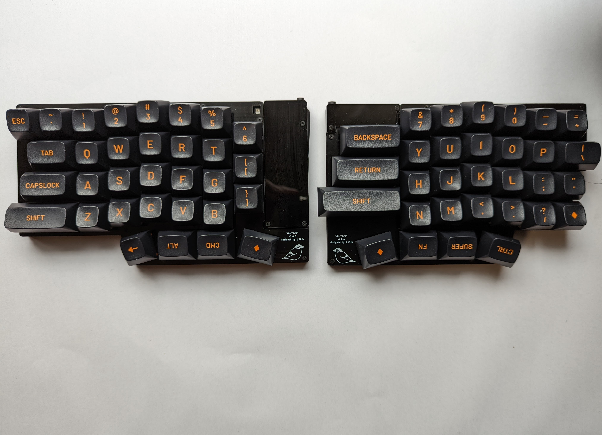
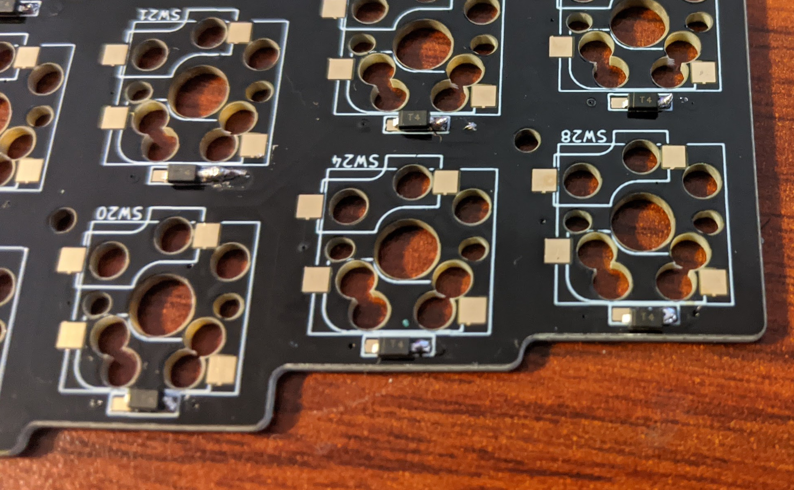
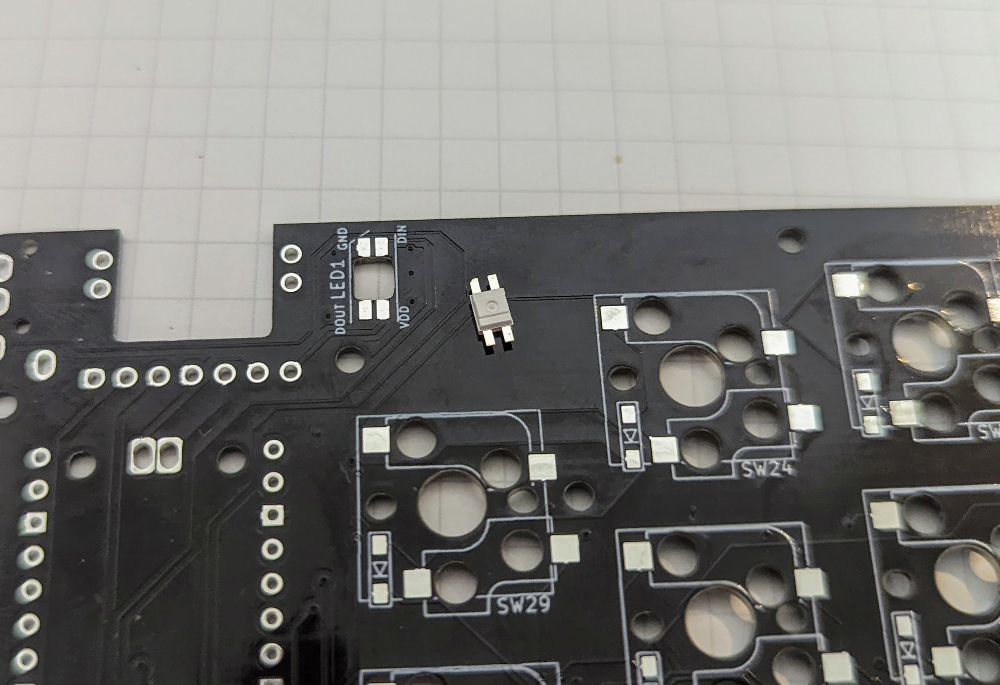
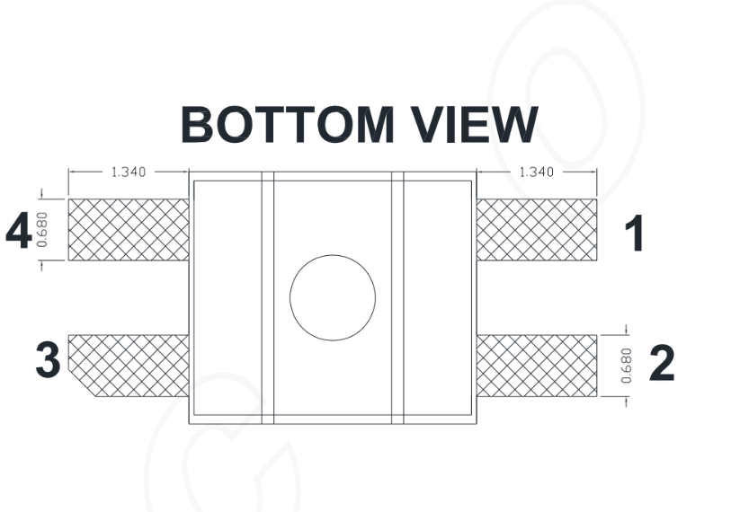

# Sparrow62 (+1) v2 Keyboard Building Guide

[If you build Sparrow 62 v1, please see v1 Buildguide](./v1.md). [Sparrow62 v1 のビルドガイドはこちら。](./v1.md)

このガイドには一部 Sparrow 62 v1 の写真が含まれていますので注意ください。





また、作成中に疑問点等質問がありましたら、74th （twitter: [@74th](https://twitter.com/74th) 、email: site@74th.tech 、 本リポジトリの issue）まで問い合わせください。

## 販売先

- 遊舎工房（委託） https://shop.yushakobo.jp/products/4295
- booth https://74th.booth.pm/items/3828479

## Sparrow62 v2 の注意点

- Sparrow62 という名前ですが、v2 は 63 キーです。
- v2.0.5 には、シルクで Sparrow64 と書かれていますが、Sparrow62 の誤りです。
- v2 には、細かいバージョン差分があり、1 セットの内に複数のバージョンの記載がありますが、そのようなセットになっております。v2.0.5 と v2.0.4 が同一のセットに含まれています
- v2.0.5 の抵抗 R9 は 27Ω に変更になりました。セットには予めはんだ付けしてあります。

## What's Sparrow 62 Keyboard

Sparrow 62 は 74th が頒布する自作キーボードキットです。
最初は Lily58 からインスピレーションを得て、数々の改良を加えました。

**using Kailh Choc V2 switches（keycap: DSA）**


これは購入者がご自身で組み立てが必要なキットです。
完成を保証するものではありません。

名称は Sparrow62 ですが、Sparrow v2 では **63 キー** で構成されます。

### 特徴 / features

- 縦に揃ったキー配置（カラムスタッガード）であり、指の曲げ伸ばしで多くのキーに届く様になっていること。
- 左右分離しており、肩を開いてタイピングができること。
- CherryMX 互換キースイッチが使えること。
- 薄型キースイッチ Kailh Choc v1/v2 が使えること。
- キースイッチが交換可能なようにスイッチソケットを使えること。
- 数字キーを網羅できるほどキーの数が多いこと（60%キーボード）。
- (new v2) 標準的なキーキャップセットを使用して、組み立てることができること。
- (new v2) 右手のキーボードの右側にマウスなどを配置できるように、右手の右側のキーの数を抑え、左側が膨らむデザインであること。
- (v1.3)オプションで、トラックパッドを右手左側に置くことができること。
- (v1.3)ゴム足の代わりに、ゴムシートを使うことで十分薄くすることができること。
- (new v2) 厚さの異なるプレート、PCB を用いて可能な限り薄くしていること。
- (new v2) PCB とゴムシートの間にプレートをはさみ、全体の剛性と、打鍵感を高めてあること。
- (new v2) 半導体不足でも入手の容易で、高性能な Raspberry Pi PICO （以下、PICO） を用いること。
- (new v2) マイコン 1 つで左右のキーボードを制御すること。
- (new v2) USB Type-C で接続できること。

### v1 と v2 の違い

- v1 は ProMicro と、QMK Firmware を用いて、キー入力を調整することができました。v2 は ProMicro と QMK Firmware に対応していません。
- チップ抵抗や、マイコン裏のスルーホールとランドの接続など、実装難度は高くなっています。

## 準備が必要なもの

### 部品

キットの他に追加で以下のものが必要です。

- スイッチ用ソケット x63
  - 「Cherry MX 互換用」と「Kailh Choc V1/V2 用」があります
  - MX 互換スイッチ用 ([遊舎工房](https://yushakobo.jp/shop/a01ps/)、[TALP KEYBOARD](https://talpkeyboard.stores.jp/items/5e02c5405b120c792616bcf9))
  - Kailh Low Profile Choc V1/V2 用 ([遊舎工房](https://yushakobo.jp/shop/a01ps/))、TALP KEYBOARD
- 自作キーボードスイッチ x63
  - Cherry MX 互換スイッチ と Kailh Choc v1/v2 スイッチを使うことができます
- TRRS ケーブル （4 極オーディオミニプラグのケーブル）x1
  - 3 極ステレオケーブルは不可
  - TRRS ケーブル x1 ([遊舎工房](https://yushakobo.jp/shop/trrs_cable/)、[Amazon](https://www.amazon.co.jp/dp/B018FPYC78))
  - 50 cm より長いケーブルで接続可能かどうかは確認していません。
- Raspberry PI Pico x1
- USB 2.0 Type-C Cable x1
- (CherryMX 互換スイッチを使用する場合）PCB マウントスタビライザー x

### 組み立てに必要な機材

- はんだごて、はんだこて台、スポンジ
  - BC 型 と ペン型 の 2 つのこて先があると便利ですが、どちらかでも大丈夫です。
- はんだ
- ピンセット（表面実装部品を抑えるのに利用します）
- ニッパ（連結ピンヘッダの切断や、長いピンの切断に使います）
- 両面テープ（ゴムシートとボトムプレートを接着します）
- はさみ（ゴムシートを切断するのに使います）
- PC（Windows、Linux、MacOS の動作するもの。ファームウェアの作成に必要。）

### あるとよいもの

- フラックス
  - はんだにはフラックスが含まれていて、端子に広がるようにできていますが、熱を加えすぎるとすべてのフラックスが蒸発します。その場合、追加のフラックスを入れて使います
- フラックス洗浄液
- ルーペ（スマートフォンカメラでも代用できます）
- ラジオペンチ（ネジ止めの他、スイッチの足が曲がってしまった場合に、つまんで伸ばします）
- 黒のマジックペン（側面を黒く塗ると一体感が出ます）

## キットに同梱されているもの

- 左手トッププレート x1
- 左手 PCB x1
- 左手ボトムプレート x1
- 右手トッププレート x1
- 右手 PCB x1
- 右手ボトムプレート x1
- 左手 IC カバー（黒アクリルプレート、穴 3 つ） x1
- 右手 IC カバー（黒アクリルプレート、穴 2 つ） x1
- ゴムシート x2
- 2012 SMD 抵抗 1kΩ(102) x2
- 2012 SMD 抵抗 5.1kΩ(512) x2
- 2012 SMD 抵抗 10kΩ(103) x5
- ダイオード 1N4148W x63
- USB Type-C ソケット基板 x1
- LED SK6812MINI-E x1
- TRRS ソケット x2
- IO エキスパンダー IC MCP23017 x1
- ピンヘッダー 1 列 12 ピン x1
- 3.5mm スペーサー x25
- 5.0mm スペーサー x5
- 4.0mm ネジ（黒） x30
- 5.0mm ネジ（銀） x30

※ キットに含まれる内容が MX 用トッププレート固定穴 1 つ分の、3.5mm スペーサー、4.0mm ネジ(黒)、5.0mm ネジ(銀)が少ない内容になっておりました。大変申し訳ありません。購入された方に追加の部品を送らせていただいています。74th.tech@gmail.com まで連絡いただきますようお願い致します。

ダイオードなど一部は必要個数以上同梱しています。

## 作成方法 / how to build

はじめに、PCB、トッププレート、ボトムプレートには、トッププレートの表側を除き、「PCB Foreground」「Top Plate Background」と、どの部品であるかどうかと、どちらが表（foreground）か裏（background）であるか記載があります。

特に PCB においては、表と裏を間違えないようにご注意ください。

### Kailh Choc v2 を使う場合

Kailh Choc v2 を使うの場合、足を 1 本切断する

Kailh Choc V2 has three copper wireand one of the red circles in the photo is cut with nippers.

Kailh Choc V2 では銅線の足が 3 つ出ていますが、このうち写真赤丸の 1 本をニッパで切断します。
切断した際に発生する小さな破片にご注意ください。
写真青丸の銅線は切断しないように気をつけてください。


ここできれいに切断すると、安定性が増します。

### SMD 抵抗のはんだ付け

チップ抵抗は左手と右手にそれぞれ 5 個ずつあります。

1k(102)、5.1k(512)、10kΩ(103)の 3 種類の抵抗を使い分けます。
間違えないように気をつけください。
どの抵抗かわからなくなったときにはルーペで拡大し、書かれている数字を確認してください。

まず、片方のランドにハンダを乗せます（予備はんだ）。


片手にはんだごて、片手にピンセットで抵抗をつまみ、ハンダを溶かして抵抗をスライドさせるように差し込みます。


片側のはんだ付けができたところで、一度誤った抵抗を接続していないか確認すると良いです。


もう片方のはんだ付けもします。


これを、左右 5 個ずつ行ってください。


### ダイオードのはんだ付け / Solder Diodes

Solder the diode, paying attention to the orientation of the diode.
ダイオードを向きを気をつけて、はんだ付けします。

The video by @Salicylic_acid3 is very good, so I think you can check here.
実装手順については、サリチル酸さんのツイートの動画が非常に良くできているため、こちらを確認いただくと良いと思います。

https://twitter.com/Salicylic_acid3/status/1296494976319315970
https://twitter.com/Salicylic_acid3/status/1108798243142434816

先に PCB の片側にはんだをつけます。


つけたハンダを溶かして、ダイオードを片側をはんだ付けします。


まず、すべてのダイオードを**片側だけ**はんだ付けをしましょう。
片側のはんだ付けが済んだところで、一度すべてのダイオードが同じ向きを向いているか確認します。


確認が済んで大丈夫であれば、反対側の足もはんだ付けします。



### スイッチソケットを実装する

Choc 用のスイッチソケットは、Cherry MX 用スタビライザーに干渉します。
使用しない場合は異なるスイッチのソケットは実装しないようにしてください。

Choc 用スイッチソケットには向きがあります。以下の記事を参考に、正しい向きで実装するようにしてください。

- https://www.eisbahn.jp/yoichiro/2021/01/kailh_choc_v1_socket.html
- https://kochikbd.hatenablog.com/entry/choc-socket-orientation
- https://scrapbox.io/self-made-kbds-ja/Kailh_Choc_%E3%82%BD%E3%82%B1%E3%83%83%E3%83%88%E3%81%AE%E6%96%B9%E5%90%91%E3%81%AB%E3%81%A4%E3%81%84%E3%81%A6

ソケットのはんだ付けは動画のようにすることをおすすめしています。

[動画（Google Drive）](https://drive.google.com/file/d/1VQYtKHCZkTQwoi6JiOMwTrHwYhy1caux/view?usp=sharing)

[動画（Twitter）](https://twitter.com/74th/status/1514942328900775938)

[動画ファイル switch_socket.mp4](./img/v2/switch_socket.mp4)

1. ソケットを正しい方向にセットします。
2. ソケットの端子の内側から、はんだごてで熱を加えます
3. ソケットの外側から、はんだごてを当ててはんだを流し込みます
4. はんだを外してから、ピンセットなどでソケットを抑えます
5. はんだごてを抜きます

### LED ライトを実装する

LED SK6812MINI-E の方向を注意してください。

LED の実装は、PCB 裏面に裏向きにセットして実装します。
PCB 表向きから見ると、発光面が見える形になります。

また、LED の 4 本の足の 1 つ GND には切れ込みが入っています。切れ込みとシルクの斜め線を合わせるようにしてください。





向きを確認できたら、一方の足をマスキングテープで留めます。


すべての足を実装します。


### USB Type-C ソケットを実装する

このキットには USB Type-C ソケット基盤が付属しています。
もしキーボードの使用で USB ソケットが壊れてしまった場合、交換用の USB Type-C ソケット基盤を提供できるため、74th まで問い合わせください。

まず、PCB を裏向きにし、ソケット基盤を**表側**から当てます。
表側には白いラインがついているので、そのラインのある方に当ててください。

また、表側からソケット基盤の文字が読めることを確認してください。

↓ 表側。ソケット基盤を当てる前。


↓ 裏側。表側から基盤を当てている。


ピンヘッダを裏から、プラスチックの部分が上になるように差し込みます。
ピンヘッダは穴に刺さるように分割してください。
分割した際にプラスチックの部分が破れてしまっても問題ありません。


差し込んだ後に、マスキングテープで固定をします。


表に向けます。このとき、ソケット基盤と PCB が密着するようにしてください。


表からはんだごてでピンヘッダをはんだ付けします。


裏に向けます。


ラジオペンチでピンヘッダのプラスチックの部分をゆっくりと抜きます。


7 ピンのものは、左右交互に少しずつ引き抜いてみてください。


ぬけたら、裏側からはんだ付けをします。


はんだから飛び出ているピンをニッパで切り取ります。


### Raspberry Pi PICO （以下、PICO）の USB のランドへの予備ハンダ

このキットでは USB 端子を、付属の Micro USB から USB Type-C に変換しています。
PICO の裏側には、USB DM/DP の信号のランド（TP2、TP3）があり、ここを PCB と接続する必要があります。

PICO の実装の前にここにハンダを少し載せておきます。
多くなるとガタつくため、少量のせてください。
写真は TP3 に乗せていますが、TP2 と TP3 の 2 つに乗せてください。


### Raspberry Pi PICO （以下、PICO）の実装

PICO は PCB を表向きにして、はんだづけをします。


PICO を重ねます。


PICO と PCB には M2 の穴があいており、ここに 5mm のネジを差し込むと、PICO が動かずにはんだづけができます。


まず端の 2 箇所を、PICO の側面の端子を使ってはんだづけをします。
はんだづけをしてから M2 のネジを外します。


残りをはんだづけします。

最後に横から確認し、PCB のランドと、PICO の間が空いていないことを確認します。


空いてしまっている場合、以下の写真のようになります。再度はんだづけをおこなってください。


### Raspberry Pi PICO の USB 端子の実装

ここが Sparrow 62 v2 の最難関です。

PCB を裏側に、この先程はんだを少し乗せた USB DM/DP が覗けるスルーホールが空いています。


このスルーホールとランドを接続するように、はんだごてをあててはんだを流し込みます。
このとき、はんだごてのこて先はペン型のこて先を利用するとやりやすいです。


実装後は一度 USB Type-C ソケットを、PC の USB と、ケーブルで接続してみましょう。
RPI-RP2 というドライブがマウントできれば、成功です。

### IO エキスパンダ MCP23019 の実装

IO エキスパンダ MCP23019 を実装します。
まず、右手用の表面に、図が入っています。
表面から切れ込みの入っている方向に注意して、差し込みます。
足を多少曲げなければ入らないようになっています。
曲げすぎて折れてしまわないように気をつけてください。


裏面からはんだ付けを行います。


### TRRS ジャックの実装

TRRS ジャックは、左右それぞれ 1 つずつあります。
表面から差し込みます。


浮いてしまわないように、マスキングテープで留めておくと良いです。


裏面から、はんだづけをします。


これで、はんだこてが必要な作業は以上になります。

### スタビライザーの装着

CherryMX 互換スイッチを使用する場合、このタイミングでスタビライザーを差し込んでください。
左手に 1 箇所、右手に 3 箇所あります。


### ボトムプレートが鑑賞しないか確認する

まず、裏面からボトムシートを重ねます。


これは実装箇所に干渉せず、ピタリを収まるようにできています。


干渉する場合、部品のズレなどをはんだ付けを再度やり直してください。

### すべてのキーが動作するか確認する

#### USB の認識確認

キーがすべて動作するか確認するため、テスト用のファームウェアを書き込みます。

まず、TRRS ケーブル使って、左右のキーボードをつなぎます。

USB ソケットから PC に接続し、RP2-PICO というドライブが認識するか確認します。

ここで USB ドライブが認識しない場合、以下の可能性があります。

1. 左手表面の PICO の実装において、PICO の端子とランドが正しく実装されていない。
2. 左手裏面のスルーホールから PICO のランド接続するところが、正しく実装できていない。
   1. スルーホールをはんだで覆ってしまっていて、PICO のランドに届いていない。
   2. PICO がずれていて、単一のスルーホールが、複数のランドに接続されている。
   3. スルーホールの上部にはんだがはみ出しており、意図せず 2 つスルーホールが接続されている。
3. PC の設定で USB メモリが自動で認識しないようになっている
4. USB ソケット基盤のはんだ付け不良

1.のケースとしては、加熱が PICO の端子のみで、PCB のランドが熱し足りない場合、はんだが PICO とランドを接続できないことがあります。
PCB を横から覗き込み、PCB のランドと PICO の端子が確実にはんだによって接続されていることを確認します。

2.のケースとしては、複数考えられます。
スルーホールの周りをよく観察してください。
一度はんだ空いてとりせんを用いてはんだを取り除き、再度はんだづけを行ってください。

PICO のランドは、熱しすぎると剥がれて取れてしまう場合があります。
ですので、はんだ吸い取り線が PCB にくっついて取れない場合も、力任せに引っ張ってしまわないように気をつけてください。

#### ファームウェアの準備と書き込み（KMK Firmware）

KMK Firmware を使った例を紹介します。
以下のリポジトリをチェックアウトし、記載の install に従い、セットアップを行います。

https://github.com/74th/sparrow62-kmk

キーマップファイル keymap.py には、[keymaps/test/keymap.py](https://github.com/74th/sparrow62-kmk/blob/main/keymaps/test/keymap.py) を使います。
こちらは、レイヤーを使用しないキーマップの例になっており、キーの実装がうまくいっているかどうかを確認するのに最適です。

#### キースイッチのテスト

[QMK Configurator の Keyboard Tester](https://config.qmk.fm/#/test) を開き、各スイッチソケットを通電させ、各キーが動作するか確認してください。
aaa
通電させるためのケーブルをお持ち出ない場合、キースイッチをソケットに挿して、押下することでもテストできます。

ここでは、以下のような問題が見つかります。

1. 一部のキーが動作しない
   1. ダイオードが正しい方向に実装されていない、もしくははんだづけ不良がある
   2. スイッチソケットが正しくはんだ付け不良がある
2. キーが一切機能しない
   1. PICO へ正しくファームウェアがインストールされていない
   1. TRRS ケーブルではなく、モノラル/ステレオオーディオケーブルを使用している
   1. TRRS ケーブルとして、ノイズが大きいケーブル、または長すぎるケーブルを使用している
   1. TRRS ソケットにはんだづけ不良がある
   1. 1kΩ 抵抗、10kΩ 抵抗が誤って接続されている

#### シリアルコンソールの確認

すべてのキーの動作を確認できた場合、シリアルコンソールを確認する必要はありません。
シリアルコンソールには、以下のエラーメッセージが出ることがあります。

- `no module named 'kmk' / cannot find kmk module` : KMK モジュールが、PICO 内の lib/ ディレクトリに入っていません。
- `no module named 'adafruit_mcp230xx' / cannot find adfruit_mcp230xx module` : MCP23017 のライブラリが、 PICO 内の lib/ ディレクトリに入っていません。
- `no module named 'neopixel' / cannot find neopixel module` : neopixel ライブラリが lib/ ディレクトリに入っていません。
- `No pull up found on SDA or SCL; check your wiring / cannot communicate to right board` : 右手とかろうじて通信はできているが、適切な状態ではないようです。この場合、左手の R1、R2 の 1kΩ 抵抗が正しく実装されていない場合に発生します。
- `ValueError: No I2C device at address: 0x20 / cannot communicate to right board` : 右手と一切通信できない状態です。R1、R2 の抵抗や、PICO の GPIO 12、13 の接続、TRRS ソケットの接続を確認し、再度はんだごてを当ててはんだを追加したりします。

### ボトムプレート、スタビライザー、トッププレートの組み立て

ネジで止める箇所には、トッププレートとつなぐ部分と、アクリル製 IC カバーとつなぐ部分の 2 種類があります。IC カバーのネジ止めは、以下の 5 箇所になります。


IC カバーの箇所は以下のように重ねてネジ止めを行います。


順序は以下のように行います。

1. PCB と ボトムプレートを重ねます。
2. 下から、5.0 mm ネジ（銀色）差し込みます。
3. 上から、5.0 mm スペーサーを当てて、ネジを回します。
4. スペーサーをラジオペンチなどで固定し、ネジを回して締めます。樹脂スペーサーのため、締めすぎると削れてしまうため、注意します。
5. アクリル IC カバーを重ねます。
6. 上から 4.0 mm ネジ（黒色）を差し込み、締めます。樹脂スペーサーのため、締めすぎると削れてしまうため、注意します。

Kailh Choc スイッチを使用する場合、ボトムプレート、PCB、トッププレートは以下のように隙間なく重ねます。ネジ止めは IC カバーのみ行います。


CherryMX 五感スイッチを使用する場合、ボトムプレート、PCB、スペーサー、トッププレートを以下のように重ねます。


順序は以下のように行います。

1. PCB と ボトムプレートを重ねます。
2. 下から、5.0 mm ネジ（銀色）差し込みます。
3. 上から、5.0 mm スペーサーを当てて、ネジを回します。
4. スペーサーをラジオペンチなどで固定し、ネジを回して締めます。樹脂スペーサーのため、締めすぎると削れてしまうため、注意します。
5. トッププレートを重ねます。
6. 上から 4.0 mm ネジ（黒色）を差し込み、締めます。樹脂スペーサーのため、締めすぎると削れてしまうため、注意します。

### ゴムシートの貼り付け

ゴムシートはボトムプレートの裏に貼り付けて使います。
貼り付けには、両面テープ（ご用意ください）を使ってボトムプレートの裏に貼り付けます。
また、はさみでボトムプレートの形に切り抜きます。

### 完成

以上で、完成です。

### 組立後に動作しないキーがある場合

#### 1 キーのみ動作しない場合

まず、キースイッチの足が曲がっていないか確認してください。

左手用のキーの場合、以下の同じ色の部分がつながっています。それぞれテスターなどで疎通しているか確認ください。


右手用のキーの場合、以下の同じ色の部分がつながっています。それぞれテスターなどで疎通しているか確認ください。


#### 縦一列、横一列が動作しない場合

データシートの回路図を確認ください。PICO の GPIO がどの 行、列 と対応しているか記述されています。
その箇所のはんだを追加して実装し直すなど行ってください。

## Using QMK Firmware / QMK Firmwareの使用について

Currently, it is not merged into the official repository, but forked and operated in a private repository.

現状公式リポジトリにはマージしておらず、個人リポジトリでフォークして運用しています。

https://github.com/74th/qmk_firmware_sparrow_keyboard/tree/sparrow/keyboards/sparrow62/rev2

You can use `qmk` command by cloning this to `$HOME/qmk_firmware` or adding it as a remote.

こちらを `$HOME/qmk_firmware` にクローンしたり、リモートとして追加することで、`qmk` コマンドを利用することができます。

See the QMK Firmware documentation for more details.

くわしくは、QMK Firmware のドキュメントを参照してください。

## REMAP/VIA を利用する

## Using REMAP/VIA

A firmware for VIA is prepared. Please write this to your Raspberry Pi Pico and use it.

VIA用のファームウェアをいかに用意しています。こちらをRaspberry Pi Picoに書き込んで利用ください。

[firmware/sparrow62_v2_via.uf2](firmware/sparrow62_v2_via.uf2)

We are currently applying to add a keyboard to REMAP. Until then, you can use the following as a configuration file.

現在[REMAP](https://remap-keys.app/)にはキーボードの追加を申請中です。それまでは設定ファイルとして以下を利用することで利用できます。

[firmware/via_sparrow62_v2.json](firmware/via_sparrow62_v2.json)

## 資料

- [回路図、配線図等データシート](./datasheets/)
- [付属部品の追加の購入先](./parts/)

## Contact me

- Twitter: @74th
- Mail: site@74th.tech

```

```
